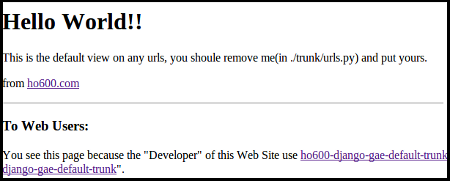

================================================================================
本專案說明(正體中文版)
================================================================================

--------------------------------------------------------------------------------
授權條款
--------------------------------------------------------------------------------

為 new BSD 授權( 3-clause )。

--------------------------------------------------------------------------------
目的
--------------------------------------------------------------------------------

把創建一個軟體專案所需要的常用檔案及結構定義好，方便取用。\
主要是給 django-based 系統使用，\
同時可套用在「自架機器」或「GAE hosting」的「應用專案」上。

.. note:: 名詞定義

 1. 「本專案」指的是 ho600-django-gae-default-trunk 專案
 2. 「應用專案」指的是您把 ho600-django-gae-default-trunk 所有檔案複製成新開發專案的那個專案

本專案的檔案架構配置如下：

.. code-block:: bash

    ho600-django-gae-default-trunk/
                                    asset/
                                    bin/
                                    conf_example/
                                    docs/
                                    docs-of-ho600-django-gae-default-trunk/
                                    ho600_lib/
                                    H6_lib/
                                    trunk/
                                            depends_modules/
                                            modules/
                                            local_settings.py

asset/
^^^^^^^^^^^^^^^^^^^^^^^^^^^^^^^^^^^^^^^^^^^^^^^^^^^^^^^^^^^^^^^^^^^^^^^^^^^^^^^^

放置第三方的函式庫， ./depends_modules.conf 則紀錄應該要抓取那些專案到 asset/ 中。\
內容如下：

.. code-block:: python
    :linenos:

    # ./depends_modules.conf
    asset/django-mediagenerator:tip = ssh://hg@bitbucket.org/wkornewald/django-mediagenerator
    asset/django-tastypie:XXXYYYZZZ = git://github.com/toastdriven/django-tastypie.git

若有其他想要加入的模組，可自行加在 depends_modules.conf 中\
XXXYYYZZZ 代表特定版本的 changeset 碼，若無設定代表 tip ，\
有設定 XXXYYYZZZ 後，則該模組就只會 update 至該版本。但 pull 時還是會抓到 tip 版。

.. note::

    目前僅支援 mercurial 儲存庫。若是使用 GitHub 專案請參考 \
    `hg-git <http://hg-git.github.com/>`_ 。

bin/
^^^^^^^^^^^^^^^^^^^^^^^^^^^^^^^^^^^^^^^^^^^^^^^^^^^^^^^^^^^^^^^^^^^^^^^^^^^^^^^^

目前有兩個執行命令：

prepare_programming.py
................................................................................

每次在撰寫自己的應用專案前，所執行的指令。\
幫你把 depends_modules.conf 中所指定的專案程式更新到指定版本。\
並提醒你還有那些 hg repo 尚未 commit 。

更新完所需的 moduels 後，也同時把 trunk/depends_modules/ 中的 modules \
(有登記在 settings.INSTALLED_APPS ) 刪除，以確保在開發程式時，\
所載入的 module 一定是 settings.py 中有指定特別版本、特別位置的 module 。

before_deployment.py
................................................................................

要上傳至 production server 前所執行的指令，\
也是未來 jenkins 執行的指令。

這裡的行為主要是把 settings.INSTALLED_APPS 有登記的 modules (扣除 django 自己帶入的)，\
複製一份到 trunk/depends_modules/ 。這樣在 deployment 時，只需把 trunk/ 整包上傳即可。

conf_example/
^^^^^^^^^^^^^^^^^^^^^^^^^^^^^^^^^^^^^^^^^^^^^^^^^^^^^^^^^^^^^^^^^^^^^^^^^^^^^^^^

放置 Apache+wsgi 及 Nginx+uWSGI 的設定範例檔。建議使用時，\
是將所需 apache2.conf 或 nginx.conf 檔案複製到 trunk/ 中，\
並在系統的 apache.conf 內使用：

.. code-block:: apache
    :linenos:

    # YOUR_SYSTEM_APACHE/httpd.conf
    Include "WHERE_YOU_PUT_CONF_DIR/apache2.conf"

或是在系統的 nginx.conf 內使用：

.. code-block:: nginx
    :linenos:

    # YOUR_SYSTEM_NGINX/nginx.conf
    Include "WHERE_YOU_PUT_CONF_DIR/nginx.conf"

其中因為 nginx 是結合 uWSGI 一起使用的，所以需另外設定 uwsgi 設定檔：

.. code-block:: ini
    :linenos:

    ## /etc/uwsgi/apps-enabled/www.ini
    ## sudo invoke-rc.d uwsgi start
    ## sudo invoke-rc.d uwsgi stop
    ## sudo invoke-rc.d uwsgi restart
    ##
    [uwsgi]
    socket = /var/run/uwsgi/app/www/socket
    chmod-socket = 666
    limit-as = 256
    processes = 6
    max-request = 2000
    memory-report = true
    enable-threads = true
    pythonpath = /YOUR_PROJECT_DIR/
    chdir = /YOUR_PROJECT_DIR/
    wsgi-file = /YOUR_PROJECT_DIR/wsgi.py

docs/
^^^^^^^^^^^^^^^^^^^^^^^^^^^^^^^^^^^^^^^^^^^^^^^^^^^^^^^^^^^^^^^^^^^^^^^^^^^^^^^^

為 sphinx-based 的文件資料夾。給「應用專案」使用的預設文件寫作位置，\
當然也可以全刪除不使用或是自行再利用 sphinx-quickstart 生成一個。

docs-of-ho600-django-gae-default-trunk/
^^^^^^^^^^^^^^^^^^^^^^^^^^^^^^^^^^^^^^^^^^^^^^^^^^^^^^^^^^^^^^^^^^^^^^^^^^^^^^^^

本專案的文件所在處。

ho600_lib/
^^^^^^^^^^^^^^^^^^^^^^^^^^^^^^^^^^^^^^^^^^^^^^^^^^^^^^^^^^^^^^^^^^^^^^^^^^^^^^^^

方便作 django-based 程式開發的函式庫，主要有 bugrecord 功能，在執行程式時，\
若發生 404|500 錯誤時，能紀錄在資料庫內。

.. todo::

    目前 ho600_lib 仍未實作。

H6_lib/
^^^^^^^^^^^^^^^^^^^^^^^^^^^^^^^^^^^^^^^^^^^^^^^^^^^^^^^^^^^^^^^^^^^^^^^^^^^^^^^^

為商業套件，並不是以 new BSD 授權發佈。

trunk/
^^^^^^^^^^^^^^^^^^^^^^^^^^^^^^^^^^^^^^^^^^^^^^^^^^^^^^^^^^^^^^^^^^^^^^^^^^^^^^^^

這裡是執行 ./manage.py runserver 0.0.0.0:8080 的地方，若要執行 GAE-based 的應用專案，\
則到上層目錄執行 dev_appserver.py . -a 0.0.0.0 -p 8080 。

trunk/depends_modules/
^^^^^^^^^^^^^^^^^^^^^^^^^^^^^^^^^^^^^^^^^^^^^^^^^^^^^^^^^^^^^^^^^^^^^^^^^^^^^^^^

在使用 jenkins 發佈應用專案時，利用 bin/before_deployment.py 可將 \
settings.INSTALLED_APPS 中所需的 modules (扣除 django 自己的)全複製到 \
trunk/depends_modules/ 下。這樣 jenkins 發佈時，就只需要把 trunk/ 上傳至伺服器。\
目標伺服器就不需要預先安裝特定 pure-python 函式庫，但還是要裝 django 函式庫。

trunk/modules/
^^^^^^^^^^^^^^^^^^^^^^^^^^^^^^^^^^^^^^^^^^^^^^^^^^^^^^^^^^^^^^^^^^^^^^^^^^^^^^^^

配置應用專案所開發的 modules 位置。

trunk/local_settings.py
^^^^^^^^^^^^^^^^^^^^^^^^^^^^^^^^^^^^^^^^^^^^^^^^^^^^^^^^^^^^^^^^^^^^^^^^^^^^^^^^

不被 hg 控管的本地設定檔，本檔案所設定的參數會覆蓋 trunk/settings.py 的設定，\
但設定時，有一限制： 在 local_settings 的參數名稱必須預先存在 trunk/settings.py 中，\
這是確保開發者在本地自行開發後，也必須記得把該參數登記到 trunk/settings.py ，\
以利其他開發者更正自己的 trunk/settings.py 。

--------------------------------------------------------------------------------
實際應用範例
--------------------------------------------------------------------------------

到 `https://bitbucket.org/hoamon/ho600-django-gae-default-trunk/downloads <https://bitbucket.org/hoamon/ho600-django-gae-default-trunk/downloads>`_ \
這裡下載所需的 ho600-django-gae-default-trunk 專案。也可以是用 \
hg clone ssh://hg@bitbucket.org/hoamon/ho600-django-gae-default-trunk \
指令再配合 hg update -C 'release-1.X.X' 來使用。

得到 ho600-django-gae-default-trunk 資料夾後，先把它改名成自己的應用專案，像是： \
my-example ，並刪除 .hg 資料夾，這是 ho600-django-gae-default-trunk 的版本控制庫，\
如是從 bitbucket downloads 頁面下載的，則無此資料夾。

修改 ./depends_modules.conf 。而後執行：

.. code-block:: bash

    hoamon@localhost my-example # bin/prepare_programming.py

修改 trunk/settings.py 。而後執行：

.. code-block:: bash

    hoamon@localhost my-example/trunk # ./manage.py runserver 0.0.0.0:8080

然後你可以在瀏覽器中看到：

接下來修改 trunk/urls.py (先把 urls.ho600_default_view 移除)，\
刪除 trunk/__docs__ 、 ./docs-of-ho600-django-gae-default-trunk/ 。

如果你的應用專案是 gae-based 的，那請再修改 ./app.yaml 檔案。且利用下列指令在本地端開發。

.. code-block:: bash

    hoamon@localhost my-example # dev_appserver.py . -a 0.0.0.0 -p 8080

現在你可以在 trunk/moduels/ 加入自己的模組了。恭喜你!