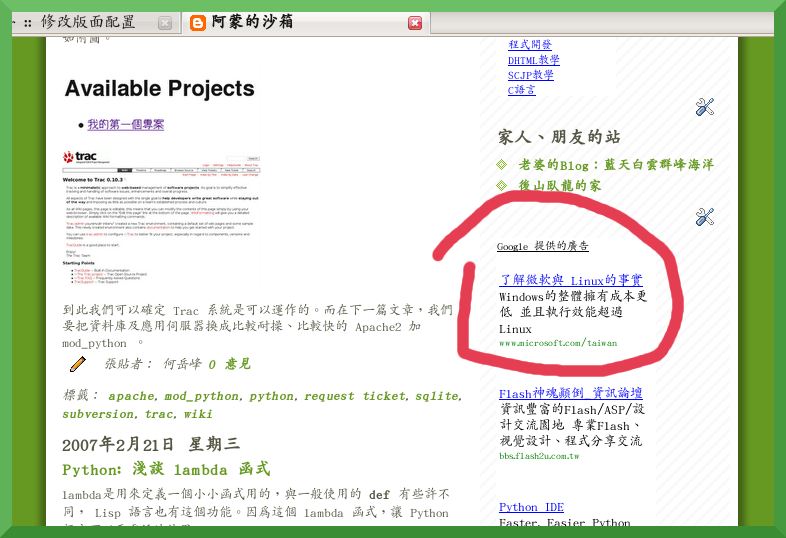

有趣的Google Adwords，微軟也有在用喔~
================================================================================

    Google Adwords ，微軟也有在用喔～

某個機緣發現了 Google Adsense(網頁出版者放置廣告的系統) ，覺得 Google 真是一家良心企業，他們願意提供部份利潤給網頁出版者。

一般來說，網頁出版者寫網頁的心態大部份只是分享自己的成果，如果要讓這個成果有「利」可圖，\
得再花費一段力氣，如出書、建物流體系…等。但 Google Adsense 卻讓出版者簡單即能獲得利益，\
只要網頁使用者瀏覽網頁之際也點選了 Google Adsense 提供的廣告，那麼 Google 就會拿出一部份他在這個廣告所獲得利潤給網頁出版者。

.. more::

談到這，請熱心的讀者不要為了「讓我多賺點錢」去點選 Google Adsense 的廣告。原因有二：

1.  申請 Google Adsense 時，有條款禁止網頁出版者鼓勵瀏覽者點選 Google Adsense 廣告。
2.  這樣會破壞網頁內容與廣告之間的關係。

第2條的含義在於：如果是瀏覽者是在瀏覽網頁時，恰好看到廣告內容符合需要才點選的話，\
對 Google 而言，還能作網頁內容與廣告之間的關連分析。像是，\
讀者在閱讀我所寫的 Python 文章時，發現廣告中有介紹 Python IDE 工具，\
並點選進入，這會讓 Google 認知到我文章中的關鍵字句與 Python IDE 是有一層關係的。

不過網頁出版者對 Google Adsense 還是不要抱持著太大的希望，想因此致富，\
因為瀏覽者要點選4萬~6萬次關鍵字廣告， Google 才會發給你一張50美元的支票。\
要把這張支票當作是一種鼓勵，而不是生活費用的依據。

像 Google Adsense 這樣的好工具，微軟也知道了，附圖是我的網站快照，\
可以知道微軟用 Google Adwords(是廣告主付錢給 Google ，讓他們的廣告能出現在網頁出版者的 Adsense 系統上) 來作廣告。

.. author:: default
.. categories:: chinese
.. tags:: google adsense, google, microsoft
.. comments::