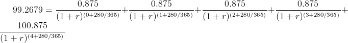

FOClass: 計算債券殖利率
================================================================================

P.S. FO 就是 Futures and Options (期貨與選擇權)。

債券殖利率是投資人在買進債券後，一直持有至債券到期日為止，這段持有期間的年平均報酬率。\
故殖利率又稱「到期殖利率(YTM，Yield to Maturity)」。\
而公債殖利率則是我們用來評價期貨與選擇權的主要工具之一。\
因為它代表了 **資金在無風險情況下的機會成本** 。

對主修營建管理的學生而言，計算債券殖利率的原理即是工程經濟中計算某一型態現金流量的 IRR (Internal Return Rate 內部報酬率) 。\
我們以一中央政府公債作為範例，介紹該殖利率計算方式。

.. more::

「A98101 98央債甲1」其給息及基本條件如下：

* 2009/1/21 發行
* 2009/4/16 以 99.2679 購入
* 到期日為 2014/1/21
* 每年發放一次債息，配息日為每年 1/21
* 票面利率為 0.00875
* 面額為 100 元

所以可知該債券的現金流量為：

1.  2009/4/16: -99.2679
2.  2010/1/21: +0.875
3.  2011/1/21: +0.875
4.  2012/1/21: +0.875
5.  2013/1/21: +0.875
6.  2014/1/21: +100.875

使用公式如下：

.. figure:: http://latex.codecogs.com/gif.latex?PV%20=%20%5Csum_%7Bi=1%7D%5E%7Bn%7D%5Cfrac%7BC_%7Bi%7D%7D%7B%281+r%29%5E%7Bi%7D%7D%5C:%20+%20%5Cfrac%7BFV%7D%7B%281+r%29%5E%7Bn%7D%7D
    :align: center

* PV: 現值
* i : 期別
* n : 總期別
* Ci: i期年金
* FV: 未來值
* r : IRR，也就是債券殖利率

在代入公式時，有一件事須注意，因為 4/16 距配息日 1/21 並不是剛好一年，\
所以公式中的 i 並不為整數而是 ( i + 280/365) ，且 i 從 0 到 4 。

求解方程式如下：

作到上述式子為止，已經把整個現金流量模式都定義好，基本上，是可以數值方式去求出 r 為何了。\
**然而，在債息分配上，因為已經過了配息日，而債券賣方應可享有從 1/21 ~ 4/16 之間的債息 (0.875 * (1-280/365)) ，\
且在債券賣出日即歸屬賣方** ，所以上式須再減去賣方的可得利息，式子修改如下：

.. figure:: http://latex.codecogs.com/gif.latex?99.2679%20=-%20%5Cfrac%7B0.875%5Ctimes%20%281-%5Cfrac%7B280%7D%7B365%7D%29%7D%7B%281+r%29%5E%7B0%7D%7D%20+%20%5Cfrac%7B0.875%7D%7B%281+r%29%5E%7B%280+%5Cfrac%7B280%7D%7B365%7D%29%7D%7D%20+%20%5Cfrac%7B0.875%7D%7B%281+r%29%5E%7B%281+%5Cfrac%7B280%7D%7B365%7D%29%7D%7D%20+%20%5Cfrac%7B0.875%7D%7B%281+r%29%5E%7B%282+%5Cfrac%7B280%7D%7B365%7D%29%7D%7D%20+%20%5Cfrac%7B0.875%7D%7B%281+r%29%5E%7B%283+%5Cfrac%7B280%7D%7B365%7D%29%7D%7D%20+%20%5Cfrac%7B0.875%7D%7B%281+r%29%5E%7B%284+%5Cfrac%7B280%7D%7B365%7D%29%7D%7D
    :width: 600px
    :align: center

這樣就可以用 :doc:`數值方法 <../../04/01/blog-post_28>` 求 r 了。

:doc:`../../05/01/blog-post_07` 系列文章
--------------------------------------------------------------------------------

    #. :doc:`../../04/01/foclass` (本文）
    #. :doc:`../../04/01/blog-post_28`
    #. :doc:`../../05/01/foclass`
    #. :doc:`../../05/01/foclass_07`

.. author:: default
.. categories:: chinese
.. tags:: option, bond, future, foclass
.. comments::