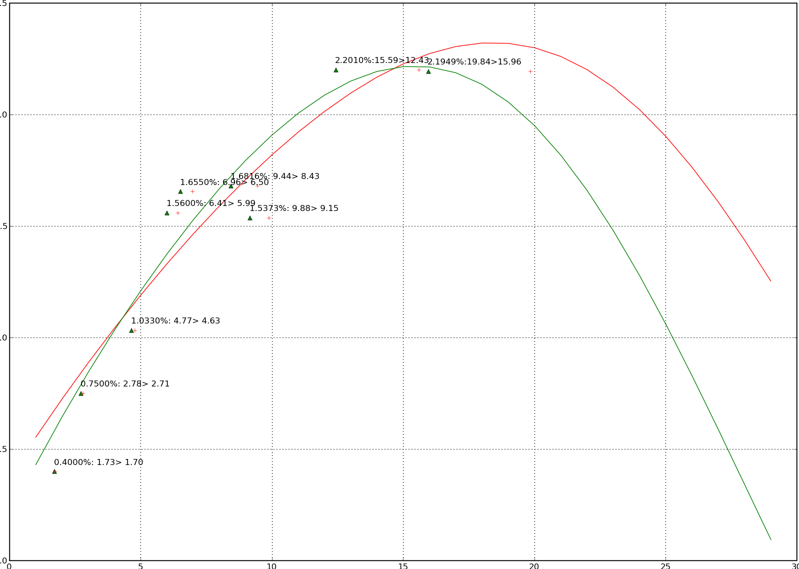

我們如何評定工程專案的資金機會成本
================================================================================

當我們評估一投資方案或是生產方案是否實行時，就現金流量而言，\
我們可用 IRR(Internal rate of return) 來作評估。\
然在比較機會成本上，試問你該以什麼樣的利率作為訂定報酬率的依據，\
選定 5% 而不是 3% 的理由是什麼呢?

用銀行報價的存款利率可以嗎? 那用那一家呢? 台新銀行、國泰銀行還是台中銀行? \
試問萬泰銀行的存款利率高還是國泰銀行的利率高?

.. more::

請記住重點： **利率就是資金的機會成本** ，也就是如果不接這個工程案，\
把錢放在銀行裡，那手頭上的資金是可以有利息的收入。接了工程案後，\
它的利潤就應該比利息的水準還高，否則我們就不應該去接此工程。\
當然，這是純以資金面的角度來看該不該投標，\
但有的時候考慮了機具、人員的沉沒成本後，\
不得不接一些達不到市場利率的工程來作。就像 DRAM 廠為了生存，只要銷價高於變動成本，\
雖然未能回收固定成本，但它們還是會接訂單。

而我們評估方案的標準應是以 **無風險利率** 來作評估較為合理。\
原因是無風險利率代表著貸放者鐵定可以回收本利，\
而其他比「無風險利率」高的利率都是隱藏著拿不回本金的 **風險** 。\
所以，比無風險利率高的部份，我們稱之為「risk premium 風險補貼(貼水)」，\
那是資金貸放者承受風險的報酬。我們常選用政府公債殖利率來當作無風險利率，\
因為政府如果還不出錢的話，它會直接印鈔票，保證本利和一毛不少。

除非 A 國政府賣出的是 B 國貨幣債券。\
較著明的例子就是 90 年代的阿根廷政府，它們賣出了約 1000 億的美元債券\
（ `阿根廷債務危機 <http://baike.baidu.com/view/1908455.htm>`_ 、 \
`政府違約 誰因阿根廷經濟而哭 <http://www.readit.com.cn/m/cjws/m/21873.shtml>`_ 、 \
`美法院判阿根廷還債 11年前債務危機餘波 <http://hk.news.yahoo.com/%E7%BE%8E%E6%B3%95%E9%99%A2%E5%88%A4%E9%98%BF%E6%A0%B9%E5%BB%B7%E9%82%84%E5%82%B5-11%E5%B9%B4%E5%89%8D%E5%82%B5%E5%8B%99%E5%8D%B1%E6%A9%9F%E9%A4%98%E6%B3%A2-212010451.html>`_ ）。\
這為什麼阿根廷政府能賣出美元債券呢？ 詳細手法就要問 `美國 5 大投資銀行 <http://zh.wikipedia.org/zh-tw/%E6%8A%95%E8%B5%84%E9%93%B6%E8%A1%8C#.E8.B5.B7.E6.BA.90.E5.92.8C.E5.8F.91.E5.B1.95>`_ 了，它們的佣金賺不少。\
而且我有聽說它們在 `希臘危機 <http://www.businessweekly.com.tw/KArticle.aspx?id=41763>`_ 的案子上也賺不少。

一個工程案少者一年，多者 10 年、 20 年，如此長天期的無風險利率又該去那裡找呢? \
而且有時候，我們的工程預估是 17.5 年，那這時又怎麼辦呢?

所以我們要利用國內政府公債的交易資訊來求出一條「零息債券的殖利率曲線」。\
因為「零息債券」的殖利率才等於即期利率(也就是以當下時間點來推估資金的機會成本)。\
成果應如下圖：

    綠色線為零息債券殖利率曲線、紅色線為附息債券殖利率曲線

「零息債券的殖利率曲線」作法請參考 :doc:`債券殖利率曲線計算 <../../05/01/foclass_07>` 。\
其中，因為我們的債券交易資訊都是附息債券的交易，\
所以我們須利用 :doc:`Macaulay duration 調整法 <../../05/01/foclass>` 來消除息票效應，\
將附息債券轉成零息債券。

而一債券的殖利率計算方式請見 :doc:`如何計算債券殖利率 <../../04/01/foclass>` 。

又如果你不會用數值方式來求方程式的根，你可以參考 :doc:`二分逼近法求債券殖利率 <../../04/01/blog-post_28>` 。

如果你對本主題完全沒概念的話，請依下列順序閱讀「我們如何評定工程專案的資金機會成本」系列文章：

    #. :doc:`../../04/01/foclass`
    #. :doc:`../../04/01/blog-post_28`
    #. :doc:`../../05/01/foclass`
    #. :doc:`../../05/01/foclass_07`

Old Comments in Blogger
--------------------------------------------------------------------------------

`Rob <http://www.blogger.com/profile/13396758070066817450>`_ at 2009-10-07T09:26:46.717+08:00:
^^^^^^^^^^^^^^^^^^^^^^^^^^^^^^^^^^^^^^^^^^^^^^^^^^^^^^^^^^^^^^^^^^^^^^^^^^^^^^^^^^^^^^^^^^^^^^^^^^^^^^^^^^^

    有意思！很不錯的一篇文章！

.. author:: default
.. categories:: chinese
.. tags:: bond, math, cmclass
.. comments::