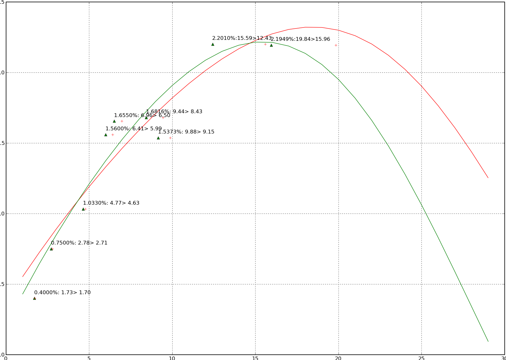

FOClass: 債券殖利率曲線計算
================================================================================

在 :doc:`../../05/01/foclass` 中，我們可算出零息債券的殖利率，但如果要套用在實務上的應用中，\
我們必須將觀察到的各點作一迴歸函式，讓我們可以找到各天期的殖利率。

.. more::

運用原理為 Cubic Spline 方法。假設債券的 Discount 因子為一個三次方程式：

.. figure:: http://latex.codecogs.com/gif.latex?D%28t%29%20=%201%20+%20a%5Ctimes%20t%20+%20b%5Ctimes%20t%5E2%20+%20c%5Ctimes%20t%5E3
    :align: center

而每張債券的現金流量再套入下方方程式：

.. figure:: http://latex.codecogs.com/gif.latex?PV%20=%20\sum_{i=1}^{n}C_{i}%20\times%20D_{i}
    :align: center

可得到類似 3.3a + 1.2b + 5.5c = 30 的等式。像是代入 `前篇文章 <../../05/01/foclass>`_ 的九張債券可得如下式子：

.. figure:: http://latex.codecogs.com/gif.latex?%5Cbegin%7Bbmatrix%7D%20x_%7B11%7D%20&%20x_%7B12%7D%20&%20x_%7B13%7D%5C%5C%20...%20&%20...&%20...%5C%5C%20x_%7B91%7D%20&%20x_%7B92%7D%20&%20x_%7B93%7D%20%5Cend%7Bbmatrix%7D%20%5Cbegin%7Bbmatrix%7D%20a%5C%5C%20b%5C%5C%20c%20%5Cend%7Bbmatrix%7D%20=%20%5Cbegin%7Bbmatrix%7D%2043.33%5C%5C%20...%5C%5C%203,4%20%5Cend%7Bbmatrix%7D
    :align: center

經過矩陣移位：

.. figure:: http://latex.codecogs.com/gif.latex?%5Cbegin%7Bbmatrix%7D%20a%5C%5C%20b%5C%5C%20c%20%5Cend%7Bbmatrix%7D%20=%20%5Cleft%20%28%5Cbegin%7Bbmatrix%7D%20x_%7B11%7D%20&%20x_%7B12%7D%20&%20x_%7B13%7D%5C%5C%20...%20&%20...&%20...%5C%5C%20x_%7B91%7D%20&%20x_%7B92%7D%20&%20x_%7B93%7D%20%5Cend%7Bbmatrix%7D%5E%7Bt%7D%20%5Ccdot%20%5Cbegin%7Bbmatrix%7D%20x_%7B11%7D%20&%20x_%7B12%7D%20&%20x_%7B13%7D%5C%5C%20...%20&%20...&%20...%5C%5C%20x_%7B91%7D%20&%20x_%7B92%7D%20&%20x_%7B93%7D%20%5Cend%7Bbmatrix%7D%5Cright%20%29%5E%7BINV%7D%20%5Ccdot%20%5Cbegin%7Bbmatrix%7D%20x_%7B11%7D%20&%20x_%7B12%7D%20&%20x_%7B13%7D%5C%5C%20...%20&%20...&%20...%5C%5C%20x_%7B91%7D%20&%20x_%7B92%7D%20&%20x_%7B93%7D%20%5Cend%7Bbmatrix%7D%5E%7Bt%7D%20%5Ccdot%20%5Cbegin%7Bbmatrix%7D%2043.33%5C%5C%20...%5C%5C%203,4%20%5Cend%7Bbmatrix%7D
    :align: center

再透過 OLS(ordinary least square) 方法求出 a, b, c 的適當值後，即可代入：

.. figure:: http://latex.codecogs.com/gif.latex?Y%28t%29%20=%20%5Csqrt%5Bt%5D%7B%5Cfrac%7B1%7D%7BD%28t%29%7D%7D%20-%201
    :align: center

便算出殖利率曲線。如下圖：

    綠色線為零息債券殖利率曲線、紅色線為附息債券殖利率曲線

我們可以看到 20~30年期的殖利率下降的十分奇怪。原因是我們的觀察值債券的年期最大只有 20 年，\
所以這一條函式在預測 20~30 年期的數據應該是有問題。

Python 程式如下：

.. code-block:: python
    :linenos:

    from numpy import array, append, dot, matrix, linalg
    class CubicSpline:
         """ 使用最小平方和原則作三次方方程式的迴歸
         """
         def __init__(self):
             self.PVs = array([])
             self.X = array([])

         def addBondData(self, PV=0, Ci=[], Ni=[]):
             self.PV = PV < 0 and PV or -1*PV
             if Ni[0] == 0:
                 self.PVs = append(self.PVs,
                                    -1*self.PV-Ci[0])
                 self.Ci = array(Ci[1:])
                 self.Ni = array([[1, t, t**2, t**3]
                                    for t in Ni[1:]])
             else:
                 self.PVs = append(self.PVs, -1*self.PV)
                 self.Ci = array(Ci)
                 self.Ni = array([[1, t, t**2, t**3]
                                    for t in Ni])

             self.dt = dot(self.Ci, self.Ni)
             if len(self.X):
                 self.X = append(self.X,
                                [self.dt[1:]],
                                axis=0)
             else:
                 self.X = array([self.dt[1:]])

             self.PVs[-1] -= self.dt[0]

         def runOLS(self):
             self.X = matrix(self.X)
             self.PVs = matrix(self.PVs).T
             self.b = (linalg.inv(self.X.T
                                * self.X)
                                    * self.X.T
                                    * self.PVs)
             return self.b

:doc:`../../05/01/blog-post_07` 系列文章
--------------------------------------------------------------------------------

    #. :doc:`../../04/01/foclass`
    #. :doc:`../../04/01/blog-post_28`
    #. :doc:`../../05/01/foclass`
    #. :doc:`../../05/01/foclass_07` (本文）

.. author:: default
.. categories:: chinese
.. tags:: python, bond, foclass
.. comments::
