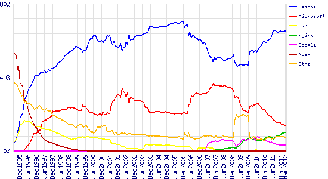
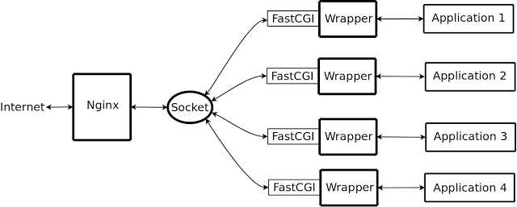

轉移至 Nginx
================================================================================

    2012 三月全世界的網頁伺服器市佔率圖 from http://netcraft.com/ 。本圖( wpid-overallc.png )非屬 hoamon 創作。

上圖可以看出歷久彌新的 `Apache <http://httpd.apache.org/>`_ 持續雄距首位，有超過 15 年的時間，沒"器"可挑戰它的地位。\
直至 `Nginx <http://nginx.org/>`_ 的出現，或許它現在只有 10% ，但從各方評價看來，\
它絕對是 Apache 有史以來最強大的對手。短短 5 年，它已經爬上第 3 名的位子，\
從趨勢線上看來，要超越 IIS 也是有很大的機會。

而 Nginx 為什麼短短幾年竄起，絕不是因為『用的人多』。\
如果是這種原因的話， palm 、 Windows OS 、 x86 CPU 、 PlayStation 到現在會活得好好地，\
因為它們都曾有超越 50% 的市佔率。

Nginx 被選擇的原因有幾點：

1.  跨平台： \*nix, Mac, Windows 皆可。這那算優點呢!!! 那個網頁伺服器沒跨平台，喔喔~講太早了， IIS 就是不能跨平台，或許這就是它市佔率持續下降的原因，強迫綁 Windows OS ，結果只要 Windows OS 下滑，它就必死無疑了。
#.  開源的 BSD-like 授權。
#.  靜態檔案輸出省資源。
#.  不怕慢速連線。
#.  比較不怕 DOS 攻擊。
#.  穩定性高。

簡單講，除了效能，還是效能。而我要的功能， Nginx 都有提供，唯一算得上缺點的，就是因為 Apache \
活得比較久，安全性已被磨得比較好了。所以對於我們愛研究的研究生來說，還有什麼理由不切換過去呢? 大概只有「懶」是個原因吧!

目前我們使用 Apache + Django 的方式多是利用 mod_python 的技術。然而這種作法是比較不安全的，把很多事都包給 Apache \
去作，那不管是我們程式設計有錯，或是它用的元件有錯，只要出錯那就是管理員等級的錯。\
不過這個「錯」也不算是 Apache 的錯，是「用 mod_python 」的錯，如果用的是「 mod_fastcgi 」，那安全層級就能拉高了。

所以說來，這次的「升級」是把「 mod_python 」丟掉，改用「 mod_fastcgi 」。\
那麼我心裡想想，都要換成 Django 自己跑 fcgi mode 了，為什麼不乾脆連前端網頁伺服器也換一下呢! \
因為重點已換成 Django 的 fcgi server ， Apache 的重點性大減，\
前端網頁伺服器的功能只剩下靜態檔案輸出、虛擬站台切換、 https 處理等，\
那我何必跑一個 Huge Apache 呢? Nginx 就是我的新選擇。

安裝很簡單，如果是在 Ubuntu 中，請打：

.. code-block:: bash

    $ sudo apt-get install nginx

如果是在 Windows 中，請到官網下載 nginx.zip 檔，解開了，就是一個可執行的 nginx 程式。

而我用的方法是下載源始碼自己編譯：

.. code-block:: bash

    $ wget some_file_link.tgz
    $ tar -zxf some_file_link.tgz
    $ cd nginx
    $ sudo apt-get install libpcre3-dev libssl-dev # 這些是編譯時，須用到的函式庫程式碼
    $ sudo apt-get install libxml2-dev libxslt-dev # 這些是編譯時，須用到的函式庫程式碼
    $ sudo apt-get install libgd2-xpm-dev libgeoip-dev # 這些是編譯時，須用到的函式庫程式碼
    $ ./configure --prefix=/usr/local/nginx --with-debug --with-http_dav_module \
    --with-http_addition_module --with-http_geoip_module --with-http_gzip_static_module \
    --with-http_image_filter_module --with-http_realip_module --with-http_stub_status_module \
    --with-http_ssl_module --with-http_sub_module --with-http_xslt_module \
    --with-ipv6 --with-sha1=/usr/include/openssl --with-md5=/usr/include/openssl --with-mail \
    --with-mail_ssl_module
    $ make
    $ sudo make install

這樣 Nginx 就安裝完成了。

接下來，我們作 Django 程式的設定，讓它可以跑在 fcgi mode 上，方法很簡單，原本我們在本機開發時，都是用：

.. code-block:: bash

    $ python2.7 manage.py runserver 127.0.0.1:8080

讓它跑在 http://127.0.0.1:8080/ 上，現在則改用：

.. code-block:: bash

    $ cd /home/somewhere
    $ su - someuser -c "python2.7 manage.py runfcgi host=localhost port=3033 daemonize=true method=threaded workdir=/home/somewhere pidfile=/home/somewhere/fcgi.pid"

這樣 django 會在 127.0.0.1:3033 中，幫我們開一個 someuser 帳號權限的 fcgi server ，\
daemonize=true 則表示指令打完後，它就背景處理了，想要把這個 fcgi server 殺掉，就去看看\
/home/somewhere/fcgi.pid 的內容，裡面的編號就是系統行程編號， kill 那個編號就能關 fcgi server 了。
同時殺掉 fcgi server ，再馬上啟動它的指令可參考如下：

.. code-block:: bash

    $ su - someuser -c "kill `cat /home/somewhere/fcgi.pid` && python2.7 manage.py runfcgi host=localhost port=3033 daemonize=true method=threaded workdir=/home/somewhere pidfile=/home/somewhere/fcgi.pid"

請注意在這個階段，你用瀏覽器去看 http://127.0.0.1:3033/ 是沒反應的，\
因為它現在跑的是 FastCGI 協定，不是 http 協定。瀏覽器無法跟 Django FastCGI 溝通。

接下來，我們再到 nginx.conf 去設定。Nginx 與 FastCGI Server 互動原理如下：

    圖來自陈辉的博客( http://huichen.org/2010/03/12/configure-fastcgi-for-nginx/ )

先由 Nginx 與瀏覽器互動，得到 GET, POST 等變數後，整理成 fastcgi 協定的變數，\
然後用 Socket 或 Port 方式傳遞給 FastCGI Server ，接下來就是 FastCGI 去驅動程式去處理，完成後拋回。

以下是 nginx.conf 的設定範例：

.. code-block:: conf
    :linenos:

    user www-data; # 子行程用的是 www-data 帳號
    worker_processes 4; # 常駐 4 個子行程
    pid /var/run/nginx.pid; # 紀錄母行程的編號
    http {
        server_tokens off; # 網頁上不顯示伺服器版本編號
        sendfile on;
        tcp_nopush on;
        tcp_nodelay on;
        keepalive_timeout 30;
        types_hash_max_size 2048;
        include /etc/nginx/mime.types;
        default_type application/octet-stream;
        access_log /var/log/nginx/access.log;
        error_log /var/log/nginx/error.log;
        gzip on;
        gzip_disable "msie6";
        server {
            listen 80;
            server_name www.whatever-you-want.com.tw;
            root /var/www;
            index index.html;
            access_log /var/log/nginx/TW-access.log;
            error_log /var/log/nginx/TW-error.log;
        }
        server {
            listen 443;
            server_name www.whatever-you-want.com;
            keepalive_timeout 60;
            ssl on;
            ssl_certificate /etc/ssl/hoamon.info/hoamon.info.crt;
            ssl_certificate_key /etc/ssl/hoamon.info/hoamon.info.key;
            location "/" {
                fastcgi_pass_header Authorization;
                fastcgi_intercept_errors off;
                fastcgi_pass 127.0.0.1:3033;
                fastcgi_param PATH_INFO
                $fastcgi_script_name;
                fastcgi_param  GATEWAY_INTERFACE  CGI/1.1;
                fastcgi_param  SERVER_SOFTWARE       nginx;
                fastcgi_param  QUERY_STRING
                $query_string;
                fastcgi_param  REQUEST_METHOD
                $request_method;
                fastcgi_param  CONTENT_TYPE
                $content_type;
                fastcgi_param  CONTENT_LENGTH
                $content_length;
                fastcgi_param  SCRIPT_FILENAME
                $document_root$fastcgi_script_name;
                fastcgi_param  REQUEST_URI
                $request_uri;
                fastcgi_param  DOCUMENT_URI
                $document_uri;
                fastcgi_param  DOCUMENT_ROOT
                $document_root;
                fastcgi_param  SERVER_PROTOCOL
                $server_protocol;
                fastcgi_param  REMOTE_ADDR
                $remote_addr;
                fastcgi_param  REMOTE_PORT
                $remote_port;
                fastcgi_param  SERVER_ADDR
                $server_addr;
                fastcgi_param  SERVER_PORT
                $server_port;
                fastcgi_param  SERVER_NAME
                $server_name;
            }
            location "/media" {
                autoindex on;
                root /home/somewhere/media;
            }
            access_log  /var/log/nginx/whatever-you-want.access_log;
            error_log   /var/log/nginx/whatever-you-want.error_log;
        }
    }

上面有兩個虛擬站台，一個是給 www.whatever-you-want.com.tw ，一個是給 www.whatever-you-want.com 。\
www.whatever-you-want.com.tw 只是單純的靜態網站，\
預設首頁是 http://www.whatever-you-want.com.tw/index.html ，而它的硬碟位置在 /var/www/index.html 。

而使用者若是瀏覽 https://www.whatever-you-want.com/media 的連結，\
則 Nginx 會給它 /home/somewhere/media 資料夾內的所有檔案。\
除了 /media/.* 外，其他的連結都會用 3033 port 送到 Django FastCGI Server 處理。

而使用 https 的方法，只須要設定 3 個變數值： ssl ， ssl_certificate ， ssl_certificate_key 即可。\
設定完成後，用指令開啟 Nginx ：

.. code-block:: bash

    $ /usr/local/nginx/sbin/nginx

重新載入：

.. code-block:: bash

    $ /usr/local/nginx/sbin/nginx -s reload

關閉：

.. code-block:: bash

    $ /usr/local/nginx/sbin/nginx -s stop

這樣 Nginx 伺服器就建立完成了。

在新架構下，可以由系統管理員獨立控管 Nginx 網頁伺服器的開啟、關閉，而讓程式設計師，\
自行作 FastCGI Server 的管理，程設師自己作程式更新、套用，避免給予過多的權限。\
畢竟這兩者的知識領域是有別的，少有人兩邊都作得很好。

以下可能是 \*nix(含 Mac) 專用(因為我不知道 Windows 能不能作 unix:socket 的指定)
--------------------------------------------------------------------------------

如果我們一台機器有多個 django-base 的虛擬站台，那麼一個 django-base project 就要花一個 port \
，這對於系統管理員及程式設計師而言，容易有搞亂的可能性，畢竟 "網址" <=> "port" <=> "django-base project" \
的過程當中，是文字對應數字，再對應文字，難以記在人的腦中(也可能是我的記性比不上平均值吧!)。

所以我建議使用 Unix Socket 方式作對應。程式設計師把 socket 開在程式庫的 root 資料夾中，\
並取名為 django.socket 。再將 django.socket 權限設為 770 ，\
然後系統管理員把這個 django.socket 擁有群組設為 www-data 。

程式專案在 /home/someproject/ ，設定範例如下：

.. code-block:: bash

    $ cd /home/someproject && /usr/bin/python2.7 manage.py runfcgi socket=`pwd`/django.socket method=threaded workdir=`pwd` pidfile=`pwd`/pid daemonize=true

上面程式設計師跑起一個 django-base 專案，並將 socket 開在 /home/someproject/django.socket 。

然後系統管理員作權限設定(也可以用 visudo 指給程式設計師作權限設定)：

.. code-block:: bash

    $ sudo chgrp www-data /home/someproject/django.socket
    $ sudo chmod 770 /home/someproject/django.socket

系統管理員再把 nginx.conf 原本的 fastcgi_pass 127.0.0.1:3033 設定改如下：

.. code-block:: conf

    fastcgi_pass unix:/home/someproject/django.socket;

改成這樣的設定方式，對程式設計師來說，永遠是把 socket 開在同一個專案資料夾中，\
並命名為 django.socket ，而系統管理員也知道一定是專案資料夾下的 django.socket 。\
少了數字 port 的對應記憶，減少錯誤的機率。

.. author:: default
.. categories:: chinese
.. tags:: mod_fcgi, django, linux, nginx, windows, unix, mac, apache, iis, mod_python
.. comments::