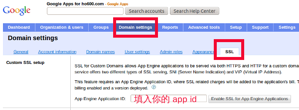
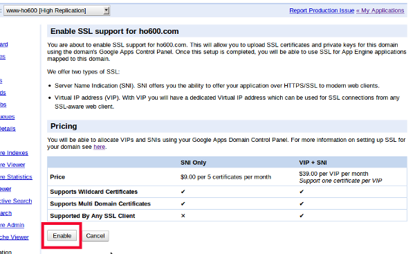
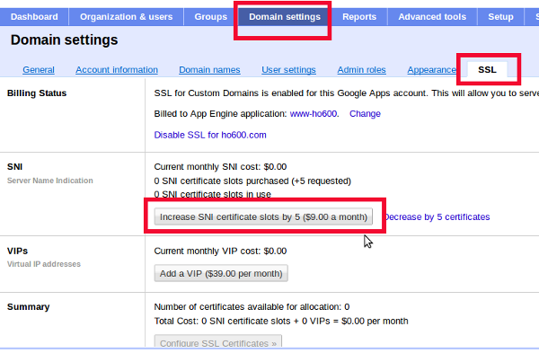
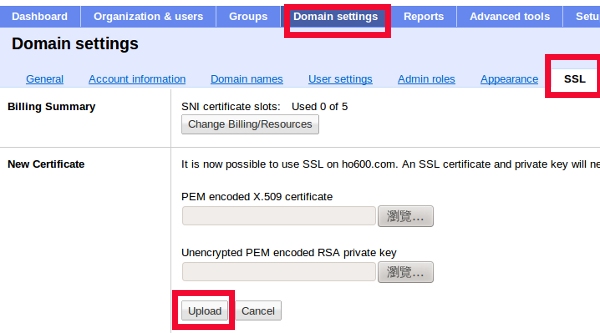
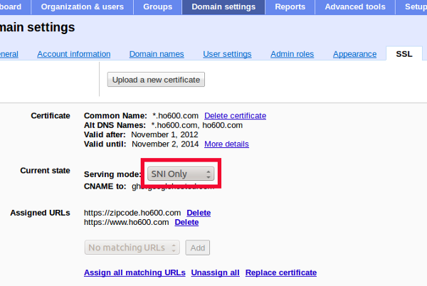

================================================================================
Ho600's SSL Certification
================================================================================

.. figure:: ho600_ssl/ho600_ssl.png
    :width: 100%

    本圖( ho600_ssl.png )部份內容引自 https://www.ho600.com/ ，並非全屬 hoamon 創作

雖然 `StartSSL.com <https://www.startssl.com>`_ 有免費一年的憑證( Class 1 )可以申請，\
但如果是商業運作的網站，它們是會拒絕你的申請，所以我的 `Ho600.com <https://www.Ho600.com/>`_
就被拒絕申請免費的 Class 1 憑證。\
不過，沒關係，人家開公司總要賺錢的嘛~ 況且他們的憑證服務真的很方便，也很便宜，\
所以我沒什麼好抱怨，甚至我很欣賞它們，因為它們提供的服務是以加解密技術為基礎向上發展的，\
或許之後我還會跟它們買硬體憑證以研發電子公文系統，或是幫它們代銷 SSL 憑證。\
**那這樣本文就算廣告文，事實上也是，請詳見本文末** 。

這次跟它們申請的是 \*.Ho600.com 2 年效期 wild card 憑證( Class 2 )，\
適用於所有第一層 Ho600.com 的子網域，\
而且我打算把這張憑證用在 `GAE <http://code.google.com/appengine>`_ 系統中。\
過去沒有設定自己的憑證時，要在 `https://www.Ho600.com/ <https://www.Ho600.com/>`_
與使用者端作加密通道( https )，只能使用 GAE 的預設網址 https://www-Ho600.appspot.com/ 。\
這當然會造成使用者的困惑，明明是跟 http://www.Ho600.com/ 作連線，怎麼網頁點著點著就變成
https://www-Ho600.appspot.com/ ，擔心是不是被"釣到"了。

.. more::

申請好的成果如上圖。 1 號框可見到綠色鎖頭的 https 字句，這是 Chrome 的樣式，其他瀏覽器當然會不一樣。\
而 2 號框指的是這張憑證適用於 \*.Ho600.com 上， 3 號框則是我的英文譯名。

因為我是要把這張 SSL 憑證放入 GAE 中，所以必須遵守 GAE 的幾項限制：

 1. Private Key and Certificate should be uploaded in PEM format.
 #. Private Keys must not be encrypted.
 #. A certificate file can contain at most five certificates; this number includes chained and intermediate certificates.
 #. All subject names on the host certificate should match or be subdomains of the domains associated with the account in the Google Apps Control Panel.
 #. Private keys must use RSA encryption.
 #. Maximum allowed key modulus: 2048 bits

1-4 點是系統管理時特別注意即可，而 5-6 點是在請 StartSSL.com 幫我們加簽時，就必須先作好，\
格式錯了，那申請的 SSL 憑證就不能在 GAE 上跑了，後 2 點務必注意。

申請 Class 2 以上的憑證，不是資料打打、 Email 點個確認信就行了，必須要作個人實體的驗證\
( 在管理頁面的『Validations Wizard』 / 『Personal Identity Validation』 )：

 1. 護照及( 身份證或駕照 )文件確認
 #. 電話確認
 #. 通話確認

為此，雖然我近期沒打算出國，但還是得花 1600 元去辦本護照。有了護照後，請掃瞄封面、內文第一頁及第二頁。\
封面、第一頁雖然只要是拿中華民國護照的都會是一樣，不過 StartSSL.com 是家以色列公司，\
它不是只有收臺灣人的驗證工作，所以還是要上傳，而第二頁就是上面有你英文姓名、生日、出生地資料的那一頁。

我另外上傳的是駕照正反面。第一步驗證作到這裡時，再去管理頁面的『Tool Box』 / 『Add Credit Card』，\
加入信用卡號。他們審核後，會另外請你再上傳電信通話費的收據，\
上面須有姓名、住址、電話號碼。審核過，他們就會打電話給你，問你護照上的資料，講的話當然是用英文啦。\
我學弟也有接過電話，他跟我的評語都是他們的 Born 發音很奇怪，要多聽幾次才知道他講的是 Born 。

第三步也完成後，過幾個小時，他們就會寄信通知你可以作 Class 2 憑證了。\
作憑證的基礎概念請參照我的舊文『 `How to get a free HTTPS web certification authority by StartSSL.com
<http://blog.hoamon.info/2011/04/how-to-get-free-https-web-certification.html>`_ 』，\
其中幾個步驟要換掉：

.. code-block:: bash

 $ openssl req -out CSR.csr -new -newkey rsa:2048 \
     -nodes -keyout privateKey.key #1. 生成私錀及 CSR 檔
 $ openssl rsa -in privateKey.key -out unencryptedkey.pem \
     #2. 私錀格式換成 PEM 格式
 $ cat ssl.crt sub.class2.server.ca.pem ca.pem \
     > 600_com.pem #3. 依序把憑證置入同一個 PEM 檔

1. 的指令是要生成 2048 長度的 RSA 私錀，而它的 CSR.csr 要貼到 StartSSL.com 的網站，\
然後它們會問你要生給什麼網址使用的，如果是 wild card 就填 * ，也可以用多值方式明確填寫特定子網域，\
確認後，送出申請，他們會人工手動作出憑證後再寄信通知你。\
下載時，記得要另外下載 sub.class2.server.ca.pem 及 ca.pem 。再依 3. 合成一個檔。

有了 unencryptedkey.pem 及 600_com.pem 後，就能到 Google Apps 管理頁面作憑證設定的工作。\
理論上，私錀是要管理員自行保管才是，但在雲端平臺上，伺服器是別人管的，非得要把私錀給別人拿不可。\
因為它是 Google ，我信心比較足，就直接上傳給它們了。

    本圖( ssl_1.png )部份內容引自 https://www.google.com/ ，並非全屬 hoamon 創作

讓 GAE 的 application 支援客定網域的 SSL 憑證，是在 Google Apps 中設定，\
但收費則是要算 application 的戶頭。

    本圖( ssl_2.png )部份內容引自 https://www.google.com/ ，並非全屬 hoamon 創作

我在 increase SNI certificate slots 時，一個手滑按到 20 個，結果當天 GAE 算我 15 個的價錢，\
也就是 15 / 5 * 0.3 = 0.9 ，說明 GAE 不是看你實際用到幾個 slots ，\
而看你多會按 increase SNI certificate slots 按鈕。

    本圖( ssl_3.png )部份內容引自 https://www.google.com/ ，並非全屬 hoamon 創作

上傳時，請務必認清那個是私錀上傳鈕，那個公錀上傳鈕，錯了，程式雖然會自動提醒你，但我怕把私錀當公錀上傳，\
會不會發生當下 Google Apps 就把私錀散佈到公眾領域去，還是別亂試的好。

    本圖( ssl_4.png )部份內容引自 https://www.google.com/ ，並非全屬 hoamon 創作

完成後，它會顯示憑證資訊，並給你選擇用 SNI 還是 VIP ，兩者價格相差 4 點多倍，前者便宜、後者昂貴。\
但後者是所有的瀏覽器皆能正常讀取 SSL 憑證，而前者在 Windows XP 上的 IE 及 Safari 會有問題。\
最後再選擇 Assigned URLs 有那些，按下儲存就完成了。

    本圖( ssl_5.png )部份內容引自 https://www.google.com/ ，並非全屬 hoamon 創作

看到自己網站有支援合法的 SSL 憑證真的很高興，尤其是這一張是跟外國公司買的。想當年，\
我在第一份工作時，也幫所服務的公司買了一張國內公司銷售的 single name 憑證，效期 1 年，\
印象中是花了 18000 元新臺幣，成本是人家的 20 倍。當然啦，國內公司審核申請人的資格比較繁鎖，\
但就 SSL 憑證來說，我個人覺得只要強度有夠，至於 SSL 所屬組織/單位是否有被認真審核根本就不重要，\
因為使用者在跟 PChoome / Yahoo / Google ... 作生意時，根本就不在乎它們的 SSL 核發公司到底有多專業。\
一切還是要回歸公司本身建立的商譽為何?

--------------------------------------------------------------------------------
以下是工商廣告時間
--------------------------------------------------------------------------------

StartSSL.com 有提供我們這些已作過 Personal Identity Validation 的人去幫別人買憑證的 \
`方案 <http://www.startssl.com/?app=41>`_ ，如果有需要我可以協助購買。收費分五個等級，\
並有三個但書。

詳細請見 :doc:`../05/startssl_com_web_ssl_retailer` 服務方案 。

.. author:: default
.. categories:: chinese
.. tags:: advertisement, ho600, ssl, startssl, startup
.. comments::
