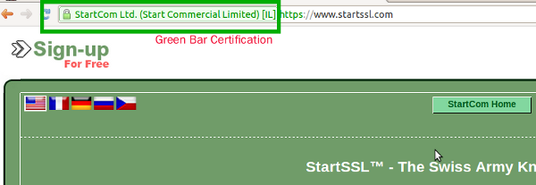
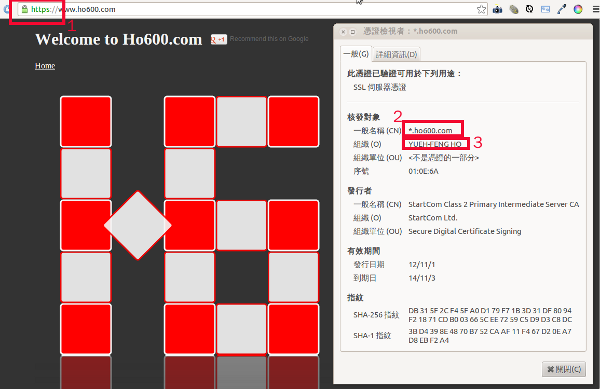

================================================================================
StartSSL.com Web SSL 憑證代購
================================================================================

下圖為綠標憑證在瀏覽器的顯示情形：

    本圖( greenbar.png )部份內容引自 https://www.startssl.com/ ，並非全屬 hoamon 創作

StartSSL.com 有提供我們這些已作過 Personal Identity Validation 的人
( 詳見 :doc:`../04/ho600_s_ssl_certification` ) 去幫別人購買 2 年效期憑證的 \
`方案 <http://www.startssl.com/?app=41>`_ ，如果有需要我可以協助購買。收費分五個等級，\
並有三個但書：

.. more::

1. 會問問題者，直接在本格留言詢問，純諮詢完全免費。
#. 技術能力有水準者( 會使用 Web Camera / Skype ，修改 DNS 紀錄，轉寄信件，生成 CSR 檔… )，每張 single name / wild card 收 1800 元新臺幣( 含發票 )，綠標（Extended Validation）每張額外加價 8000 元新臺幣（ 含發票 )。
#. 技術能力中等者( 會使用 Web Camera / Skype ，設定 VNC server ，生成 CSR 檔 )，每張 single name / wild card 收 5400 元新臺幣( 含發票 )，綠標（Extended Validation）每張額外加價 8000 元新臺幣（ 含發票 )。
#. 技術能力低下者( 會使用 Web Camera / Skype ，設定 VNC server )，每張 single name / wild card 收 10800 元新臺幣( 含發票 )，綠標（Extended Validation）每張額外加價 8000 元新臺幣（ 含發票 )。
#. 技術能力為零者( 這個不會，那個也不會 )，每張 single name / wild card 收 18000 元新臺幣( 含發票 ), 另計車馬費( 不含發票 )，綠標（Extended Validation）每張額外加價 8000 元新臺幣（ 含發票 )。

=================  ==============================  =============================================  =======================  =====================
等級 \\ 每張       含發票之服務費                  不含發票之車馬費（實報實銷）                   single name / wild card  EV
=================  ==============================  =============================================  =======================  =====================
1 會問問題         free                            free                                           free                     free
2 有水準           1800                            0                                              0                        8000
3 中等             5400                            0                                              0                        8000
4 低下             10800                           0                                              0                        8000
5 零               18000                           另計                                           0                        8000
=================  ==============================  =============================================  =======================  =====================

但書則是：

 1. 所生成的 single name / wild 憑證其組織必定為 **YUEH-FENG HO** ( 如下圖的 3 號框 )，這是受限於 StartSSL.com 的政策，無法修改。而綠標憑證則會是貴公司（組織）的名稱，但綠標須作法律認證程序。本人的服務只包括程式技術部份，法律認證部份請找自己公司的法律顧問處理。
 #. 對口技術人員需有中華民國身份證，並以 Web Camera / Skype 確認身份及繳交身份證影本( 或掃瞄電子檔 )。
 #. 本人保留提供服務的權利，如果 **我沒空** 或是 **跟你( 或貴公司 )沒緣份** ，那就十分抱歉了。

下圖為 Class 2 憑證， Class 4 的綠標憑證則如本文第一張圖所示，會在網址框前的鎖頭旁秀出公司組識的名字。

    本圖( ho600_ssl.png )部份內容引自 https://www.ho600.com/ ，並非全屬 hoamon 創作

**洽詢方式：** |email|

**付款方式：**

    1. 郵局 700 0021208-039XXXX
    #. 玉山 808 222-968-21YYYY
    #. 第一 007 442-503-0ZZZZ
    #. 臺銀 004 136-004-05WWWW
    #. PayPal(僅限 1800 元方案用)

待確認您的需求後，會用 Email 通知詳細付款資料。因為國內有些發卡銀行會視 PayPal 交易為國外刷卡而額外向持卡人收取 1.5 %的跨國交易手續費。於此我提供 30 元的折價，以上 5 種繳款方式皆適用，也就是原 1800 元者，只須繳交 1770 元， 5400 元者只須繳交 5370 元。

P.S. ** **費用皆為事前一次收取** ** 。

.. author:: default
.. categories:: chinese
.. tags:: advertisement, ssl, startssl
.. comments::
