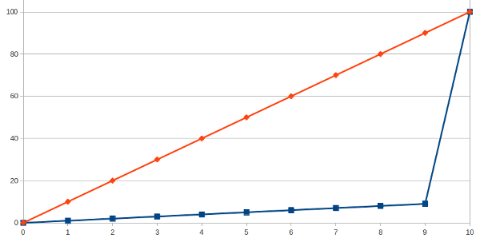

================================================================================
逃稅天堂是世界貧富差距巨增的催化劑 --- 「逃稅天堂」讀後感
================================================================================

本文是探討貧富差距的第一篇，主文在 :doc:`wealth_gap` 。

--------------------------------------------------------------------------------
吉尼係數
--------------------------------------------------------------------------------

吉尼係數是用來分析國家的貧富差距現象有多嚴重的一個指數，但我個人對它抱持懷疑態度，\
因為它只計算了收入分佈情形，卻沒有考慮擁有者識別度，這什麼意思? 我用一個例子說明：

    某社會總共有 10 個人，其中有一人的收入佔總比 91 % ，而剩下 9 個人的收入各佔總比例 1 %，\
    這個社會吉尼係數很大(有多大，請自己算，我懶得算)，但如果在自由不管制的條件下，該社會中擁有 91 %收入的人，\
    每年輪流換人坐， 10 年過去，平均每個人都有一年時間擁有 91 % 的收入。試問，這個社會的貧富差距很大嗎?

解決貧富差距問題，不見得一定要大家收入差不多，也可以是透過大風吹的方法讓大家輪流坐。

.. more::

--------------------------------------------------------------------------------
稅法門檻
--------------------------------------------------------------------------------

然而稅法門檻是一個阻止大家大風吹的有利工具，窮人及沒有能力的人是用不到這項工具的，\
就像當年西班牙征服中南美洲是因為擁有病菌、鐵器及戰馬的工具才能大勝原住民。\
稅法則是聰明人及有錢人的現代鐵器，\
就算有錢人無腦，他也該懂得花個錢找律師及會計師幫他作避稅，甚而逃稅的工作。

除了國內稅制不公外，就算稅制很簡單、公平，也無法避免有錢人利用逃稅天堂進行合法節稅，甚或非法逃稅。

--------------------------------------------------------------------------------
販賣主權
--------------------------------------------------------------------------------

租稅天堂( Tax Havens )，英文原意應為租稅庇護所，然因其運作效用，早已被許多人認定可解讀為天堂。\
『逃稅天堂』一書卻將其貶為窩藏非法逃稅的天堂，主要是流過這些租稅天堂的資金，多為黑錢。

租稅天堂的基礎在於稅法的『設籍地課稅原則』，像是不管彰化銀行在那些國家有開設分行、分別賺取多少利潤，\
都依總公司所在地(也就是中華民國)繳納營所稅給中華民國政府，就算它的部份利潤是來自大陸分行。

租稅天堂便利用此一原則，銷售設籍執照，而且收費方式多只有建置費及年費，不依公司利潤大小課徵。

也因為不依利潤大小課徵稅金，所以租稅天堂往往不要求設籍公司留下帳目資料，間接提供了公司營運的保密性，\
並從而豁免公司非法營運的責任(如：洗錢業務)，因為租稅天堂完全不知道公司是在幹什麼的，\
當事後其他國家要求司法協助時，租稅天堂可以兩手一攤：『我也不知情?』 有些租稅天堂為洗脫此類惡名，\
也有部份的退讓，所以我們的陳前總統涉及洗錢相關資料是瑞士主動提供的。

因為租稅天堂多半提供他人從事不名譽之行為，所以多半只有養不起自己人民的國家(或地方政府)才會採行此一發展策略。\
如： 香港、新加坡、開曼群島、萬那社、巴哈馬、澤西島、列支敦士登、美國德拉瓦州、愛爾蘭、英屬威京群島、瑞士…。\
惟一的特例是英國，這也是為什麼有一堆前英屬群島會是租稅天堂的原因，因為它們被自己人潛移默化了。\
且往往並不是小島本身起頭的，而是有其他律師、會計師事務所進駐小島，說服執政當局以『販賣主權」為策略，\
協助制定相關法規，如此一來，就能透過收取外國人的費用維持國家發展而少收點自家人民的稅(也可能沒什麼稅可收)。

基本上，我的看法是，這些租稅天堂就像是路邊遊民一樣，沒了未來希望，乾脆賣掉自己的身份證，\
他也管不著買家買身份證要幹麼，他只想過得了今天。

--------------------------------------------------------------------------------
移轉定價
--------------------------------------------------------------------------------

企業利用租稅天堂逃稅的最佳手段是移轉定價。因為很多國家是只允許本國有設籍的公司才可以進行商業行為的，\
所以企業可以在租稅天堂設立母公司，並在大陸設立子公司，由子公司進行生產、物流業務，如：
製作球鞋(這是舉例，我沒有任何影射)，\
整個金流方式是由母公司接受美國或其他國家公司的訂單，由母公司收款(一雙球鞋賣 6 USD)，母公司自行轉下單給子公司，\
讓子公司賠錢收單(一雙球鞋賣 3 USD 。要比直接成本高，但不會高於總成本。不然會有背信問題)。\
這樣一來，就能讓利潤留在租稅天堂中的母公司帳上，而虧損留在子公司帳上，\
虧損久了，子公司的資本額不是會成負數嗎? 此時，再由母公司現金增資子公司，這樣子公司就不會倒閉，能持續營運。\
我非會計師，以上例子只是定性且粗略描述，細節需要另行參照，如： 一開始的臺灣公司如何把錢轉到租稅天堂的設藉公司中?

是的，上述方式就是國內企業投資大陸的作法，這不但避免了大陸資本管制措施(易進難出)，\
也讓利潤停留在低(零)稅率的租稅天堂。

這也造成兩個現象：

 1. 臺灣對大陸投資金額愈來愈高，因為國內企業在租稅天堂賺的錢是保密的，政府也看不到，但賠錢投資到大陸子公司卻是明明白白的。
 #. 某些公司的外資持有率很高，因為那是董事長用租稅天堂的錢(公司賺來的錢)來買自家股票，然後投票給自己當董事長。

而大陸則是利用此一工具作資本外逃，像是最近傳聞某國家總理的家族海外資產有幾百個億，\
試想總理特權可以這麼明目張膽地把錢從本國銀行匯出嗎? 當然要利用『移轉定價』才能避人耳目。

--------------------------------------------------------------------------------
風險轉移
--------------------------------------------------------------------------------

除了『移轉定價』外，另一個被善用的工具是『風險轉移』，以在本國設立公司為例，經濟部商業司會審很多資料，\
所以一但公司成立，上面的資本額是實實在在的(但還是有可能被董事長掏空，不過這是旁話了)，生意作失敗，\
資產是會被拿來還債。

但在租稅天堂開公司就沒這麼麻煩了，某些國家給個 4 萬新臺幣就能開一家紙上公司。\
所以某些銀行或投資銀行開設紙上公司後，把基金轉給紙上公司管理，不但逃避監理機構的控管，\
當這些高風險投資工具出事的時候，理論上也不會違及銀行本身業務。那為什麼次貸爆發時，\
政府要救這些黑心公司呢? 因為有太多傻蛋跟這些黑心公司作生意了，如果政府放任這些黑心企業倒閉，\
那傻蛋公司也跟著完了，於是政府就被綁架了。

這個用法其實我小時候就聽過了。可以同時開兩家公司，兩家利用移轉定價方式，讓一家專門賺錢，另一家專門賠錢，\
後者可以專門接高風險工作，像是炒作房地產及蓋樓賣房，賺取極大營收，\
甚至後者還可虛開發票，最後讓後者倒閉，欠政府一堆營業稅，也無須負擔產品保固責任，\
而前者先把後者的利潤全拿到手，負責人早就四處逍遙了。

--------------------------------------------------------------------------------
租稅天堂是導致貧富差距擴大的重要因素
--------------------------------------------------------------------------------

上天很公平地讓每個人的能力不一樣，有些能力在這個時期很好賺錢，有些則要再等等。\
有時候，只有能力也不夠，還要運氣; 有時候，沒有能力也可以，因為運氣不錯。\
但總體來講， **以我個人經驗來看** ，能力往往與財富成正比，且財富累積到一定程度後，就與能力無關了，\
因為無腦的有錢人(可能是祖產而來，也可能是運氣)可以花錢租用能力好的人才，所以才有葉少之流，\
明明無腦，但未來日子不見得難過。

『逃稅天堂』一書中寫出：『租稅天堂是導致全球化中一個眾所周知的事實(貧富差距擴大)的重要因素。』\
看來我們是沒辦法避免貧富差距的。因為租稅天堂利用他國不得干涉本國事務的主權來賺錢，\
而我們也不能避免有錢人移民，因為我們講求自由、民主，總不能學共產黨，把資產階級綁起來，
鬥黑鬥臭再分掉他們的錢吧!

所以對貧窮的人來說，似乎得再來回味一下我父親的教悔：『法律是給懂的人用的。』，沒錢的人惟有培養能力一路可走。\
然而如果貧窮已變成人的宿命呢? 接下來，請繼續看 第二篇(撰寫中) 。

--------------------------------------------------------------------------------
參考書目
--------------------------------------------------------------------------------

* 逃稅天堂，羅能．帕蘭、理察．墨菲、克里斯提昂．蕯瓦鈕，時報文化， ISBN: 978-957-13-5251-0 。

.. author:: default
.. categories:: chinese
.. tags:: tax, finance, politics
.. comments::
