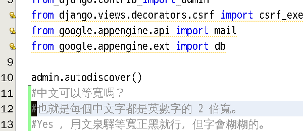
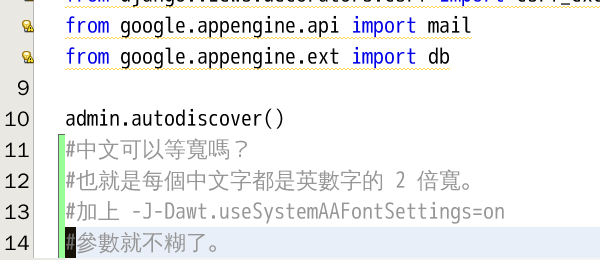

Monospaced fonts of Netbeans in Ubuntu
===============================================================================

    使用文泉驛等寬正黑，字會糊掉

我的 Netbeans 預設字型 Monospaced 一直有中英文不對齊的問題，但其實曾經在不知版本的 Ubuntu 上解決過，\
因為沒有作紀錄，所以升級後，就又出現這種問題，後來參考其他文章，本想代換成 MONACO 字型，\
但這個"通狼蚵樂"的字型，在我的 Netbeans 上，就是會出現方塊字。搞不定呀! 只得放棄。

.. more::

而系統自帶的文泉驛等寬正黑則是可以正常對齊，但字型會糊掉。結果我在某次修改 netbeans.conf 中，\
把 netbeans_default_options 加上 -J-Dawt.useSystemAAFontSettings=on 以解決鋸齒狀問題，\
結果「文泉驛等寬正黑」就正常顯示了，現在終於能等寬，字型也不錯看。

    加上反鋸齒的選項，字就不糊了

種豆得瓜，不亦樂乎。

.. author:: default
.. categories:: chinese
.. tags:: netbeans, ubuntu
.. comments::
