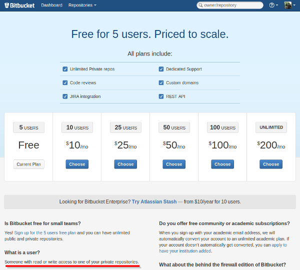

================================================================================
Bitbucket 付費方案真是佛心來著
================================================================================

**利益揭露** : 使用本頁連結下單綠大地清潔酵素系列商品，筆者會收到回饋金。

    本圖( bitbucket_plans.png )部份內容含有 `Bitbucket.org
    <https://Bitbucket.org/>`_ 製作內容，非全屬 hoamon 所創作

之前一直誤會 `Bitbucket.org <https://Bitbucket.org/>`_ 付費方案內容，\
以致作了一些錯誤決策。問題是怎麼發生的呢? 上圖中用紅線劃記的那句話： \
"Someone with read or write access to one of your private repositories." \
我之前是解讀成：『只要是你的私有儲存庫所共同管理的用戶，\
不管是擁有讀取或是寫入權限的人數，全都算在你的用戶數上。』\
而所謂的 your ，我是認定為『參與』，結果在經過一段日子的確認後，才發現是『擁有』，\
而這『擁有人』資格在一個私有儲存庫上，只會有一人。

.. more::

擁有人資格怎麼看? 以我的公開專案 `https://Bitbucket.org/hoamon/ho600-django-gae-default-trunk
<https://Bitbucket.org/hoamon/ho600-django-gae-default-trunk>`_ 來說，\
ho600-django-gae-default-trunk 網址前的 hoamon 就是擁有者的帳號。\
所以 Users Plan 的計算方式是這樣子的，先把你所有的專案抓出來看，\
只要是前置資料夾為你的帳號且該儲存庫又是私有的，\
那麼這些儲存庫所關連的用戶數(包含你自己)全加起來，就是你要付費的 Users Plan 。\
如果是 5 個，那恭喜你，還不用繳錢，如果是 6 ~ 10 個，那就算 10 個人的方案，以此類推。

過去的錯誤決策是怎麼發生的?  因為幫 `昶茂微生物開發股份有限公司
<http://www.chang-mao.com.tw/>`_ 開發 `bio-enzyme.com
<http://www.bio-enzyme.com/hmn/>`_ 電子商務網站的過程，\
也邀請該公司副總 `林博士大發
<http://www.igreen88.com/>`_ 一起使用 Bitbucket.org 的 issue 系統來作工作盯催，\
結果他一用之下，驚為天人，也想把該 issue 系統推廣給自己公司的員工使用，\
昶茂是一家典型的中小企業，員工約十數人。所以我就幫他分析一下，\
如果是用 Bitbucket issue 來作公司工作管理的話，\
那它一定得是私有專案才行，\
而這個專案又會有十多人參與，這樣一來，每個人每個月都要繳 25 元美金，
一個月得先幫員工繳出近 300 美元，約新臺幣 9000 元，這樣是划不來的。

於是，把我珍藏已久的 Ticket 系統構想拿出來跟他推銷。\
讓我來寫一個 Open Source 的 Ticket 系統，\
程式碼免費給他用，只收維護費(就是架個站、管管系統、備份資料之類的)就好。於是，\
就有這套 `https://Bitbucket.org/hoamon/ho600-django-simple-ticket-on-gae
<https://Bitbucket.org/hoamon/ho600-django-simple-ticket-on-gae>`_ 。\
不過， **請別急著拿去用呀!** 經過他們的先期測試後，有不少功能要補強，\
而且某些是專屬於他們公司的程式碼，等我改版好，再推薦給大家。

現在看來，純使用 Bitbucket issue 作任務管理，一個月只要出 25 美金，約新臺幣 750 元就好，\
都比我收他們的維護費還便宜了! 當然用我寫的，還是有一些好處! \
像是全中文頁面，以及可以開發一些他們專屬的功能。\
不過，如果換個時空，回到過去，用不同的價格資訊，再讓副總分析，他還會支持我作這一套嗎? \
歷史沒得重複，不過，我敢說，決策是有可能改變的，\
因為連我自己都會覺得再寫一套的效益既然不高，幹麼再作一個輪子呢?

所以這該算是一個美麗的錯誤。

那既然 Bitbucket.org 這麼佛心，我們還不多用一點。而且也該支持一下這麼棒的公司，\
我打算明年開始就會加入他們的 10 人付費專案了。

.. author:: default
.. categories:: chinese
.. tags:: bitbucket, python, mercurial
.. comments::
