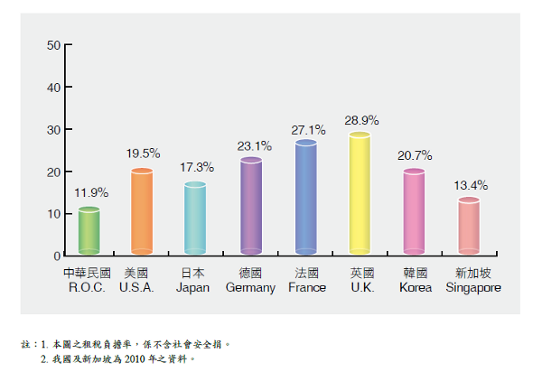

================================================================================
寅吃卯年糧，卯吃寅人糧
================================================================================

    圖片授權： Public domain image( `來源 <http://www.public-domain-image.com/plants/mushrooms/slides/tiny-wooden-house-with-mushrooms.html>`_ )

高二時，讀的是二類組，歷史、地理課不重要，高中老師也知道，\
所以會來教二類組的，不是等退休，就是帶著休閒心態而來。\
當時的歷史老師上課從來沒有同學聽懂他的鄉音，所以我們都在臺下自習、睡覺。不過，\
地理老師就不一樣了，她認為你都來學校上課了，聯考既然不考你們歷史、地理，\
但也不用浪費這 50 分鐘，她會為我們介紹世界的奇景、風俗、文化，\
至今我仍記得一個赤道帶原住民的生活習俗。

.. more::

內容大致是這樣的：

    那個地方的原住民在年老無法工作後，會自己走到離部落比較遠的一間小屋去，在那裡自主生活。\
    所謂自主生活就是『等死』，因為他的狩獵能力、採集能力不若年輕時那樣有生產力了，\
    所以若不靠部落年輕人的扶養，這些老人是非常不容易生存下去的。

當時聽到這個故事，覺得 **他們怎麼那麼笨，不去統一麵包買幾袋麵包** 呢?

過了十幾年，又從寰宇新聞台看到非洲某些部落的奇特風俗。他們對於沒生兒子的寡婦，其財產權是不允尊重的。\
所謂不予尊重，就是去她家可以見到什麼東西有用，直接拿走就行，不需經寡婦同意，鄰居也不會有意見，\
或許搞不好鄰居已經先拿走了。

這兩則風俗告訴我們什麼事呢?

**為了延續種族生存，老而無用之人該死!**

原住民社會通常還未發展至農耕社會，建立君王體制，所以對資源的保存效率不高，\
無法做到寅糧卯用，只要災害一來又或許一時運氣不好，短期間無法收集到夠用的食物，\
下場就是有人得死，而這些人望眼掃過，老人是最適合被開刀的。

很無奈，但是必須吞下來。這些原住民不信上帝，沒辦法得到奶蜜之地，只能自己想辦法，\
人想的辦法能有多好，只顧得了肚子，就顧不了尊嚴了。

還好中國向來是禮儀之邦，先人還說過：『人不獨親其親、不獨子其子，使老有所終、\
壯有所用、幼有所長、鰥寡孤獨廢疾者皆有所養』，\
這就是因為中國老早就產業升級至農耕社會，有政治體制，懂得做好資源管理。嗯嗯嗯~~~ \
好吧! 我承認是只有好的君主才能做到。

只是高中畢業後又過了幾年，我才發現原來我們不是中國，是叫臺灣。\
那些『老吾老以及人之老，幼吾幼以及人之幼』之類的道理不流行。\
在這個新國家中，要求的是『不賺錢，憑什麼拿獎金』，\
簡單講就是：『 **你老了對我沒用，幹麻讓你爽** 』。

既然一切(物質)績效至上，在這個國家，過得最爽的，就是有賺錢的企業，因為人民愛錢，\
想說從這些企業分到一杯羹，所以什麼話都聽他們的，要有產創、租稅減免、補助，\
沒客戶的，還幫它們搞品牌，結果他們肉吃得更多，而人民就多個幾口湯喝。\
雖然收穫不多，不過臺灣人民照挺，一些企業大老闆出來喊喊，就把他們意見看作比自己爸媽講得話重要，\
還有人認為該叫他們出來選總統，這才能救臺灣。

溯本正源，臺灣這種現代社會為什麼會走回頭路，幹跟非洲部落一樣的勾當，\
如果政府有錢為什麼不繼續老有所終呢? 政府之所以沒錢，就是標題所稱：『寅吃卯糧』，\
從李前總統帶我們進入真正的民主國家開始，每個出來參選的政客，\
幾乎都是撥下一世代豆腐給當代的選民吃，\
不然最近各地縣市政府為什麼要吵 :doc:`公共債務法 <../../11/25/public_debt_law>` ? \
要花錢興建設、發福利、放煙火又不加稅的簡單作法，秘訣沒別的，就是這步： **跟未來子孫借錢** 。

每年都是寅年，寅久了，總輪到卯年了吧!

是呀! 以前不民主的時候，政客只要給自己身邊的人爽就選上了。民主了，政客身邊的人照爽，\
但還得多給人民爽，不過支票開多了，總得有人要結帳吧! 於是以前有結過帳的，\
但因為他們錢多，所以再把他們抓回餐廳櫃檯重結一次。

這樣還在領月退的軍公教退休人員就最適合了，因為他們並未辦理一次領退，所以錢還掛在政府戶頭裡，\
只要政府找個理由東扣西扣，那他們就算有千百個不願意，也只能照辦了。

而且扣錢前，還給你戴帽子，說軍公教人員以前工作時，都是好吃懶作，\
現在刪他福利只是剛好而已，但退休金不是福利，是延後提領的個人所得。也不管當年他殺了幾個水鬼，\
蓋過幾個水庫，還是教出多少個為國爭光的英才，通通沒有用，因為這些人都己經老而無用，\
不在家等死，居然還敢出來抗爭!

我也知道在軍公教環境中，就是有人瀆職，有人貪汙，有人只會拍馬屁，\
但過去各位不努力抓出這些壞份子，還讓他們安穩退休了，現在才來翻舊帳，\
而且是連規規矩矩做事的軍公教退休人員一起"電"。\
尤其是有送過紅包、陪喝花酒的那些人，你們不應該有臉說事，個個都是貪汙共犯。

但怎麼辦，軍公教退休人員的皮沒得剝，要剝誰的? 首先政府及地方政府要做到收支平衡，\
收多少稅就辦多少事，當下就做到寅糧寅用，再來看是要刪福利/補助/減免或是增稅。\
一邊走自由放任資本主義; 一邊走福利國家，我都沒意見，只要收支平衡，什麼都好。

--------------------------------------------------------------------------------
刪產創/補助/減免
--------------------------------------------------------------------------------

民主國家的重點是人，重要的是人有吃飽、有尊嚴能自我實現。臺灣企業在世界搶了多少營業額，\
到最後都還是要看有沒有分配給臺灣人，有沒有讓我們吃飽、有尊嚴及自我實現。重點是人不是企業，\
搞那麼多補助、減免、產創，最後都便宜了企業，而企業又多把錢分配給股東，而不是員工，\
這還不是白搭。

為何要政府挺企業，企業挺勞工呢? 政府自己挺不就好了。\
拿錢去挹注企業對增加未來稅收的幫助會每況愈下。\
最近有兩則新聞剛好突顯這個企業繳稅問題： `Google 去年節稅20億美元 <http://dignews.udn.com/forum/post.jsp?news_id=7557439>`_ 、\
`星巴克英國避稅惹議 承諾繳稅挽回形象 <http://www.epochtimes.com/b5/12/12/7/n3747504.htm>`_ 。

過去，中華民國營所稅已被兩稅合一打了一槍，名存實亡。未來租稅天堂可能連小型企業都懂得利用。\
企業徵稅問題未來只能留待給消費者來處理了。想靠協助企業拉抬稅收，實則緣木求魚。

更何況如下圖，我國的實質稅率只有僅僅的 12 %，就算加計 5000 億(佔中央總收入的 1/3 )的健保，總共是 16% 的實質稅率，\
政府沒收到多少錢，還要拿錢去貼虛擬體(兩稅合一的精神主要就是認定公司法人係虛擬體並非納稅實體，\
僅僅分配盈餘予個人股東而已)，政府挺企業，其實挺得沒那麼有道理。

    資料來源： 中華民國財政 2011 (ISSN 1682-3990 ) - 賦稅一章

上圖中，我國實質稅率雖然只低於新加坡一點點，但星國可是在開「不仁不義」的 :doc:`黑心租稅天堂 <../../11/05/tax_havens>` ，\
與我國都是靠人民自己胼手胝足地幹出來，那是怎能比得了? 不要再長他人志氣，臺灣人及政府沒那麼爛。

想想看，我們就收這 TMD 的一點稅，還想要有多豪華的家庭劇院組，給顆 5 瓦喇叭、20 吋映像管電視，再加個免費無線 4 台，加減看吧!

--------------------------------------------------------------------------------
增稅
--------------------------------------------------------------------------------

如前節所言，營所稅已被虛擬化成綜所稅，談它沒什麼意思。現在能增稅的最有利方式，\
就是資本利得稅，其中有二個重點： 一、 `證券所得稅 <http://paper.hoamon.info/e-papers/finance/zheng-suo-shui>`_ ; \
二、 `土地所得稅 <http://blog.hoamon.info/2011/12/bull-shit.html>`_ 。筆者過去已談得不少，請各位就舊文自行參酌。

--------------------------------------------------------------------------------
結論
--------------------------------------------------------------------------------

筆者最後想說的是，政府功能終究是使用者付費的，不要以為叫它當個『家長式政府』，它就真的跟你爸媽一樣，幫你做事不用算帳。

**政府要收支平衡，才能永續經營** 。

.. author:: default
.. categories:: chinese
.. tags:: politics, finance
.. comments::
