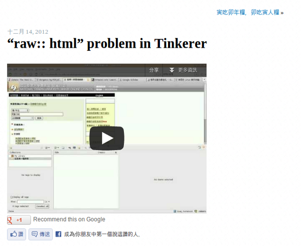

"raw:: html" problem in Tinkerer
================================================================================

    Put youtube video into tinkerer-based blog

.. more::

The below code be used to embed video in tinkerer-based blog:

.. code-block:: rst

    .. raw:: html

        
<iframe width="420" height="315"
            src="http://www.youtube.com/embed/kGAuI9DaEJY"
            frameborder="0"
            allowfullscreen="on"> </iframe>

There are two points to notice:

 1. 'allowfullscreen' attribute must be notated as allowfullscreen="xxx", don't just use allowfullscreen or you will get the error log below.
 #. Use a simple "<Space>" between in <iframe ....> </iframe> tag or you will get a confused html layout.

The error log with just use allowfullscreen:

.. code-block:: bash

    Exception occurred:
      File "/usr/lib/python2.7/dist-packages/sphinx/application.py", line 204, in build
        self.builder.build_update()
      File "/usr/lib/python2.7/dist-packages/sphinx/builders/__init__.py", line 196, in build_update
        'out of date' % len(to_build))
      File "/usr/lib/python2.7/dist-packages/sphinx/builders/__init__.py", line 255, in build
        self.finish()
      File "/usr/lib/python2.7/dist-packages/sphinx/builders/html.py", line 433, in finish
        for pagename, context, template in pagelist:
      File "/usr/local/lib/python2.7/dist-packages/Tinkerer-0.4.1b-py2.7.egg/tinkerer/ext/blog.py", line 85, in html_collect_pages
        for name, context, template in rss.generate_feed(app):
      File "/usr/local/lib/python2.7/dist-packages/Tinkerer-0.4.1b-py2.7.egg/tinkerer/ext/rss.py", line 54, in generate_feed
        app.config.website + post[:11])),
      File "/usr/local/lib/python2.7/dist-packages/Tinkerer-0.4.1b-py2.7.egg/tinkerer/ext/patch.py", line 91, in patch_links
        doc = xml.dom.minidom.parseString(in_str)
      File "/usr/lib/python2.7/xml/dom/minidom.py", line 1930, in parseString
        return expatbuilder.parseString(string)
      File "/usr/lib/python2.7/xml/dom/expatbuilder.py", line 940, in parseString
        return builder.parseString(string)
      File "/usr/lib/python2.7/xml/dom/expatbuilder.py", line 223, in parseString
        parser.Parse(string, True)
    ExpatError: not well-formed (invalid token): line 8, column 119
    The full traceback has been saved in /tmp/sphinx-err-dUPKv_.log, if you want to report the issue to the developers.
    Please also report this if it was a user error, so that a better error message can be provided next time.
    Either send bugs to the mailing list at <http://groups.google.com/group/sphinx-dev/>,
    or report them in the tracker at <http://bitbucket.org/birkenfeld/sphinx/issues/>. Thanks!

Tinkerer use xml format to check result out.

.. author:: default
.. categories:: english
.. tags:: tinkerer, sphinx
.. comments::
