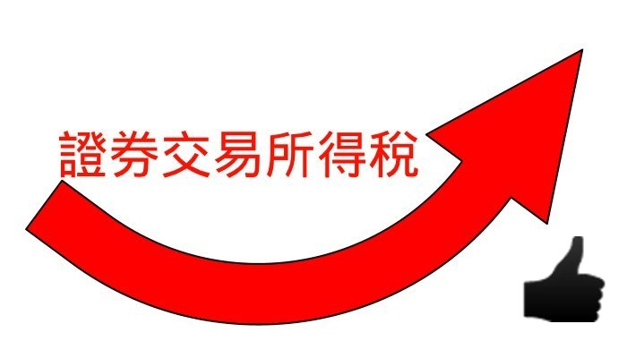

================================================================================
2013 年，我選擇核實課徵證券所得稅
================================================================================

    本圖( stock.jpg )部份內容含有 `Gentleface.com <http://findicons.com/icon/267784/hand_pro>`_ 製作之內容，非全屬 hoamon 所創作

上周二(2012/12/11)，我到證券公司填下「核實課徵申請書」了。\
會這麼做，當然是要呼應我之前一直強調 `課徵證券所得稅是符合租稅正義的稅制 <http://paper.hoamon.info/e-papers/finance/zheng-suo-shui>`_ 。

.. more::

雖然，最終通過的版本差強人意，但至少它保證了 2013 ~ 2014 兩年之內是有「證券所得稅」的概念，\
但 2015 年起就不保證了，我想明眼人也知道政府下一步險棋，希望經過這兩年的課稅經驗能喚起散戶們的理智，\
了解證所稅是為了健全中華民國稅制，不是刻意要跟人民過不去的，或許能在這兩年內，有機會再修一下法，\
讓它真正落實。

而昨天(12/14)，我也做了一件事，把巨大、美利達、龍邦都賣了，\
因為有些是零股的關係，所以加起來才 9 萬元，並預計下周再把這三支股票買回來。

**為什麼** ，沒事要幹這無聊事呢? 這一買一賣，除了多繳給券商佣金及政府的證交稅，\
還有什麼其他好處。

這三支股票我的總持股成本是 4 萬元，如果我在 2013 ~ 2014 年之間想把它們賣掉，\
得繳出 7500 元的證所稅。而利用 2013 證所稅上路前，來回操作一下，\
多花了 540 元，以後可以少掉 7500 元，很划算地。

是的，我要正義，但不當笨蛋。

其實，我也有另外幾支股票虧損很多，主要都在航運股，如果明後二年，真的要賣股，\
拿它們一起賣，也就會兩相扯平，不過，如果到時候它們也漲了二倍呢? \
既然不確定，那還是今年就先把購入成本墊高比較穩當。而這個作法，\
絕不是我這個散戶獨知，那些怕將來證所稅法案還有變數，或是有可能一年賣到 10 億元以上股票\
且持有成本又很低的人，現在花個 600 萬證交稅來墊高持有成本就像是買個保險。

但為什麼我這個被動投資人，明後年會賣股票呢? 不是一直領利息就好了，作差價幹麼? \
原因就在於，以目前這個版本，到了 2015 年對很多人來說，證所稅就落日了，\
如果在落日之前，政院及立院毫無作為的話。我就看破臺灣證券市場這個「不義之地」，\
自然不想再待下去。到時候我會改去美國券商，買買日、美、澳、歐的 ETF 。

--------------------------------------------------------------------------------
2012/12/25 後記
--------------------------------------------------------------------------------

`證所稅核實課稅 誤選本周可更正 <http://n.yam.com/chinatimes/fn/20121225/20121225085639.html>`_ 這則新聞中，\
提到國內有三千多戶選擇了「核實課稅」。財政部官員說：「我們也很意外！ 原本估計選擇核實課稅的人會極少，沒想到有三千多戶。」\
我也覺得很意外，不過是覺得怎麼會這麼少，大家都覺得明年(2013)漲不上 8500 點嗎?

還好這不是弦論，不需要有人披星戴月地作研究，會不會上 8500 點，最多再等 365 + 6 天就知曉了。

.. author:: default
.. categories:: chinese
.. tags:: finance, investment
.. comments::
