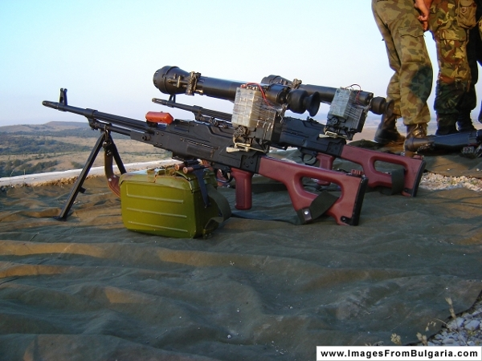
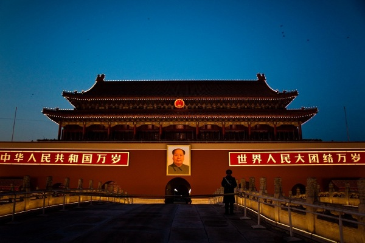

================================================================================
我支持人民擁槍權
================================================================================

    本圖( Machine-gun_with_night_vision_sight.JPG )為 `Kiril Kapustin <http://imagesfrombulgaria.com/v/Military/Machine-gun_with_night_vision_sight.JPG.html>`_ 所有，非 hoamon 創作

有時候想想，我何必自找麻煩談這個議題，現代臺灣人生活中跟"真槍"幾乎沒有關連，\
講這個是要給誰聽呀!

最近這個話題又開始熱烈起來的原因，\
源自於 `桑迪．胡克小學槍擊案 <http://zh.wikipedia.org/wiki/%E6%A0%A1%E5%9C%92%E6%A7%8D%E6%93%8A%E6%A1%88>`_ 。\
史達林說：『一個人的死是悲劇，一百萬人的死不過是個統計數字』。\
這 28 位有名有姓的被害人讓全美各地的家長及在臺灣的我們都感到十分難過，\
且深切地想檢討出一個方法來避免重複發生這類事件。\
而另一方面，每 6 秒就有一個不知姓名的兒童死於飢餓或死於營養不良，
\ 在 `9:35 ~ 9:46 <http://en.wikipedia.org/wiki/Sandy_Hook_Elementary_School_shooting>`_ 的藍札犯案時間中，\
`飢餓也殺死了 110 位兒童 <http://www.30hf.org.tw/Food.aspx>`_ ，但我想這種統計數字就擺一邊吧! \
除非您覺得這 110 位兒童比那 28 位有名有姓的受害人還重要，\
那請到 `這邊 <http://i-payment.worldvision.org.tw/html/tw/donate/12.htm>`_ 捐款。

不過如果捐完款，還有些時間，我懇請您回來本站把文章看完，本文並不是要探討人命的重要性。\
要談的重點是『民主』。

.. more::

常常覺得 1960 年代以後誕生的小孩挺幸福的， 60 ~ 70 年代出生的人在進入社會的時候，\
臺灣剛開始民主，而那時候也是 70 ~ 80 年代出生的小孩進入有思考能力的年紀。\
對我們這些相較年輕的族群來說，民主幾乎是天上掉下來的禮物。

不過，我們上一世代在爭民主時，花的力氣也不算多(以死亡人數來看)。\
雖然 `228 事件 <http://zh.wikipedia.org/wiki/%E4%BA%8C%E4%BA%8C%E5%85%AB%E4%BA%8B%E4%BB%B6>`_ (1947)中死了不少人，\
就不同報告所調查人數從 `200 到 20000 <http://tw.myblog.yahoo.com/ccshsu-clement/article?mid=9195&prev=9201&next=9194&l=f&fid=63>`_ 都有人估計，\
對照當時臺灣 800 多萬的人口來說，\
大約是 0.25% ，但 228 事件還不算臺灣人的爭民主運動，\
就連後來的 `白色恐怖 <http://zh.wikipedia.org/wiki/%E5%8F%B0%E7%81%A3%E7%99%BD%E8%89%B2%E6%81%90%E6%80%96%E6%99%82%E6%9C%9F>`_ 也不能算，\
大抵上述這些悲慘事件都只能算是臺灣人被迫害的歷史之一。

臺灣真正自我覺醒開始要爭民主，大約是從 `刺蔣案 <http://www.twcenter.org.tw/a01/a01_05.htm>`_ (1970) 開始。\
雖然之前在 1949 年， `自由中國 <http://zh.wikipedia.org/wiki/%E8%87%AA%E7%94%B1%E4%B8%AD%E5%9C%8B>`_ 開始出刊，\
知識份子訴求組黨、解除戒嚴、報禁，要求全面地落實民主政治及言論自由。\
不過，那多是之前在大陸受教育的菁英發起，\
且隨之而來的白色恐佈著實又鎮壓了二十年，\
`黃文雄 <http://www.twcenter.org.tw/a01/a01_05.htm>`_ 是第一個由臺灣培育而成的知識份子，刺蔣案後，蔣故總統也開始調整政治路線，後來陸續發生：
`美麗島事件 <http://zh.wikipedia.org/wiki/%E7%BE%8E%E9%BA%97%E5%B3%B6%E4%BA%8B%E4%BB%B6>`_ (1979)、\
`林宅血案 <http://zh.wikipedia.org/wiki/%E6%9E%97%E5%AE%85%E8%A1%80%E6%A1%88>`_ (1980)、\
`江南案 <http://zh.wikipedia.org/wiki/%E6%B1%9F%E5%8D%97%E6%A1%88>`_ (1984)、\
`鄭南榕 <http://zh.wikipedia.org/wiki/%E9%84%AD%E5%8D%97%E6%A6%95>`_ 自焚(1987)，\
一步一步帶領臺灣邁向民主。

但直到 1988 年， `李前總統登輝 <http://zh.wikipedia.org/wiki/%E6%9D%8E%E7%99%BB%E8%BC%9D>`_ 就任中華民國總統，\
我們才正式踏上了民主化道路。

相較於美國，它在 `獨立戰爭 <http://zh.wikipedia.org/wiki/%E7%BE%8E%E5%9C%8B%E7%8D%A8%E7%AB%8B%E6%88%B0%E7%88%AD>`_ \
的死亡率約有 25000 / 2500000(當時總人口) = 1% 。\
人家花在爭自由、平等的代價多大，那可是 **大家** 拿起真刀真槍來跟英國專制帝權相抗。\
相較於臺灣，我們多數人只是坐在家裡不亂說話，等待報禁、黨禁、戒嚴解除，\
讓少數人為我們犧牲他的性命、人權，就能過著快樂生活，不覺得臺灣人是幸福多了。

然而政府會變，今日讓你享受民主，不見得明日也讓你享受。\
所以 `美國獨立宣言 <http://zh.wikipedia.org/wiki/%E7%BE%8E%E5%9C%8B%E7%8D%A8%E7%AB%8B%E5%AE%A3%E8%A8%80>`_ 裡講了：

    『我等之見解為，下述真理不證自明： \
    凡人生而平等，秉造物者之賜，擁諸無可轉讓之權利，包含生命權、自由權、\
    與追尋幸福之權（原意為：擁有私人資產之權）。\
    茲確保如此權力，立政府於人民之間，經受統治者之同意取得應有之權力；特此，無論何種政體於何時壞此目標，\
    則人民有權改組或棄絕之，並另立新政府，本此原則，以成此型式之政權，因其影響人民之安全幸福至鉅』。\

而這個理念明確地寫入 `美國憲法第二修正案 <http://www.ait.org.tw/zh/the-bill-of-rights.html>`_ 中\
：『紀律良好的民兵隊伍，對於一個自由國家的安全實屬必要；故人民持有和攜帶武器的權利，不得予以侵犯』。

    本圖( Beijing.jpg )為 `Wen Chuan Tan <http://www.fotopedia.com/items/ktwenchuan-C2euwTdC-UI>`_ 所有，非 hoamon 創作

或許各位會覺得用選票、輿論就難道不能改變政府作為嗎? 想想上圖的天安門，\
多少學生的命換來的還是 **萬歲** 二字而已。\
或許你會覺得那都 20 多年前的事了，它們有改變了吧! 那我們挑近一點的故事來看： \
`藏人自焚 <http://zh.wikipedia.org/wiki/%E8%97%8F%E5%8D%80%E9%80%A3%E7%92%B0%E8%87%AA%E7%84%9A%E4%BA%8B%E4%BB%B6>`_ 。\
我們只焚了鄭南榕及 `詹益樺 <http://zh.wikipedia.org/wiki/%E8%A9%B9%E7%9B%8A%E6%A8%BA>`_ ，\
而他們都已焚了近百名藏人了，專制政權依舊聞風不動。人民若沒有武力，就只能任由專制政府宰殺。

**人民持槍的槍口該要對著專制霸權政府** 。

至此如果認同了人民擁槍權，那我們之後再來好好討論槍枝管理政策，\
而這部份，有老經驗的美國為前車之鑑。我們 **應該** 可以定得更好。

.. author:: default
.. categories:: chinese
.. tags:: politics
.. comments::
