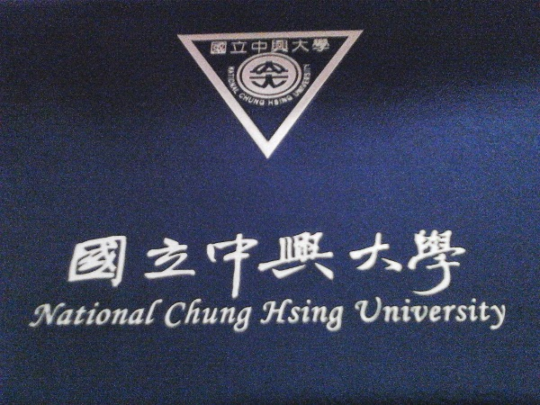

我支持大學自由調整學費
================================================================================

我個人十分贊同『高教學費由各校自行調整』，\
但前提是教育部必須把所有的補助經費，包含頂尖大學、教學卓越及各類形式獎補助、\
委辦計畫的錢全收回來。

然後以該年度 18 ~ 22 歲的青年人數及另外還在唸博碩班的學生數總合計算，\
平均分配所收回來的經費，直接發給中華民國國民。由他們自行評估學校辦學成果該不該花錢去買回來，\
不想再唸大學的，就拿著那筆錢去社會闖闖，或是去國外遊學，隨便他們。

而大學自己就擬好策略，自主經營，可以靠學費收入，或是輔以校友捐款都行，\
且也能對優秀學生自行決定多少的學費、生活費補助。

這樣的措施明顯對前段國立大學學生及後段排名大學不公平，但前者往往是家庭資源較豐富者，\
才會考上，是的，這就是教改後的結果，有錢、父母是公教人員的學生多能上前段國立大學，\
窮人、父母社經地位低的只能唸後段國立或是私立學校。\

這種重分配比 :doc:`刪軍公教退休人員福利 <../../../2012/12/13/eat_the_next_year_rice>` 合理，\
因為中華民國法律(不要跟我說教育部的行政命令有講，這都能改的)中，\
我沒看過那條法律是說小孩上大學時，學校學費不能在 4 年內調漲的。\
而每個適齡學生拿到的錢一模一樣就符合 **機會均等原則** 。

對後段大學來說，這措施不晢是早日敲醒喪鐘，只是少子化及學歷含金量低的現象下，\
早晚都得死，換個補助形式，後段大學或許還能一搏，\
畢竟它的學生所拿回來的補助款是會比它直接從教育部那邊拿到的還多，\
兩相權衡下，或許後段大學換個方式經營，搞不好就起死回生。

在這裡，我提供兩個不負責任的建議：

a. 轉型成派對大學，是的，學店不稀奇了，要百分百讓學生高興，那就是玩個痛快 4 年還有大學學歷可拿。
b. 與外國大學合併，依國人崇洋風氣如此之盛，讓學校名字變成聖"什麼"之類的臺灣分校，或許能改運。

.. author:: default
.. categories:: chinese
.. tags:: education, politics
.. comments::
