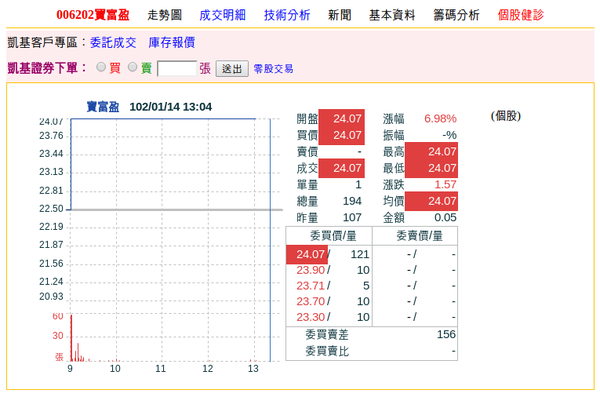

有看過債券基金漲停嗎?
================================================================================

    006202 寶富盈債券 ETF 今天漲停了! 本圖( 006202.png )包含 Yahoo! 奇摩股市網站內容，非屬 hoamon 創作。

前幾天就覺得很奇怪，為什麼 006202 的交易量變得比較大，流動性都出來了。今天(1/14)還漲停了。 \
Google 一下( http://www.ptt.cc/bbs/Fund/M.1358127045.A.ACA.html )，才知道上周元大寶來投信提了受益人大會，要投票表決清算事宜。

.. more::

`這裡 <http://mops.twse.com.tw/mops/web/t108sb30?encodeURIComponent=1&step=1&firstin=1&off=1&TYPEK=all&year=102>`_ 是\
召集受益人大會公告，議題是『終止「元大寶來櫃買ETF傘型證券投資信託基金之富盈債券證券投資信託基金」之證券投資信託契約。』

這代表若受益人投票同意清算，每張 ETF 約可以換回 25,820 元的現金，與今天漲停價 24.07 元相比，還有 7% ，大約 1800 元的套利空間。\
以此價位來看，筆者自 100 年 8 月至今，投資了 16 個月，約有 23% 的績效。\
報酬還不錯，但困惱的是未來沒有國內債券基金可買了，要我去郵局買 10 萬元的國家公債，\
我嫌太麻煩了。

元寶投信為什麼會在這個時候要清算 006202 ，除了公告中明白表示「流動性問題」外，\
我個人是覺得國內金融環境開始要面臨雙率雙升的問題，股票會比債券好。\
早點把錢從債換股，賺得比較多。

但只要談到預測，請看倌自動把筆者所言當作屁話，這只是筆者不負責任的評論。

.. author:: default
.. categories:: chinese
.. tags:: finance, investment, bond
.. comments::
