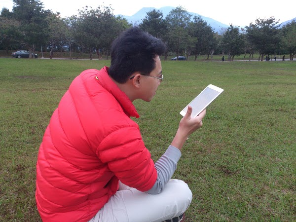

初三我在暨大看書
================================================================================

年初三跟著老婆家人到暨大放風箏。那真是一個風景優美的地方，與其他國內大學相比，\
我個人認為暨大最美，也最像美國大學城的感覺。在草地上用 iPad mini 看書真是不錯。

.. more::

.. figure:: http://www.ncnu.edu.tw/ncnuweb/units/share/130128_sa.jpg
    :width: 600
    :align: center

上面是暨大與日月潭風景區管理處合辦之『花賞茶事』活動。\
如果要到埔里、日月潭走走，也可順道拜訪一下 `國立暨南國際大學 <http://www.ncnu.edu.tw>`_ 。

這次過年看完了三本書：

 1. 不公平的代價： :doc:`心得一 <../../01/12/what_is_performance>` , :doc:`心得二 <of_the_1___by_the_1___for_the_1__from_the_price_of_inequality>`
 #. 金錢買不到的東西
 #. 反對完美

以及看了近 10％ 的 ○○ Bible 。這聖經並非宗教方面的書籍，但標題我得賣個關子，\
容後再向各位稟告。

今年也是我近幾年來，完全沒在年假工作的第一次。

.. author:: default
.. categories:: chinese
.. tags:: reading
.. comments::
