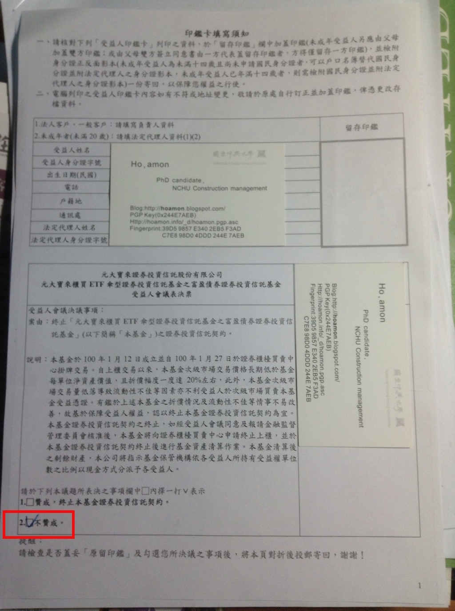

寶富盈(006202)的清算表決票
================================================================================

寶富盈(006202)的清算表決票要在 2013-02-25 以前回寄，而我勾了『不贊成』。

.. more::

原因很簡單，不靠寶富盈投資政府公債的話，\
我得去 `郵局買公債 <http://www.post.gov.tw/post/internet/fund/index.jsp?ID=902#01>`_ ，\
最低買額是 10 萬元，還不算高，但很麻煩，沒有網路交易，要去開戶，再拿本存摺回家，\
想賣的話，又得去郵局一趟。

看看同意票上的清算理由，主要是低流動性及高折價兩個，而這對我，一個被動投資人來說，\
並不在乎。本來，投資債券的期間就應該要比股票還長，而股票部份，被動投資的起跳值就是 5 年，\
債券當然更長了，所以低流動性，我是一點都不害怕。

高折價這個缺點則可視『清算可能性』而有所不同。這次一提出清算會議後，\
高折價就不見了，雖然目前市價在 25 元左右，距淨值 25.82 還有 3% 空間。\
但想想大部份時間的寶富盈都是在 20 元左右游走的，對很多已購買的投資人而言，\
這 3% 根本不算什麼。

我的建議是： 『在提出清算會議後，如果市價即趨近淨值，則想賣的人就利用次級市場交易把它賣了。\
如果這個把戲搞了幾次玩不下去，市價並不會跟著貼近淨值，那麼投資人再來投清算贊同票，\
把它確實清算，拿回合乎淨值的現金。』

.. author:: default
.. categories:: chinese
.. tags:: finance, investment, bond
.. comments::
