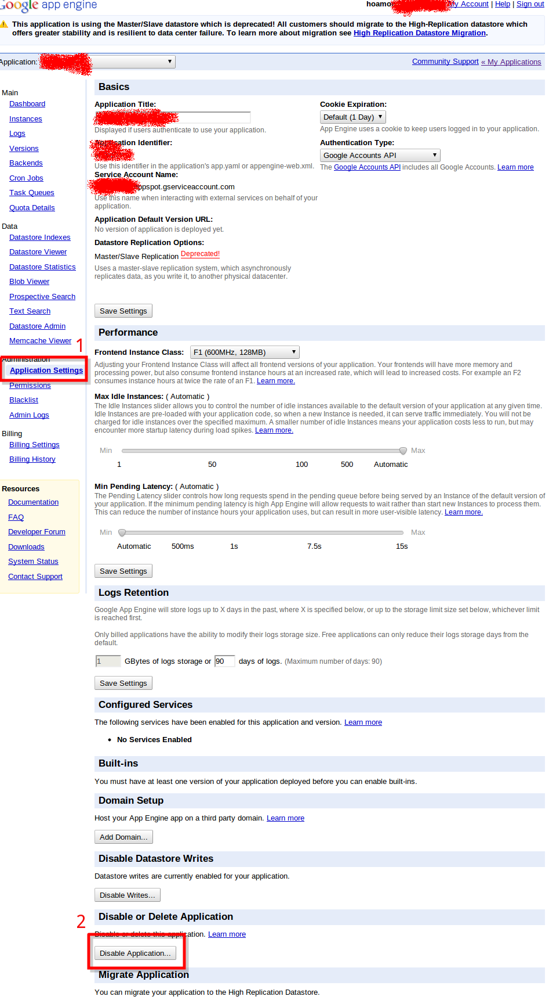
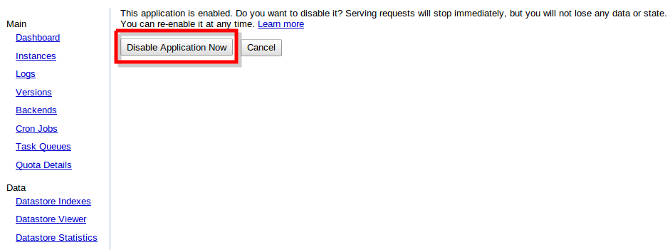
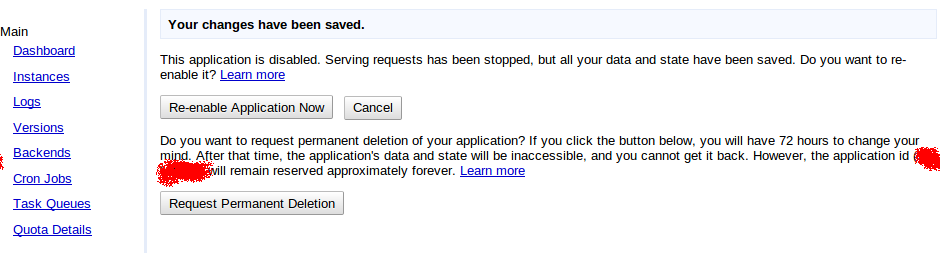
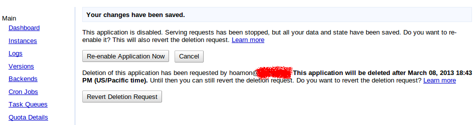

刪除 GAE 中的應用程式（application）
================================================================================

.. figure:: https://developers.google.com/appengine/images/appengine-silver-120x30.gif

    圖片來源： `https://developers.google.com/appengine/downloads`_

有朋友問我如何刪除 GAE 中的應用程式。因為每個人最多只能開 10 個應用程式，\
如果有不需要再用到的，當然還是把它刪一刪，不然，就要花 5000 USD 去買個無限量的資格。

.. more::

首先進到該應用程式的 dashboard 頁面：

點選左邊選單中的 Application Settings 連結，再按下下方的 Disable Application 按鈕。\
接下來出現下圖：

詢問你，是否真的要停用本應用程式？ 按下後，再出現下圖：

一個按鈕是給你「重新啟用」的，下一個按鈕則是給你「永久刪除本應用系統」的。\
按下「Request permanent deletion」，就會看到：

告訴你， Google 會在 3 天（72小時）後才正式刪除本應用系統，如果後悔的話，\
可以再回到前一個頁面，去作「Revert Deletion Request」的動作。超過 3 天，神仙也沒辦法了。

.. author:: default
.. categories:: chinese
.. tags:: google app engine
.. comments::
