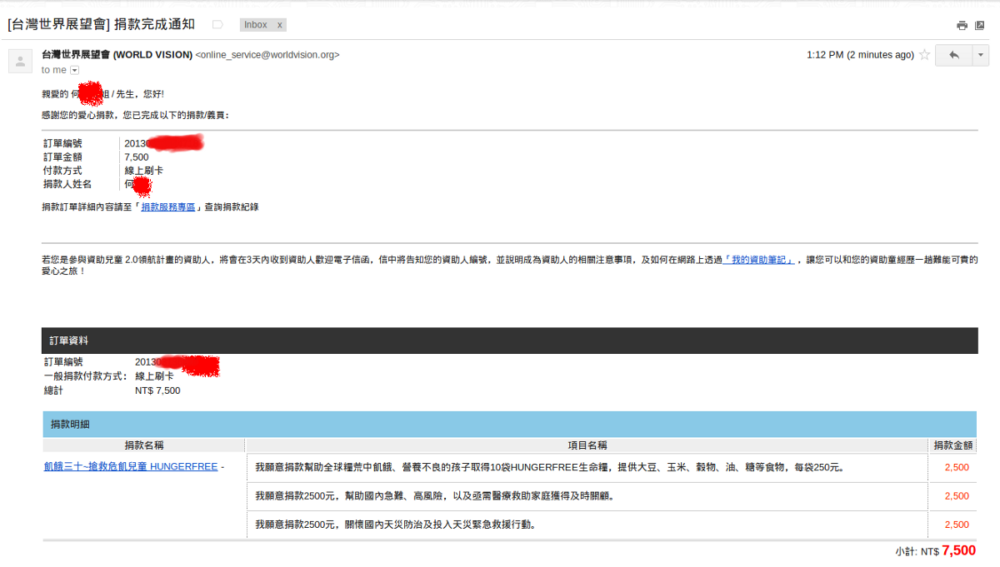

美國人也在世界飢餓
================================================================================

    捐款 7,500 元至世界展望會的收據

還記得我說過：『 :doc:`飢餓這武器比槍枝更有力？ <../../../2012/12/18/rights_of_people_own_guns>` 』，\
而去年我作了一個 :doc:`減稅手段 <../../../2012/12/15/2013_capital_tax_type>` ，\
這個 **"不義之財"** 剛好就拿來拯救飢餓了。任何一個重視生命的人，都會明白飢餓比較可怕，而不是槍炮彈藥。

.. more::

不過本文重點並不是要說我 **野人獻曝** 還是 **拋磗引玉** ，而是要講講 **美國也不見得是個好國家** 。

因為『 **不** 民主中國』的甲鳥霸個性，我時常會宣傳如果真要作統一的話，\
希望臺灣優先與民主日本、民主美國統一，而後才是民主中國，非必要是不跟『 **不** 民主中國』談統一的。

這論調似乎表明日本、美國是個好國家，而中國不是。但其實每個國家都有自己的問題，\
日本也深陷美中角力、 \
`低民族自信心 <http://big5.ce.cn/gate/big5/intl.ce.cn/qqss/201303/13/t20130313_24192918.shtml>`_ 、 \
`生活壓力大(自殺率是全球第 6 強) <https://zh.wikipedia.org/wiki/%E5%90%84%E5%9B%BD%E8%87%AA%E6%9D%80%E7%8E%87%E5%88%97%E8%A1%A8>`_ … 。\
而美國的貧富差距之大，是我們多數臺灣人難以想像的，\
國內媒體常在比較一個剛出社會的大學新鮮人要不吃不喝多久才能買到一戶 **帝寶** ，藉以證明臺灣貧富差距之大。\
而這種『不吃不喝』通常是假設，\
但很多美國家庭則已開始力行『 `部份不吃不喝 <http://www.worldhunger.org/articles/Learn/us_hunger_facts.htm>`_ 』:

    * In 2010, 17.2 million households, 14.5 percent of households (approximately one in seven), were food insecure, the highest number ever recorded in the United States 1 (Coleman-Jensen 2011, p. v.)
    * In 2010, about one-third of food-insecure households (6.7 million households, or 5.4 percent of all U.S. households) had very low food security (compared with 4.7 million households (4.1 percent) in 2007. In households with very low food security, the food intake of some household members was reduced, and their normal eating patterns were disrupted because of the household’s food insecurity (Coleman-Jensen 2011, p. v., Nord  2009, p. iii.) .
    * In 2010, children were food insecure at times during the year in 9.8 percent of households with children (3.9 million households.) In one percent of households with children,one or more of the children experienced the most severe food-insecure condition measured by USDA, very low food security, in which meals were irregular and food intake was below levels considered adequate by caregivers (Coleman-Jensen 2011, p. vi).
    * The median [a type of average] food-secure household spent 27 percent more on food than the median food-insecure household of the same size and household composition (Coleman-Jensen 2011, p. vi)..
    * Background: The United States changed the name of its definitions in 2006 that eliminated references to hunger, keeping various categories of food insecurity.  This did not represent a change in what was measured.  Very low food insecurity (described as food insecurity with hunger prior to 2006) means that, at times during the year, the food intake of household members was reduced and their normal eating patterns were disrupted because the household lacked money and other resources for food. This means that people were hungry ( in the sense of "the uneasy or painful sensation caused by want of food" [Oxford English Dictionary 1971] for days each year (Nord 2009 p. iii-iv.).

    from " `Hunger in America: 2013 United States Hunger and Poverty Facts <http://www.worldhunger.org/articles/Learn/us_hunger_facts.htm>`_ "

下面是我的 **不精準** 翻譯：

    * 2010 年， 1720 萬戶家庭，佔全美 14.5%（也就是七分之一）有飢餓問題，這是歷年來最高紀錄。
    * 2010 年, 在飢餓問題家庭中大約有三分之一（670萬戶，也就是 5.4% ）面臨極度飢餓問題（相較於 2007 年，這數據是 4.7% )。家庭成員的食物攝取量減少，也無法維持正常的飲食習慣。
    * 2010 年，飢餓問題的小孩所處家庭佔全美有小孩的家庭中，有 9.8% 的比率（共有 390 萬戶）。美國農業部並統計到有百分之一的有小孩家戶，其食物攝取量水準偏低，已在照顧者認知的合理水準以下。
    * 沒有飢餓問題的家庭中位數，相較有飢餓問題的相同成員家庭中位數其在食物上頭花費高於 27% 以上。
    * 背景： 美國聯邦在 2006 年修改飢餓問題的定義，以上數據無法表現測量工具本身的變化。在 2010 年的飢餓意義是人們的食物攝取量不足並缺錢補充其他來源的食物。

文章中並指出 2010 年時有 55% 的飢餓家庭接受一個或多個的聯邦食物及營養補給計畫：

    * Supplemental Nutrition Assistance Program (SNAP)
    * Special Supplemental Nutrition Program for Women, Infants and Children (WIC)
    * National School Lunch Program

而有 60% 的貧窮家庭的收入水準是每小時 6 ~ 8.5 美元（筆者向來評估美國薪水的方式，\
是直接除以 3 來對比臺灣收入，所以他們實際賺回來的時薪相當於新臺幣 60～ 90 元之間），\
而另外的 40% 的貧窮家庭是沒有工作收入的。

這報告說明了什麼？ 當美國人不是個個都能幸福美滿，不要看到川卜講著：『 You are fired 』！很豪氣，\
想到美國去當老闆，過著紙醉金迷的生活，也看看得踩著多少人的飢餓肚子呀。

就這飢餓問題來看，還是臺灣好。我們的 `食物銀行 <http://www.foodbank-taiwan.org.tw/a1/index.php?id=9>`_ \
數據提到不過是 2000 名兒童三餐不濟、 \
2192 名獨居老人（以 2,400,383/365/3 估算）、 3368 名街友及 40% 的弱勢兒童沒有正常飲食。\
總合數據，我猜飢餓人數應不超過臺灣人口的 1% （23 萬人）吧！

會發本文的目的，實是因為此文：『 `美監獄絕食事件 <http://accrcw75.pixnet.net/blog/post/49118078>`_ 』。\
感嘆部份沒能力、運氣的美國人會吃不飽，而部份有能力的人卻可以賤踏人權。

美國真的好嗎？ 雖然我用著美國機房的伺服器、讀著美國人寫的教科書/技術手冊、看著美國職業運動比賽。\
但我心裡依舊 :doc:`保持懷疑 <../../../2012/01/01/blog-post>` 。

.. author:: default
.. categories:: chinese
.. tags:: politics
.. comments::
