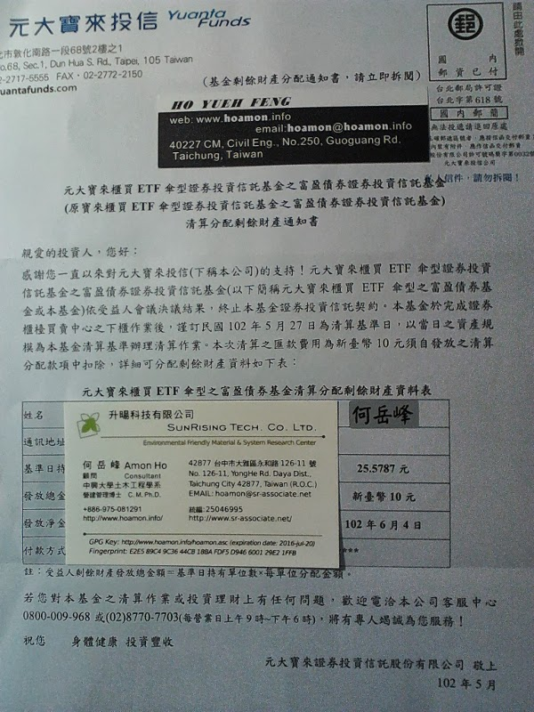
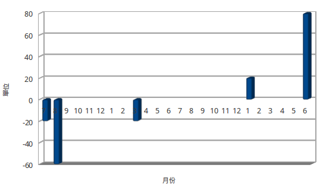

寶富盈(006202)於2013年5月27日清算
================================================================================

    元大寶來投信寄來的基金剩餘財產分配通知書

昨天接到元寶投信寄來的通知信，告訴我將在 6 月 4 日將寶富盈清算完的現金分配回來。\
每單位所分配的金額為 25.5787 元、匯款費用 10 元。結果算來這是一次很棒的投資。

.. more::

自 2011 年 7 月開始陸續買入 006202 以來，只賣出過 1 次受益憑證。\
而且還是在提案清算表決訊息發佈之後，該次所賣出的價位已在 25 左右。\
相較我的平均持股 20 元來說，已經很漂亮了。

下圖是我的投資現金流量情形:

橫座標是買入或賣出時間，縱座標是買入或賣出的量，負值為買入（現金支出），正值為賣出（現金收入）。\
以 :doc:`債券殖利率公式 <../../../2009/04/01/blog-post_28>` 計算這個現金流量情形，\
則我的 **年化報酬率為 15.65%** 。是的！ 我賺了不少\
（以率來看不錯，但以金額來看，還是買不起 :doc:`半臺車 <../../../2013/05/28/i_am_guilty>` ）。

不過，現在很困惱。國內已無其他方便的債券投資工具，\
因為 :doc:`郵局的買法 <../../../2013/02/17/vote_for_006202_settlement>` 實在不方便。\
而我又不想買其他國家的公債。

不買其他國家的公債是因為我是被動投資人，股債投資的目的是為了確保我的退休生活水準等同一般大眾的生活水準，\
我也不打算在國外度過退休晚年（至少現在是這樣想），所以就應將大部份的投資金額配置在主要退休生活地區的股債。

但現在國內公債投資管道變麻煩，而 `股票投資市場又快要變回不公不義 <http://udn.com/NEWS/BREAKINGNEWS/BREAKINGNEWS1/7936306.shtml>`_ ，\
使得我快要有 `第一世界憂鬱症 <http://www.youtube.com/watch?v=SIvE6qBcPaU>`_ 了。

畢竟我是工程師，還是要解決問題的，想了幾個方案：

1. **改投入** :doc:`REITs <../../../2011/11/01/reitreat>` : 它們本來就與證所稅無關，往後若有土地所得稅，我也很樂意繳納（是在清算時，由物業管理公司處理）。而且 **房地產收入性質也與公債較為接近** 。
#. **把錢全給老婆，由她代為投資** : `鍵人 <https://www.facebook.com/HKSocComic/posts/606322712714260>`_ 我因為多讀了點書，才知道「證所稅」是符合租稅正義的工具。但我老婆不知道，就由她全權管理我的財產，她良心過得去，而我退休生活有著落，這感覺滿好的。手法是從 **各大食品公司及各小美食攤販** 那邊學來的，『 **買原料，千萬別問它安不安全； 等出事了，再說自己也是受害者** 』，簡單講就是 **無知者無罪** 。
#. 錢先存下來，等 `人民幣債券 ETF <http://www.libertytimes.com.tw/2013/new/apr/18/today-e22.htm>`_ 在臺上市後再來投資。因為鍵人我也滿看好不久的將來中共與臺灣統一的趨勢(最近智財局所提的 `類 SOPA <http://zh.wikipedia.org/wiki/Wikipedia:%E6%8A%97%E8%AD%B0%E7%B6%93%E6%BF%9F%E9%83%A8%E6%99%BA%E6%85%A7%E8%B2%A1%E7%94%A2%E5%B1%80%E7%A0%94%E6%93%AC%E5%B0%81%E9%8E%96%E5%A2%83%E5%A4%96%E4%BE%B5%E6%AC%8A%E7%B6%B2%E7%AB%99%E8%A1%8C%E5%8B%95>`_ 法案，就是要與大陸長城接軌)，把錢放在人民幣上，並不違背我 **投資退休地區股債的原則** 。
#. 把錢省下來， **買一些花圈、花環** ，去祝福那些投票通過證所稅修正案的立院諸公們，感謝他們為大股東們盡心盡力。

不知各位看倌，比較喜歡那個方案？

.. author:: default
.. categories:: chinese
.. tags:: finance, liquidation, investment, bond
.. comments::
