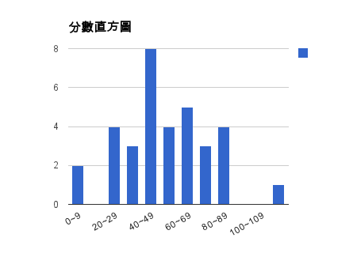
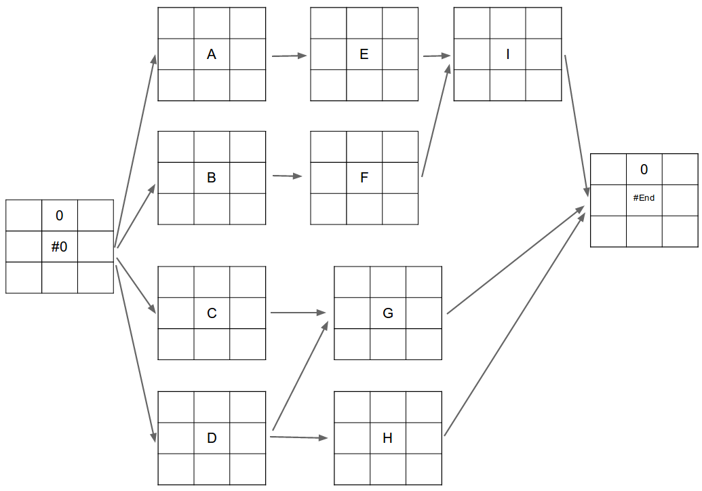
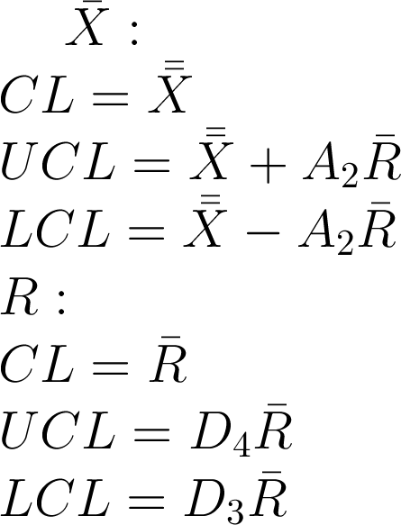

2013 年營建管理學期末考試題庫
================================================================================

前言
--------------------------------------------------------------------------------

    這是本次考試結果： 平均分數 53 分，標準差是 23 分

本文無意論證國內教育與國外教育的差距（並不是臺灣人辦的就會比較差）。只想聊聊一個問題： 誰逼你走進大學校門？

其實我是個不喜歡出題考試的人，我比較喜歡出作業。\
在高等教育中，受教育者要為自己的學習負責，有學到東西、沒學到東西都是自己的事。\
而考試是用來檢查「還有什麼東西是沒想懂的」，不是在預測「 `你的未來有多摧燦 <http://www.bqjournal.com/google-recuitment-tips>`_ 」。

    我老闆的立場是堅持維護傳統學院精神，不遺餘力地反對新學制，\
    講課時有機會就拿新學制來酸一下。在一門課，有學生下課後問他：\
    「您都不點名，這樣我們怎麼拿修課證明？」（他只需要修課的出席證明，而不需要成績。）\
    我老闆便在下一堂課公開宣布：「我的想法仍是老派的，我認為點名違反了學院自由，\
    我在這裡向您說，只要您告訴我一聲，您不需簽到，我就會給您修課證明。」\
    頓時台下全體敲桌喝采。

    然而台灣人也許會問：這樣學生蒙騙打混怎麼辦？傳統德式學院的回答會是： \
    大學生是成年人，應該為自己的決定負責，學院不能為他決定、也不能替他負責。 \
    引自 `論大學生燒成績單的可能性(Dscher-Han Huang) <https://www.facebook.com/notes/dscher-han-huang/%E8%AB%96%E5%A4%A7%E5%AD%B8%E7%94%9F%E7%87%92%E6%88%90%E7%B8%BE%E5%96%AE%E7%9A%84%E5%8F%AF%E8%83%BD%E6%80%A7/10151220848110388>`_

雖然我很想跟那位德國教授作一樣的事，不過，我只是兼任老師，明年學生回來就找不到我了。\
而現在臺灣的大學生多半是被父母逼來唸的。\
要他們自己想把作業作好、書讀好、學問求好，是不容易的。\
且這門課「營建管理學」是必修課，也可能有人打死都不想唸，只是因為要拿學分畢業的關係才只好坐在教室裡。

.. more::

想想既然臺下的學生多半是被迫坐在這裡，那為了不想讓同學浪費來學校的汽油錢、\
教室冷氣費、電燈費。所以我只好加碼推出「難作弊」的考試。題目中的數字是每一位同學都不一樣的。\
而且簡述題的總分只有 58 分，如果不認真想懂「營建管理學」中的隨便一個數學方法，那鐵定是不及格的。

雖然最後還是有的同學照樣沒有唸書。但我接受他自己的選擇。這種考法至少讓我可以公正地決定那幾位同學被當，\
而保護了其他有"多讀點書"的同學。

而最重要的是，我還把計算過程列出來，答錯了，沒關係! 看著老師的解法，想想看，為什麼？\
只要你願意想了，就對得起繳出去的學費了。畢竟二十歲的你，沒人能逼你走進學校大門吧！

試題說明
--------------------------------------------------------------------------------

**在本次考試中，請試著將自己代入營造廠商(甲等綜合營造業)的角色中。考題中，如無條件設定，請以效益最大化考慮。** \
請直接在試卷上作答。若有計算過程請列出，在答案計算錯誤的狀態下，會以計算過程作為次要評分條件。

可攜帶『營建管理學教科書』以及『全手寫筆記』入場考試。

.. raw:: html

    

廠商識別代碼
^^^^^^^^^^^^^^^^^^^^^^^^^^^^^^^^^^^^^^^^^^^^^^^^^^^^^^^^^^^^^^^^^^^^^^^^^^^^^^^^

請以個人學號推算出你的廠商識別代碼:

==================== ==== ==== ==== ==== ==== ==== ==== ==== ==== ==== ================================
       學號                    V    ?    ?    ?    ?    ?    ?    ?    備註
------------------------------ ---- ---- ---- ---- ---- ---- ---- ---- --------------------------------
乘以                                                    某   整   數
**等於**                                                     某   數
再加上                                        另   一   個   整   數
**等於你的廠商代號** 1    2    3    4    5    6    7    8    9    0    由左至右，依序為第1位、2位…
==================== ==== ==== ==== ==== ==== ==== ==== ==== ==== ==== ================================

範例如下：

==================== ==== ==== ==== ==== ==== ==== ==== ==== ==== ====
       學號                    V    1    2    3    4    5    6    7
------------------------------ ---- ---- ---- ---- ---- ---- ---- ----
乘以                                               1    0    0    1
**等於**             1    2    3    5    8    0    1    5    6    7
再加上                    9    8    7    6    5    4    3    2    1
**你的廠商代號**     2    2    2    3    4    5    5    8    8    8
==================== ==== ==== ==== ==== ==== ==== ==== ==== ==== ====

.. raw:: html

      <b style="color: red;">不說怕你不曉得。這張考題的答案是用 javascript 自動算出的，方便給你練習用。
     請輸入自定的廠商代號（以更新下方解答數據）</b>:
        <input id="input_number" value="2223455888" /> 
        <input id="calculate" type="submit" value="重新計算下方答案" /> (輸入完畢請點選按鈕。本功能只保證在 Google Chrome 瀏覽器可正常使用) 

營建管理目標( 4 分)
^^^^^^^^^^^^^^^^^^^^^^^^^^^^^^^^^^^^^^^^^^^^^^^^^^^^^^^^^^^^^^^^^^^^^^^^^^^^^^^^

(出處：頁 1)

使用現代化管理方法，有效利用人、機、料、資金等資源，以達成

|
______________ 、 ______________  、______________  、______________ 。

營建工程之生命週期（ 5 分）
^^^^^^^^^^^^^^^^^^^^^^^^^^^^^^^^^^^^^^^^^^^^^^^^^^^^^^^^^^^^^^^^^^^^^^^^^^^^^^^^

(出處：頁 2)

請說明你的企業在工程生命週期的各階段中，會從事什麼樣的作業。一個階段只須列舉一項作業。\
例如： 在「營造施工」中，須作好「成本控制」。

最大業主( 6 分）
^^^^^^^^^^^^^^^^^^^^^^^^^^^^^^^^^^^^^^^^^^^^^^^^^^^^^^^^^^^^^^^^^^^^^^^^^^^^^^^^

(出處：頁 4)

我國營造廠商的營收來源，其中大部份來自 ________ ，該單位最常見的發包工程案類型有那些？試列舉 5 種。

工程興建方式（8分）
^^^^^^^^^^^^^^^^^^^^^^^^^^^^^^^^^^^^^^^^^^^^^^^^^^^^^^^^^^^^^^^^^^^^^^^^^^^^^^^^

(出處：頁 13, 14, 89, 126)

試簡述何謂 BOT , 聯合開發，聯合承攬, 統包。

外籍勞工(4分）
^^^^^^^^^^^^^^^^^^^^^^^^^^^^^^^^^^^^^^^^^^^^^^^^^^^^^^^^^^^^^^^^^^^^^^^^^^^^^^^^

(出處：頁 19)

貴公司於承攬公共工程時，若能申請外籍勞工，請問你對「外籍勞工」的責任有那些？

營建業特性（6分）
^^^^^^^^^^^^^^^^^^^^^^^^^^^^^^^^^^^^^^^^^^^^^^^^^^^^^^^^^^^^^^^^^^^^^^^^^^^^^^^^

(出處：頁 23)

營建業於其他產業相異的特性為何，請簡述。

PCM（6分）
^^^^^^^^^^^^^^^^^^^^^^^^^^^^^^^^^^^^^^^^^^^^^^^^^^^^^^^^^^^^^^^^^^^^^^^^^^^^^^^^

(出處：頁 24)

何謂 PCM ？

公共工程(8分）
^^^^^^^^^^^^^^^^^^^^^^^^^^^^^^^^^^^^^^^^^^^^^^^^^^^^^^^^^^^^^^^^^^^^^^^^^^^^^^^^

(出處：頁 60, 67)

政府採購法中，規定的招標方式有那些？ 對貴企業而言，在招標時，應避免那些違法事宜，請列舉 3 項。\
又訂定單價分析表時，如何製作不均衡標？ 政府機關要如何避免此類情事發生？

合理標（10分）
^^^^^^^^^^^^^^^^^^^^^^^^^^^^^^^^^^^^^^^^^^^^^^^^^^^^^^^^^^^^^^^^^^^^^^^^^^^^^^^^

(出處：頁 86)

一機關採「合理標」發包工程案，而底價及各廠商出價如下，請問何家廠商得標，其標價為何？

========== ==== ==== ==== ==== ==== ==== ==== ==== ===================================
機關底價   （此為 2 千多萬的工程案）
---------- ---------------------------------------------------------------------------
審計機關   2                                       請代入貴企業的廠商代號 1 ~ 7 碼
主管機關   2                                       請代入貴企業的廠商代號 2 ~ 8 碼
主辦機關   2                                       請代入貴企業的廠商代號 3 ~ 9 碼
========== ==== ==== ==== ==== ==== ==== ==== ==== ===================================

有 5 家廠商投標：

========== ==== ==== ==== ==== ==== ==== ==== ==== ======================================
廠商標價   (大家出的標價從 1 千多萬到 3 千多萬）
---------- ------------------------------------------------------------------------------
A廠商      1         3                             請依序代入貴企業的廠商代號 1 ~ 6 碼
B廠商      2              4                        請依序代入貴企業的廠商代號 2 ~ 7 碼
C廠商      2                   5                   請依序代入貴企業的廠商代號 3 ~ 8 碼
D廠商      3                        6              請依序代入貴企業的廠商代號 4 ~ 9 碼
貴企業     2                             7         請依序代入貴企業的廠商代號 5 ~ 10 碼
========== ==== ==== ==== ==== ==== ==== ==== ==== ======================================

.. raw:: html

    計算結果： 

契約型態(10分)
^^^^^^^^^^^^^^^^^^^^^^^^^^^^^^^^^^^^^^^^^^^^^^^^^^^^^^^^^^^^^^^^^^^^^^^^^^^^^^^^

(出處：頁 100)

一工程契約項目如下：

==== ============ ========== ================ ================ ============================================================
編號 工料名稱     單位       數量             單價             備註
==== ============ ========== ================ ================ ============================================================
一   RC擋土牆     立方公尺   50 * □ =         400 * □ =        請依序代貴企業的廠商代號第 3 及 6 碼，若為 0 ，請改代 1
二   漿砌卵石     立方公尺   20 * □ =         200 * □ =        請依序代貴企業的廠商代號第 3 及 6 碼，若為 0 ，請改代 1
三   AC 路面      立方公尺   100 * □ =        300 * □ =        請依序代貴企業的廠商代號第 3 及 6 碼，若為 0 ，請改代 1
==== ============ ========== ================ ================ ============================================================

而工程實作數量如下：

==== ================ ========== ================ =================================================
編號 工料名稱         單位       數量             備註
==== ================ ========== ================ =================================================
一   RC擋土牆         立方公尺   50 * □ =         請代貴企業的廠商代號第 5 碼，若為 0 ，請改代 1
二   漿砌卵石         立方公尺   20 * □ =         請代貴企業的廠商代號第 5 碼，若為 0 ，請改代 1
三   AC 路面          立方公尺   100 * □ =        請代貴企業的廠商代號第 5 碼，若為 0 ，請改代 1
==== ================ ========== ================ =================================================

請分別計算在「總價承包契約」、「單價承包契約」、「數量精算式總價承包契約」、「成本報酬契約」下，營造廠商最終可從業主支領的總額為何？\
在 **「數量精算式總價承包契約中，AC路面為實做數量計價」** ； 而 **「成本報酬契約的管理費及利潤為總工程費的 3 ％」** 。

.. raw:: html

    計算結果： 

開口合約(2分）
^^^^^^^^^^^^^^^^^^^^^^^^^^^^^^^^^^^^^^^^^^^^^^^^^^^^^^^^^^^^^^^^^^^^^^^^^^^^^^^^

(出處：頁 104)

請說明何謂「開口合約」？

最低標之保證金(10分）
^^^^^^^^^^^^^^^^^^^^^^^^^^^^^^^^^^^^^^^^^^^^^^^^^^^^^^^^^^^^^^^^^^^^^^^^^^^^^^^^

(出處：頁 134)

========== ==== ==== ==== ==== ==== ==== ==== ==== ======================================
底價／標價 金額
---------- ------------------------------------------------------------------------------
機關預算   2    3    0    0    0                   請依序代入貴企業的廠商代號 2 ~ 4 碼
機關底價   2    0    0    0    0                   請依序代入貴企業的廠商代號 2 ~ 4 碼
A廠商      1    9    3    0              1         請依序代入貴企業的廠商代號 2 ~ 4 碼
B廠商      1    8         8    0         1         請依序代入貴企業的廠商代號 2 ~ 4 碼
貴企業     1         7         7         7    1    請依序代入貴企業的廠商代號 2 ~ 4 碼
========== ==== ==== ==== ==== ==== ==== ==== ==== ======================================

請計算出得標廠商是否有押標金（以5％為原則）、履約保證金（以10％為原則）、差額保證金、保固保證金（以5％為原則），及其金額為何？

.. raw:: html

    計算結果： 

仲裁（4分）
^^^^^^^^^^^^^^^^^^^^^^^^^^^^^^^^^^^^^^^^^^^^^^^^^^^^^^^^^^^^^^^^^^^^^^^^^^^^^^^^

(出處：頁 196)

何謂仲裁？

進度管制（50分。網圖計算到累計進度為三十五分。）
^^^^^^^^^^^^^^^^^^^^^^^^^^^^^^^^^^^^^^^^^^^^^^^^^^^^^^^^^^^^^^^^^^^^^^^^^^^^^^^^

一施工網圖如下：

其工期則由貴企業廠商代號計算得來，詳如下表：

==== ==== ==== ==== ==== ==== ==== ==== ==== ==== ========================================================================
工項 A    B    C    D    E    F    G    H    I    備註
---- ---- ---- ---- ---- ---- ---- ---- ---- ---- ------------------------------------------------------------------------
代號                                              請依序代入貴企業的廠商代號 1 ～ 9 碼
工期                                              依上列代號，遇奇數則工期為 3 ，偶數為 2 ，0 為 1 天
==== ==== ==== ==== ==== ==== ==== ==== ==== ==== ========================================================================

請計算網圖中工項的 ES, EF, LS, LF, TF, FF 及標示要徑工項。其中 TF 等於 LF - Duration - ES; \
FF 等於後續作業中最小的 ES - 自己的 Duration - 自己的 ES 。

==== ==== ==== ==== ==== ==== ==== ===================
工項 ES   EF   LS   LF   TF   FF   要徑工項請填 ○
==== ==== ==== ==== ==== ==== ==== ===================
A
B
C
D
E
F
G
H
I
==== ==== ==== ==== ==== ==== ==== ===================

契約預算(單位：萬）、施工預算(單位：萬）、趕工成本(單位：萬）、作業人員(單位：人）如下，\
且每個工項最多只能趕工一天。

======== ======== ======== ======== ========
工項     契約預算 施工預算 趕工成本 作業人員
======== ======== ======== ======== ========
A        60       30       55       4
B        180      150      175      3
C        120      90       110      1
D        60       30       55       4
E        240      210      220      2
F        60       60       65       4
G        60       30       55       3
H        60       30       70       1
I        180      150      155      5
======== ======== ======== ======== ========

請計算業主要求之累計進度數據：

============== ==== ==== ==== ==== ==== ==== ==== ==== ==== ==== ==== ==== ==== ==== ==== ====
工項\天數      1    2    3    4    5    6    7    8    9    10   11   12   13   14   15   16
============== ==== ==== ==== ==== ==== ==== ==== ==== ==== ==== ==== ==== ==== ==== ==== ====
A
B
C
D
E
F
G
H
I
小計金額
累計金額
累計進度％
============== ==== ==== ==== ==== ==== ==== ==== ==== ==== ==== ==== ==== ==== ==== ==== ====

假設業主允許廠商每施工 5 天可請款 1 次（提示： 第一次請款為第 6 天、最後一次請款為完工日後 1 天），\
撥款時間為請款後 5 天。且假定貴企業施工進度完全符合預定進度並完成驗收。\
而貴企業對下包及原料供應商採當日付現。在保留款為 5 ％ 、每日管理成本 5 萬的條件下，\
請計算貴企業的現金流量情形及本工程應備週轉金額。

現金流量表：

============== ==== ==== ==== ==== ==== ==== ==== ==== ==== ==== ==== ==== ==== ==== ==== ====
工項\天數      1    2    3    4    5    6    7    8    9    10   11   12   13   14   15   16
============== ==== ==== ==== ==== ==== ==== ==== ==== ==== ==== ==== ==== ==== ==== ==== ====
A
B
C
D
E
F
G
H
I
契約金額小計
累計契約金額
管理成本小計   5    5    5    5    5    5    5    5    5    5    5    5    5    5    5    5
支出金額小計
累計支出金額
請款金額
保留款金額
實際撥款金額
當日週轉金額
============== ==== ==== ==== ==== ==== ==== ==== ==== ==== ==== ==== ==== ==== ==== ==== ====

本工程應備週轉金額：

.. raw:: html

    

請列出趕工 1 天的方案：

======== ============ ================
工項     趕工天期     浮時減少天數
======== ============ ================
A
B
C
D
E
F
G
H
I
======== ============ ================

請列出趕工 2 天的方案：

======== ============ ================
工項     趕工天期     浮時減少天數
======== ============ ================
A
B
C
D
E
F
G
H
I
======== ============ ================

.. raw:: html

    

機具折舊（加分題 10 分）
^^^^^^^^^^^^^^^^^^^^^^^^^^^^^^^^^^^^^^^^^^^^^^^^^^^^^^^^^^^^^^^^^^^^^^^^^^^^^^^^

又為處理要徑作業，貴企業購入一批全新機具，其金額為要徑作業總成本的 40％ ，\
假定 1 年後（365工作天），該機具殘值為 0 ，試問，完工後，該批機具的折舊費為何？ \
(請用工作時間法)

.. raw:: html

    計算結果： 

品質管制（14分）
^^^^^^^^^^^^^^^^^^^^^^^^^^^^^^^^^^^^^^^^^^^^^^^^^^^^^^^^^^^^^^^^^^^^^^^^^^^^^^^^

下表為混疑土試體抗壓強度的檢驗結果，請以 2 個數值為 1 組製作 Xbar-R 管制圖，包含中間值及上下限。\
編號 11 ~ 20 的強度數據請依序代入貴企業的廠商代號。

=========== ====== ====== ====== ====== ====== ====== ====== ====== ====== ======
編號1~10    250    249    220    245    230    245    245    222    235    256
編號11~20   24□    23□    23□    25□    25□    22□    21□    26□    23□    24□
=========== ====== ====== ====== ====== ====== ====== ====== ====== ====== ======

使用公式如下：

管制係數如下：

================= ================= ================= =================
樣本大小（n）     A2                D3                D4
================= ================= ================= =================
2                 1.880             無                3.267
3                 1.023             無                2.574
4                 0.729             無                2.282
5                 0.577             無                2.114
10                0.308             0.223             1.777
20                0.180             0.415             1.585
================= ================= ================= =================

.. raw:: html

    計算結果： 

勞工職業災害（3分）
^^^^^^^^^^^^^^^^^^^^^^^^^^^^^^^^^^^^^^^^^^^^^^^^^^^^^^^^^^^^^^^^^^^^^^^^^^^^^^^^

(出處：頁 410)

請列舉 3 項勞工職業災害，並簡述之。

.. author:: default
.. categories:: chinese
.. tags:: construction management
.. comments::
