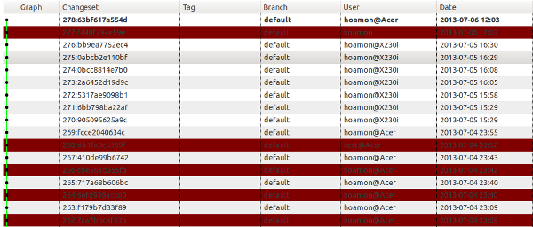
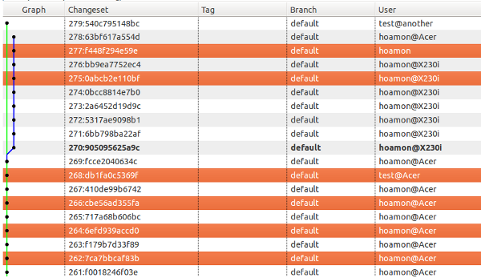

分散式系統中提供區域中心的訊息簽章
================================================================================

    紅底部份為合法 GPG 簽章的版本(changeset)

標題講得很複雜，但其實就是要方便有效率地作到 mercurial 版本的 GPG 簽章。

.. more::

在分散式系統中，編輯功能與認證功能往往是分離開的，如果兩者無法剝離，這代表它是不完全的分散式系統。\
目前我們(程式設計師)最常使用的分散式系統就是 mercurial (或是 git )，\
對一般人來說則是 Google Drive 、 Dropbox …之類的分散式檔案管理系統。

以 Google Drive 來說，各位在離線整理檔案時，斷無系統跳出「無法登入，禁止編輯」的警語吧！ \
如果有這樣的限制，那使用效率不是大打折扣。

一樣地， mercurial 也允許程式設計師可離線編輯程式碼、查詢版本歷史、提交程式碼…等。\
但因為是離線模式， mercurial 就無法與區域中心作帳號認證的動作(乃刻意為之，非不能也)。\
所以在提交程式碼時， mercurial 完全相信當下的使用者所決定採用的版本作者(username)，\
且在送出(push)時，就算使用者登入區域中心所用的帳號與版本作者(username)不同也能照樣 push 。

在這樣的鬆散架構下，編輯作者與版本送出者是徹底分離的，這麼作是有助於程式設計師專心於程式寫作，\
而不用費心管理區域中心的「權力結構」，並有助於程式碼版本(changeset)的流通。

簡單舉個例子： 我在 A 專案儲存庫中撰寫 af1234(changeset) 版本的程式碼，\
而我屬於 A 部門員工，在因緣際會下， B 部門也拿了 A 專案去使用並 fork 了 A' 專案，\
新專案由他們 B 部門員工自行作維護的動作。如果編輯作者需等於版本送出者，\
那麼在我沒有 A' 專案的送出權限下， B 部門所 fork 的 A' 專案勢必得為歷史版本中的作者資訊更新，\
雖 mercurial 預設不允許更動歷史版本的任何資訊，但可遶個路(mq)處理，這樣會造成額外工作量的增加。

所以說： **編輯作者與版本送出者是不應該強迫一致的** 。

但不強迫一致則會衍生另一個問題，如果我要惡整同事，只要在提交版本時，使用同事的帳號為作者，\
那該版本程式碼出事(有 bug ，或根本就是要盜取資料庫資料)，被砍頭的不就是那位同事嗎？

或許各位的職場伙伴們，大家都是好人，不可能會有人惡意栽臟他人。\
但制度的建立(政治制度也一樣)可不是期待都找到好人就一切萬事如意了。\
我們得假想大家都是壞人，以最壞的打算來建立制度。

要作到離線驗證版本就是某人所寫下的，自然無法依賴「與區域中心連線認證」這種作法。\
最好的辦法就是數位簽章： 利用自然人憑證、 PGP 錀匙對某段訊息(也就是程式碼版本)簽名。

中華民國的自然人憑證使用技術卡在「Windows(IE) Only」上，自然不會是我們的解決方案。所以我們就使用 PGP 技術。\
而 mercurial 也有與 GnuPG(Gnu出品的 PGP Open Source 工具) 結合的外掛，只要在 .hgrc 中設定：

.. code-block:: ini
    :linenos:

    [gpg]
    key = 29E21FFB
    key_url = "http://www.hoamon.info/hoamon.asc"
    #在簽章後順便在 hg 註解中放入公錀下載點

即可在 shell 中，執行：

.. code-block:: bash

    $ hg sign changeset_version

來為該 changetset_version 作數位簽章。這樣其他的同事就可用：

.. code-block:: bash

    $ hg sigcheck changeset_version

來驗證這個 changeset_version 是否是由 `29E21FFB <http://www.hoamon.info/hoamon.asc>`_ 這把錀匙所簽章的，\
是的話，就能百分百相信這個版本是由 YUEH-FENG HO(也就是何岳峰) 所作的。 \
PGP 原理請見 `舊文 <http://blog.hoamon.info/search?q=pgp>`_ 。

有了 GPG 外掛後，其他人的確可以確認某個版本是某個人所作的。但如果原本的儲存庫有 200 個 changeset ，\
那每個都要加上 signature ，不是就會暴增到 400 個 changeset 嗎？ 這不會太浪費空間了？

以上圖為例， 270 ～ 277 版中，我只對 277 版作 GPG 簽章，這是因為 8 個版本是我在同一時段內，連續寫下的。\
我既然簽章了 277 版，不也連帶認同它的 parent changeset 276 嗎？ 也連帶一路同意到 270 版。\
所以作 GPG 簽章不用一個版作一個，而是一批版本作一個就行了，而批的單位，我認為是兩次 push 之間。

所以每次在作 push 動作之前，先檢查自己有沒有在最新版上作 GPG 簽章，沒有的話就不准 push 。\
又如果在本機程式編輯到一半，需要把別人修好的程式 merge 進來前，也應該要檢查別人的版本是不是有作 GPG 簽章，\
如下圖：

我自己手邊作到 278 版，而同事(test@another)另外作了 279 版，\
那一樣為了要確認 test 同事得為 279 版負責，\
所以我在 merge 前，應該要作 $ hg sigcheck 279 ，如果 279 沒有簽章，\
就有可能代表它是某人的惡搞作品，萬萬不可 merge 進來。

如果 push 前及 merge 他人作品前，都有確實為自己的作品簽章及驗證他人作品的簽章，\
這樣整個儲存庫中的 changeset 就能確定沒有壞人在惡搞同事了。

但若是每次都要手動去簽章及驗證，不也是累人的事，\
而往往這些累人的事，就不會有好人去作了，因為 **好人很懶** 。\
所以我們應將這兩個動作自動化，寫成 hg_hook 程式。

如下是 hg_hook.py( :download:`程式碼下載 <hg_hook.py>` ) 的內容：

.. code-block:: python
    :linenos:

    #!/usr/bin/python
    import os, re

    def autosign(*args, **kw):
        u""" 檢查倒數第二版有沒有 GPG 簽章，有則略過
            無則視最新版作者為誰來處理：
                最新版作者為本人(同 hgrc[ui].username)
                則自動簽章。
                非本人則視有沒有 -f 參數來處理
        """
        print('HG Push Start...\n')

        author_name = kw['ui'].username()
        public_key_id = kw['ui'].config('gpg', 'key')
        public_key_url = kw['ui'].config('gpg', 'key_url')
        key_info = os.popen('gpg --list-public-keys %s'
                            %public_key_id).read()
        public_key_uid = re.search(r'uid\s+([^\n]+)',
                            key_info).groups()[0]
        print('Author Name: %s\n'%author_name)
        print('Public Key UID: %s\n'%public_key_uid)

        check_version = os.popen('hg log -r tip^'
                            +'--template "{node|short}"'
                            ).read()
        res = os.popen('hg sigcheck %s'%check_version).read()

        if public_key_uid in res:
            print('No need to sign GPG signature!\n')
            return False
        else:
            print('Head Changeset:\n')
            res0 = os.popen('hg tip -v').read()
            for line in res0.split('\n'): print('\t%s'%line)

            if (not re.search(r'\b'+author_name+r'\b', res0)
                and "push -f" not in kw['args']):
                print('The newest changeset is not yours\n')
                return True
            else:
                version = re.search(
                    r'changeset:\s+[0-9]+:([^\s]+)\s',
                                    res0).groups()[0]
                key_info = ("with id:%(key_id)s %(key_url)s"
                            % {'key_id': public_key_id,
                            'key_url': public_key_url})
                r = os.popen('hg sign '+version+' -m '
                            '"Added signature('+key_info+')'
                            +' for changeset '+version+'"')

                print('Done for %s\n'%r.read())
                return False

    def merge_sigcheck(*args, **kw):
        u""" 若使用者執行 hg merge -r 1234 ，
            則本函式會去驗證 1234^ (1234 的前一版)的簽章。
            若驗證成功，則 return False ，
            不成功則視有沒有傳入 -f 參數
                ($ hg merge -r 1234 -f)
                來 return False or True
        """
        type_version = kw['opts']['rev']
        merge_version = os.popen(('hg log -r %s^'
                            %type_version)
                            +' --template "{node|short}"'
                            ).read()
        res = os.popen('hg sigcheck %s'
                        %merge_version).read()
        if ' signed ' in res:
            return False
        elif ' -f' in kw['args']:
            return False
        else:
            print('changeset:"%s" has no GPG signature!\n'
                    %type_version)
            return True

並在 .hgrc 中設定如下：

.. code-block:: ini

    [hooks]
    pre-merge = python:/bin/hg_hook:merge_sigcheck
    pre-push = python:/bin/hg_hook:autosign

這樣使用者在作 hg merge 及 hg push 時， mercurial 會先去執行 merge_sigcheck 及 autosign 函式，\
當函式回傳 False 時，才會執行原本 mercurial 內部的 merge 及 push 動作，若回傳 True 則會停止執行。

.. author:: default
.. categories:: chinese
.. tags:: git, gnupg, hg, mercurial, pgp, python
.. comments::
