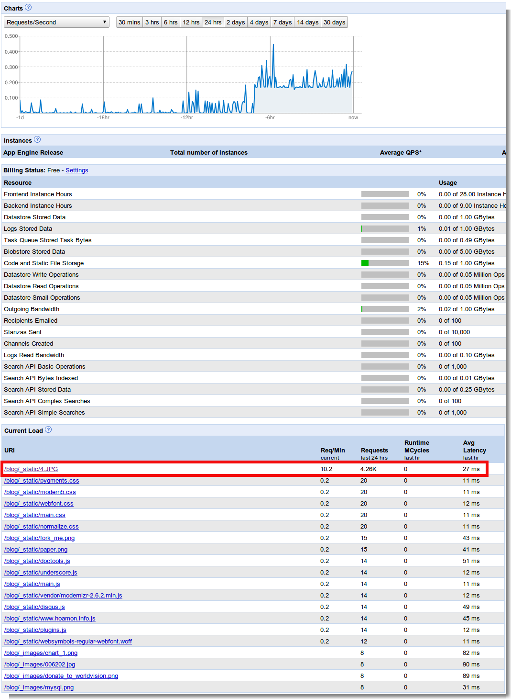
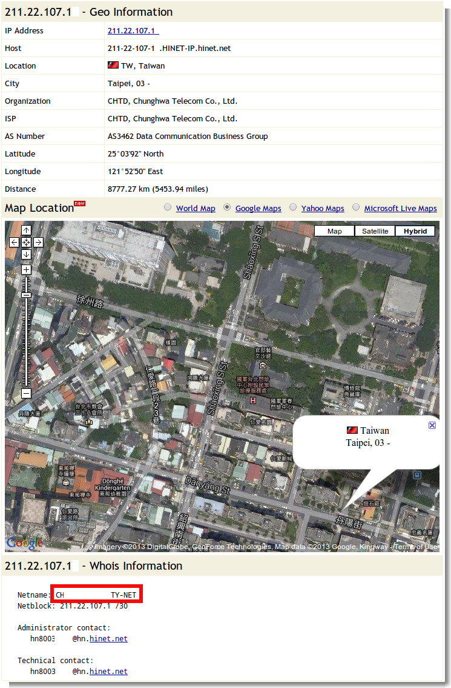

有人在攻擊我的站台或是中毒或…
================================================================================

    
    Google App Engine 的 Dashboard 頁面
    
大約是下午 2 點(2013-07-10)開始，一直在下載 http://www.hoamon.info/blog/_static/4.JPG 圖檔，\
每分鐘抓 10 次，已下載四千多次（到現在 21:30 為止)。

.. more::

.. code-block:: ini

    2013-07-10 21:29:13.504 /blog/_static/4.JPG 304 12ms 0kb
        Mozilla/5.0
        (compatible; MSIE 9.0; Windows NT 6.1; Trident/5.0)
    211.22.107.1X - - [10/Jul/2013:06:29:13 -0700]
        "GET /blog/_static/4.JPG HTTP/1.1"
        304 0
        "http://www.hoamon.info/blog/2007/02/01/pythonpdb.html"
        "Mozilla/5.0
        (compatible; MSIE 9.0; Windows NT 6.1; Trident/5.0)"
        "www.hoamon.info" ms=12 cpu_ms=0
        app_engine_release=1.8.1 

上面是 GAE 的 Log ，可以看到 211.22.107.1X 在抓 http://www.hoamon.info/blog/_static/4.JPG ，\
只是 GAE 一直回給它 304 。 `304 的意義 <http://www.aceblue.cn/post/374.html>`_ \
是拿瀏覽器跟伺服器所要的檔案與本身已瀏覽過的檔案相比，若其並未更新，\
則只須回傳一個 304 狀態來讓瀏覽器拿之前快取過的檔案來產生頁面即可。
    
奇怪的地方有兩個：

    1. 抓 4.JPG 前，所瀏覽的頁面應是 http://www.hoamon.info/blog/2007/02/01/pythonpdb.html ，但它並沒有相對應的被下載次數
    #. 瀏覽器有乖乖地丟出自己瀏覽過檔案的最後更新時間，這代表它並不是刻意要花費伺服器資源
    
既然想不通，就找找看有沒有對方 IP 的聯絡方式，用 `whois 服務 <http://cqcounter.com/whois/>`_ 查了一下：

果然有發現。該 IP 應是某個 Hinet 固定制的商業用戶所有，因為它的網段為 /30 ，這代表它可以領到 4 個 IP ，\
已去信 HN8003....@hn.hinet.net 告知。希望它們有注意到這個問題。

.. author:: default
.. categories:: chinese
.. tags:: ddos
.. comments::
