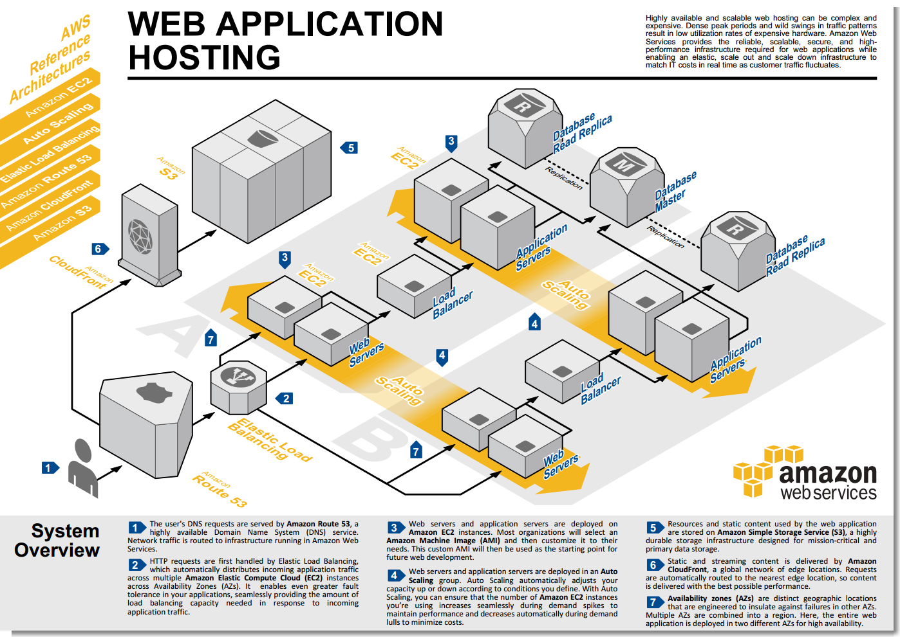

AWS 問題: ELB 會強迫切斷用戶與 EC2 的連線 
================================================================================

    
    此圖為 Amazon 所製的 Web 服務架構建議，著作權非 hoamon 所有 

當 `ELB <http://aws.amazon.com/elasticloadbalancing/>`_ 結合 `Auto Scaling <http://aws.amazon.com/autoscaling/>`_ 使用時， \
在 `CloudWatch <http://aws.amazon.com/cloudwatch/>`_ 觀察 `EC2 <http://aws.amazon.com/ec2/>`_ \
instance 的 CPU 、網路輸出入…(可自定)低於一下限值後，可自動停止某台 EC2 instance ，\
並刪除它的 `EBS <http://aws.amazon.com/ebs/>`_ 資料。聽起來有 Auto Scaling 真棒，\
也這樣才有雲端運算的感覺： 『人多自動開機器，人少自動關機器。』 

結果很扯的是：『 **ELB 少了一個關鍵功能** 』。\
而且 `這個問題 <https://forums.aws.amazon.com/thread.jspa?threadID=61278&start=0&tstart=0>`_ 已存在 2 年半之久，\
直到最近， AWS 員工才出來說要 `確定問題 <https://forums.aws.amazon.com/message.jspa?messageID=459078#459078>`_ 。\
很難相信，這是 AWS 的處理方式。

問題是怎麼發生的？ 

.. more::

ELB 的作用即是把使用者瀏覽網站的需求連線，隨機分派到不同的 Web 伺服器，如果 ELB 知道某個 Web 伺服器壞了，\
就會把它從備選名單中移出，並把 **新的** 使用者連線需求分派給其他還活著的 Web 伺服器。\
前句之所以強調 **新的** ，就是因為問題發生在 **舊的** 連線。 ELB 認定 Web 伺服器只有 2 種狀態： \
好的(就連)； 壞的(就斷)。沒有中間模糊地帶，像是： 『未來不能連，但目前舊的連線要保持』這種狀態。

而 Auto Scaling 的功能是利用 CloudWatch 判斷有沒有機器是閒置的(所謂閒置可能是 CPU 在 40% 用量以下，\
也不一定是無用戶連線)，有閒置它就會執行停機指令。它的停機指令也只有『立即停機』這種指令，\
而沒有『請等到舊連線全中斷後，才自行停機』的功能。

後者的問題好解決，只要寫一個 Script ，讓 EC2 自己判斷舊連線全斷線後，才自砍就行了。\
但前者的問題沒解決，後者的解法就是個屁，因為 ELB 還是會一直丟新連線過來，\
那這台 EC2 要等到什麼時候才會自殺呢？ \
(註： 自殺，不能解決難題；求助，才是最好的路。求救請打 1995 (要救救我) )\
而要 ELB 不丟新連線過去，就必須先通報自己不能用了，可這樣 ELB 會連舊連線也一起殺。

所以這問題的源頭就是 ELB 。

釐清問題不難，今天我第一次看到這個討論串，大概就猜是這問題了。只是沒想到 AWS 的反應居然可以拖 2 年多。\
該討論串中還有 `一篇 <https://forums.aws.amazon.com/message.jspa?messageID=445788#445788>`_ 說它們的服務每月有 60 億條連線數，\
他都很想出走了。 **我這個最近才想要使用 Auto Scaling 的人，怎麼辦呢？**

.. author:: default
.. categories:: chinese
.. tags:: amazon, aws, load balancer, http, web
.. comments::
