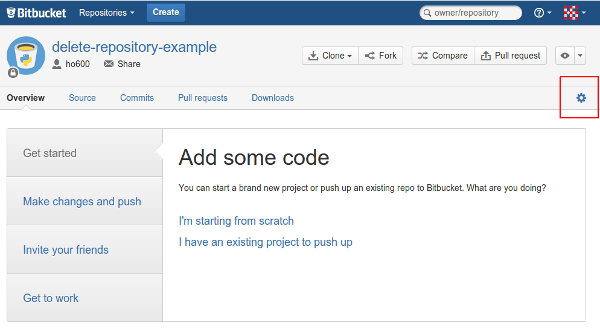

如何刪除 Bitbucket.org 上的專案或是移除專案成員
================================================================================

既然 :doc:`Bitbucket 那麼佛心 <../../../2012/12/10/bitbucket_billing_plan>` ，\
開再多專案( repository )都不用加錢，管理費用比 `GitHub.com <https://github.com/>`_ 低很多，\
但人氣就是比不上 GitHub.com 。不過，我還是喜愛 Mercurial 勝過 Git ，\
在 GitHub.com 上的專案也都是使用 `hg-git <http://hg-git.github.io/>`_ 外掛操作。

.. more::

因為 Bitbucket 開專案不用錢，不管是公開或是私有的都免費，所以常常一有靈感就開專案，\
結果時間過去了，往往夢想還沒達成，這熱情已經不見了。空留下一個專案的名字在那，\
看了就傷心，不如把它刪了。

首先是進入管理頁面：

    這個按鈕是專案管理者才看得到的

點選左邊選單的「Delete repository」：

.. figure:: delete-repository-example02.png
    :width: 100%
    :align: center

按下「Delete repository」按鈕並再次確認即刪除本專案。

又如果你是要移除專案參與者，那麼就點選管理頁面中的「Access management」，\
點選要移除的帳號右邊的叉叉就能移除參與者，如下圖：

不過刪了之後，是否讓你的付費等級可以調降，這倒不一定。\
請詳見 :doc:`Bitbucket.org 的付費計算方式 <../../../2012/12/10/bitbucket_billing_plan>` 。

.. author:: default
.. categories:: chinese
.. tags:: bitbucket, python, mercurial
.. comments::
