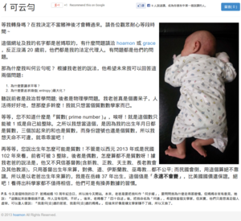

女兒的網站: 我是云勻
================================================================================

    http://www.hoyun2.info/ 網站快照

女兒出生時就買了為期 10 年的網址： http://www.hoyun2.info/ 。\
都過了快 4 個月了，直到今天才有空整理。會幫她這麼早就申請個網址，\
無非是希望她能愛上寫作以及能勇於表達，這些不過是我的眾多期待中的小小部份罷了。

.. more::

這網站用的技術不多，純 HTML 的靜態網站，用了三項工具:

1. Bootstrap: 前端 css/js 框架
#. Amazon S3: 網頁檔 Hosting serivce
#. Jenkins: 發佈伺服器

本來是要跑在 http://bitbucket.org/ 的 Hosting Service 上，不過它不讓我把 hoyun2.bitbucket.org 轉成 www.hoyun2.info ，\
只好放棄。

.. author:: default
.. categories:: chinese
.. tags:: hoyun2
.. comments::
