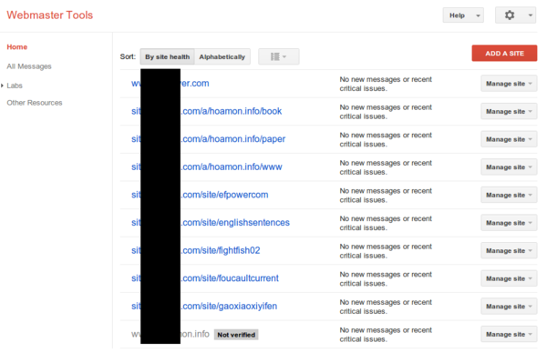
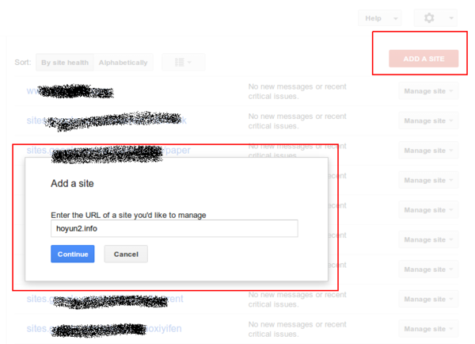
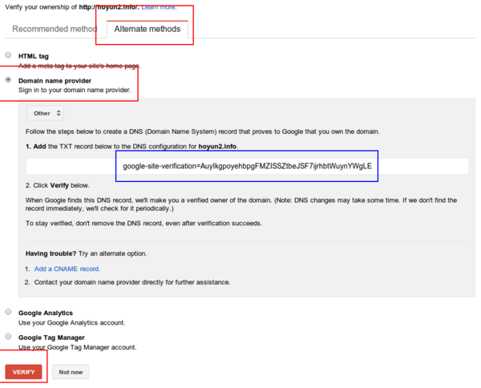
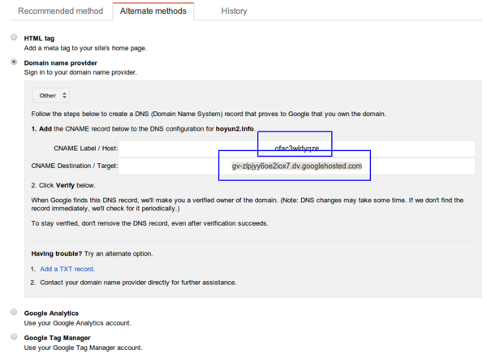
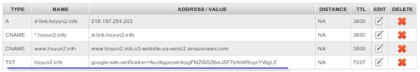
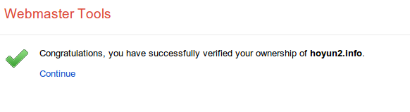

採用靜態網頁為個人或公司門面網站( Google Cloud Storage 篇)
================================================================================

過去架一個內容系統，多是使用動態語言( `Perl <http://www.perl.org/>`_ / `PHP <http://php.net/>`_ \
/ `Python <http://www.python.org/>`_ / `Ruby <https://www.ruby-lang.org/>`_ )跑在 \
`Linux <http://www.linux.org/>`_ 、 `Apache <http://www.apache.org>`_ / \
`Nginx <http://nginx.org>`_ 、 `MySQL <http://www.mysql.com/>`_ / \
`PostgreSQL <www.postgresql.org>`_ 上面。\
只要拿到好上手的 `CMS(Content Management System) <http://en.wikipedia.org/wiki/Content_management_system>`_ ，\
這對一個系統管理員而言，不是難事。問題是它對伺服器的要求會高了點：需要有動態語言、資料庫的支援，\
又如果你的站台是熱門網站，那上傳頻寬、負載平衡都會是不小的問題。

.. more::

還好近年來因為 `Disqus <http://disqus.com>`_ 的流行，\
讓內容管理系統有了不一樣的戰局，什麼是 Disqus ? 請見我文章下方的留言板，那就是個活生生的範例。\
對個人或一般企業網站而言，發佈內容的變動性其實不高，又如果發佈內容是不分權限，任何人都可以讀取的，\
那這跟使用純靜態網頁又有什麼不同! 此時的 CMS 功能除了『可以讓人留言討論』外，\
就是『提供一個母版，讓內容發佈後，只會改變該改變的地方』，前者幾乎已被 Disqus 取代，\
某些 CMS 系統早已內建使用 Disqus plugin 。

而針對後者，如果你不嫌麻煩的話，讓『只會用 Dreamweaver / Frontpage 的美工』\
(這是對比於懂 html/css 源始碼的 UI 設計師)處理，\
一樣可以得到美美的以及三不五時某些母版連結失效的內容頁面(通常都發生在只會用所見即所得網頁編輯工具且不具細心的美工身上)。

如果你真的想解決『三不五時某些母版連結失效』的問題，那就使用內容生成工具來變通也成。\
花點力氣，使用 `Django <https://www.djangoproject.com/‎>`_ + `medusa <https://github.com/mtigas/django-medusa>`_ \
來寫個靜態檔案生成系統，如：我客戶的未來新官網： `綠大地 Chang Mao <http://tawww.bio-enzyme.com/>`_ 或\
使用 Open Source 的文件生成系統 `Sphinx <http://sphinx.pocoo.org/>`_ (用在我的 `個人網站 <http://www.hoamon.info/>`_ ) \
或 Sphinx + `Tinkerer <http://www.tinkerer.me/>`_ (用在我的 `部落格 <http://www.hoamon.info/blog/>`_ ) \
還是乾脆改成純手工的一頁式網頁，像是我女兒的網站： `亻可云勻 <http://www.hoyun2.info>`_ 。

在有了靜態網頁後，要解決的問題就是『網頁檔案要放在那裡』? 所幸在這個『雲端運算』喊的價響的現在，\
我們擁有一大堆的解決方案： `Google Cloud Storage(GCS) <https://cloud.google.com/products/cloud-storage/>`_ 、\
`Amazon Simple Storage Service(S3) <http://aws.amazon.com/s3/‎>`_ 、 \
`Content delivery network(CDN) <http://en.wikipedia.org/wiki/Content_delivery_network>`_ + \
`Dropbox <https://www.dropbox.com>`_ … 。

本文要介紹的是 GCS 的設定，後兩者待有時間再續。

大致流程如下：

1. 驗證 root domain 的所有權(如果你想設定的網址是 www.hoyun2.info ，那它的 root domain 就是 hoyun2.info 。
2. 把 www.hoyun2.info CNAME 到 c.storage.googleapis.com 。
3. 開設 www.hoyun2.info BUCKET ， BUCKET 就是放置靜態檔案的最上層資料夾。
4. 設定 www.hoyun2.info BUCKET 裡面的檔案為 public-read 。
5. 上傳你的靜態檔案(如果不嫌棄的話，可以先拿我女兒網站的 `檔案 <https://bitbucket.org/hoyun2/hoyun2.bitbucket.org/get/tip.zip>`_ 頂著用)。
6. 設定 www.hoyun2.info 的 index 及 404 NotFound 頁面的檔案名稱。

其中 1 只能用瀏覽器設定， 2 是看你的域名商， 3 ~ 5 可用瀏覽器也可以用 gsutil 設定， 6 則是一定用 gsutil 設定。

1. 到 Google Webmasters 驗證 root domain
--------------------------------------------------------------------------------

請到 `Google Webmasters <http://www.google.com/webmasters/>`_ 頁面，登入後可看到下圖：

    列表的是已驗證或待驗證的網站

按下「 Add A Site 」，可看到小視窗出現：

    輸入你想驗證的 root domain

我的域名商( `Namesilo.com <http://namesilo.com/>`_ )比較小間，所以不在 Google 的快速驗證清單內，\
但也沒關係，可選擇 Altermate methods > Domain name provider > Others (這種是通用的，不管那一間都成)，\
其中的 TXT 或 CNAME(點選「 Add a CNAME record 」) 方式都可以。

    藍色框內的文字是要貼到你的 Domain provider 的管理頁面中

DNS 設定完成後，建議過 5 分鐘後，再點選「 VERIFY 」按鈕。

若選的是「 CNAME 」的設定方式，則會出現 Label / Destination 兩個欄位：

下圖是我的 DNS 設定頁面，如果是 GoDaddy 或是其他域名商，\
其 TXT > Name 的部份，通常是寫 @ (@ 在 DNS 規格中就是 root domain 的意思)。

5 分鐘後，按下「 Verify 」後，如果沒有問題就可以看到下個畫面：

2. 把 www.hoyun2.info CNAME 到 c.storage.googleapis.com
--------------------------------------------------------------------------------

一樣是到域名商的 DNS 管理頁面設定。請在 Name/Lable 的地方填寫 www ，\
在 Destination/Target 的地方填 c.storage.googleapis.com 。

3. 開設 www.hoyun2.info BUCKET
--------------------------------------------------------------------------------

進入 https://cloud.google.com/console/project > Projects 。先開設專案，\
這裡的專案，其功能是包含 `Google App Engine <https://developers.google.com/appengine/>`_ 、 \
Google SQL 、 Compute Engine 、 Cloud Datastore …等，不過，現在我只介紹 Google Cloud Storage 。

專案開立後，請進入該專案，並在 Settings 中 Enable Billing ,　有啟用 Billing ，才能使用 GCS 功能。\
完成後，點選左邊選單的 Cloud Storage ，在 Storage browser 中，可見到「 New BUCKET 」的按鈕，\
這裡是開 BUCKET / 刪 BUCKET / 上傳檔案、資料夾的地方。

不過，我要介紹的是 gsutil 的用法，請點選 Storage browser 下面的 Project dashboard ，\
如果有看一個 Enable 的藍色按鈕，請用力點下去\
(沒點的話，可是連上面的 Storage browser 都不能用，這似乎是 Google 的 bug ，或是說頁面的控制流程沒寫好)。\

Storage Access Enable 後，再點選左邊選單中的 Interoperable Access ，裡面有 gsutil 所需的 Key/Secret ，\
Key 的格式如： GOOGOFBWWW?????????? ，而 Secret 格式長得像： UoFYgFtqY??????????SLR3b??????????jYEcMz 。\
請保管這組 Key/Secret ，不然別人就能靠這組 Key/Secret 生個 BUCKET ，讓你幫他付帳單。

3.1 安裝 gsutil Tool
^^^^^^^^^^^^^^^^^^^^^^^^^^^^^^^^^^^^^^^^^^^^^^^^^^^^^^^^^^^^^^^^^^^^^^^^^^^^^^^^

`gsutil <https://developers.google.com/storage/docs/gsutil>`_ 的 Linux 裝法，就是 sudo pip install gsutil ，\
而 Windows 的話，請先安裝好 `Python2.7 <http://www.python.org/download/>`_ ，\
再到 http://storage.googleapis.com/pub/gsutil.zip 下載 zip 檔，\
解壓縮到你喜歡的資料夾，如： C:\\gsutil> 。

3.2 設定 gsutil
^^^^^^^^^^^^^^^^^^^^^^^^^^^^^^^^^^^^^^^^^^^^^^^^^^^^^^^^^^^^^^^^^^^^^^^^^^^^^^^^

使用你的命令列工具，進入 C:\\gsutil> ，執行下列指令(在 Linux 下，請把 python 去掉，就是只要 gsutil config )：

.. code-block:: dos

    C:\gsutil> python gsutil config

    Please navigate your browser to the following URL:
    https://accounts.google.com/o/oauth2/auth?scope=https%3A%2F%2Fwww.googleapis.com
    %2Fauth%2Fdevstorage.full_control&redirect_uri=urn%3Aietf%3Awg%3Aoauth%3A2.0%3Ao
    ob&response_type=code&client_id=123432566777.apps.googleusercontent.com&access_t
    ype=offline
    In your browser you should see a page that requests you to authorize gsutil to a
    ccess
    Google Cloud Storage on your behalf. After you approve, an authorization code wi
    ll be displayed.

    Enter the authorization code: 4/SFVQ???????????????????????????????XjMIoI333dWiA
    XXXXXXX????

    Please navigate your browser to https://cloud.google.com/console#/project,
    then find the project you will use, and copy the Project ID string from the
    second column. Older projects do not have Project ID strings. For such projects,

    click the project and then copy the Project Number listed under that project.

    What is your project-id? YOUR_PROJECT_ID

    Boto config file "C:\Users\hoamon\.boto" created. If you need to use a
    proxy to access the Internet please see the instructions in that file.

它會要求你先到 https://accounts.google.com/o/oauth2/.... 這個網址去瀏覽，登入你的 Google 帳號，\
並開放權限，就能看到一個 token: 4/SFVQ???????????????????????????????XjMIoI333????dWiAXXXXXXX ，\
貼回命令列，按下 Enter ，\
再要求你提供「欲控制的專案ID」，這樣就完成了 C:\\Users\\hoamon\\.boto 設定檔的設定。

你也可以不要使用 gs_oauth2_refresh_token 的認證方式，改用上述 3.1 的 Key/Secret ，請在設定檔中加上：

.. code-block:: ini

    gs_access_key_id = GOOGOFBWWW??????????
    gs_secret_access_key = UoFYgFtqY??????????SLR3b??????????jYEcMz

3.3 創建 BUCKET
^^^^^^^^^^^^^^^^^^^^^^^^^^^^^^^^^^^^^^^^^^^^^^^^^^^^^^^^^^^^^^^^^^^^^^^^^^^^^^^^

.. code-block:: dos

    C:\gsutil> python gsutil mb gs://www.hoyun2.info

gs:// 後面則是 BUCKET 名稱。

4. 設定 www.hoyun2.info 內的檔案為 public-read
--------------------------------------------------------------------------------

有兩種設定方式，一種是設定權限的預設值：

.. code-block:: dos

    C:\gsutil> python gsutil setdefacl public-read gs://www.hoyun2.info

另一種是上傳檔案後再更改權限：

.. code-block:: dos

    C:\gsutil> python gsutil -m setacl -R -a public-read gs://www.hoyun2.info

5. 上傳檔案
--------------------------------------------------------------------------------

可整站上傳：

.. code-block:: dos

    C:\gsutil> python gsutil cp -R -a public-read C:\hoyun2-hoyun2.bitbucket.org-b96cbcf8d4d9\* gs://www.hoyun2.info

也可針對某資料夾上傳：

.. code-block:: dos

    C:\gsutil> python gsutil cp -R -a public-read C:\hoyun2-hoyun2.bitbucket.org-b96cbcf8d4d9\static\* gs://www.hoyun2.info/static

6. 設定 index 及 404 NotFound 頁面的檔案名稱。
--------------------------------------------------------------------------------

.. code-block:: dos

    C:\gsutil> python gsutil setwebcfg -m index.html -e 404.html gs://www.hoyun2.info

打完收工。

.. author:: default
.. categories:: chinese
.. tags:: google cloud storage
.. comments::
