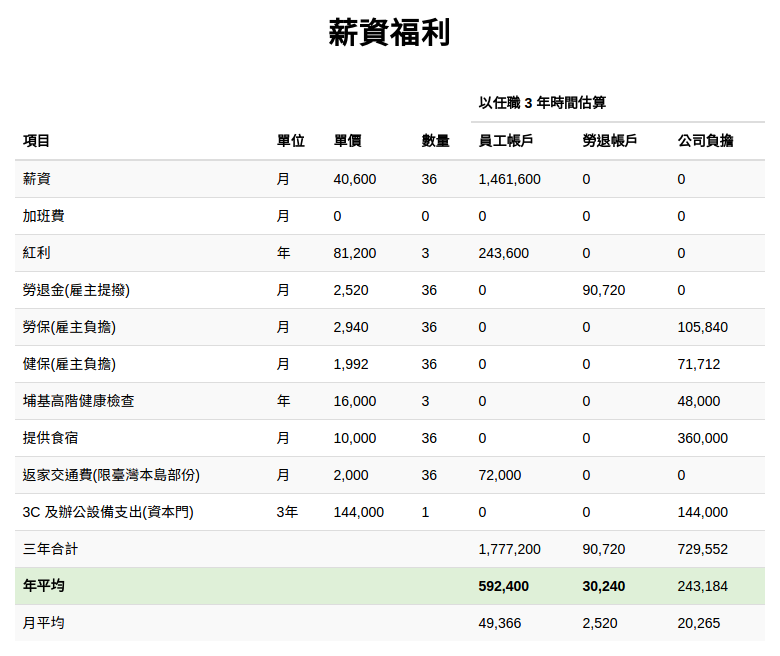

為什麼給一個在埔里工作的軟體工程師如此高的薪水?
================================================================================

    年薪:60萬+ ; 每週工時:40小時- ; 週休 3 日; 學歷/科系/性別/年齡/...: 不限;

標題是敝下夫人給我的問題。所以好吧! 不解不行，請看下去我是如何求解的。

.. more::

下面是幾個軟體工程師傳聞的收入情形：

* 比爾．蓋茲每秒賺進 250 美元，每 1 工作小時，約合新臺幣 48 萬，依敝司月工作時數來算，其月薪約 7680 萬新臺幣。
* 唐鳳為蘋果工作時，每 1 工作小時領 1 塊比特幣，約合新臺幣 2 萬 5 ，依敝司月工作時數來算，其月薪約 400 萬新臺幣。
* 賴瑞．佩吉、謝爾蓋．布林、馬克．佐伯格的年薪都是 1 美元，換算成月薪約是 3 元新臺幣。

以上這些人雖然不是只作軟體工作，但他們都曾經擔任過程式設計師的工作，拿來作參考依據雖不中亦不遠已。

而敝司開出來的價碼有落在中間，看起來也算是個可行解。那為什麼不開月薪 400 萬呢? 或是 200 元呢?

前者原因是敝司沒打算、也沒能耐去請大神級的軟體工程師來幫忙，如果我有錢花 400 萬/月，那我會請自己就好了； 後者原因顯而易見地與中華民國勞動基準法衝突，自然不能考慮。

這樣求解範圍已縮小到 2 萬 2 至 400 萬之間。

現在來跳一下探戈，聊聊「營建管理的四個目標」。『使用現代化管理之各種方法，並有效利用人力、機具、材料、資金等各種資源，以達成提升品質、降低成本、縮短工期、確保安全等目標之管理，稱為營建管理』(林金面，營建管理學，2012)，而敝下再抖個一斗膽，把前輩的語句，加上兩個字，改成「使用現代化管理之各種方法，並有效利用人力、機具、材料、資金等各種資源，以達成提升品質、降低成本、縮短工期、確保安全等目標之管理，稱為營建**專案**管理」。因為我在中興大學土木工程學系營建管理組中是學到了「營建工地管理」、「營建專案管理」、「營建公司管理」、「營建業管理」，廣義的營建管理應包含這四項。

「確保安全」的目標，在我上大學時，並未包含到。還好，發生了眾多的工傷意外，所以我們的課本改版了。「提升品質」、「降低成本」、「縮短工期」、「確保安全」這四個目標彼此是互斥的，若是多重視點「確保安全」，勢必安全帽要多買幾頂，安全網、護欄、圍籬、安全警示牌要多裝一些，工人要定期參加安全衛生講習，成本得多花、工期得加長。若是品質要多提升，那灌漿後養護時間要拉長，若是遇到鑽心試體強度不足(總有意外)，就要拆除重作，這些措施都免不了花錢花時間…

那真的沒辦法在營建專案上，又作到「提升回質」、「降低成本」、「縮短工期」同時又「確保安全」嗎? 有的，從「現代化管理之各種方法」來著手。

工法變革能讓四個目標同時躍階。在研究所期間，正是我國興建第二高速公路及高速鐵路的期間，二高施工比一高施工多採用了幾種新式橋梁工法： 節塊推進、支撐先進、懸臂法，而高鐵又多了全跨預鑄。這些施工法的採用，大大地拉高橋面板的離地距離，提升使用者的乘車舒適性。預鑄讓混凝土可以保持穩定的品質、少用了場撐鷹架，成本變少、工期加快，而這些工法的特性也都讓施工現地的參與工人數量變少，於是人就沒死那麼多了。

談到施工人數變少的事，就不得不提一個故事。指導教授曾邀請一位施工機具租賃公司的老闆來介紹支撐先進，他提到作客戶租後服務時，就會遇到明明一套設備的施工人數只需要 10 ~ 12 人，但設備上面就是會擠了 20 多位工人。他向業主詢問，業主會說這些工班都是長期合作的，不好意思讓他們沒工作做，反正用了這套設備己大幅縮短施工期及省得很多假設工程了，多花的人事費，他當作人情回饋。這位先進就會跟業主提醒，多花的人事費他沒意見，但每套設備都有最適工作人數，超過的不止可能拖慢施工速度，最大的問題是安全性，工人也需要有安全的施工空間，人多這平均施工空間就少，反而容易造成傷害。

探戈跳完了，把「營建專案管理」換成「軟體專案管理」來討論，兩者相較，「軟體專案管理」少了「確保安全」，多了「規模擴縮」，畢竟寫軟體，除非過勞，不然很少會遇到人身意外。而軟體系統容易在規模作漸進式調整，雖然某些營建專案也是可以作分期式規模擴充，像是高速公路段可以先作到埔里，等將來比較有錢，或是地方團體確認環保評估後，再作進盧山，甚至通到花蓮；或是住宅建案可分多期推出。分期規劃在營建專案上本身就是一種專案了，而不會像是「軟體專案」本身內建的一種目標。

舉我先前所寫的電商系統來說，業主不需要等它功能完備才上線，而是達到滿足一定程度的業務需求就上線，下列是該專案大略里程碑：

1. ○ 單頁式銷售頁+貨到付款及 PayPal 刷卡付款
#. 訂單管理
#. 管理員管理
#. 商品管理
#. 其他銷售平台訂單整合管理
#. ○ 聯盟行銷會員管理
#. ○ 公告管理
#. ○ 電子報管理
#. 購物車管理
#. 聯信刷卡
#. 頁面更新套版
#. 統計管理
#. 未完待續…

前有 ○ 者，代表在未開工前的需求訪談時，業主明確指出的規格。系統在第一步驟完成，就上線開賣了，之後的步驟就是看訂單量以及業務單位本身需求來擴充。這就是軟體本身的特質，更新版本在導入 CI 後只需 10 分鐘不到就完成了，所以在設計時，分期施工幾乎都是必經之路。而對營建專案來說，往往改一個版(非指變更設計)，重置本身就花一堆時間及成本了，例如： 老屋裝修，不算構想、設計的時間，光是要動工前，把傢俱清空、牆版剝皮、移除水電管路…就要花了 10 天以上。

所以在一個「規模擴縮」已定的軟體專案下，其「提升品質」、「降低成本」、「縮短工期」的目標是彼此互斥的，要想同步躍階，非得依賴「現代化管理之各種方法」。

在營建專案中，一個工人想要使用創新工法，往往成不了事，拿前文的支撐先進設備來說，得要有另外 9 ～ 11 個人也這麼想，還要老闆肯花錢租賃，才能換新工法。若是採用預鑄工法，則製品皆由工廠製作，現地施工需要的是吊車及吊裝指揮、電焊工等，模版工、鋼筋工都不需要了，這還造成職業的洗牌。

在「軟體專案」中，軟體工程師的工法升級多是看自己造化。從我打定主意走資訊這一行(2003)時，就用了 CVS ，後來換了 subversion, svk, hg ，到現在的 git (不是說 git 比 hg 好，只是為了跟別人協同工作，而 git 比較多人用罷了)，只要我願意升級就升級，沒人攔得住我。可笑的是，現在(2016)我還是會遇到不用版本控制器的程式設計師，這樣他跟對日抗戰的大刀隊長有什麼兩樣。

因為工法創新對軟體工程師而言，多只是關乎個人而已，就不會被別人影響(被拉低平均)，好軟體工程師的生產力可以是爛軟體工程師的百倍以上，這裡的爛單指的是有心無腦的，那種有腦黑心的工程師就不提了。因為軟體工程師的生產力差別程度如此極端，這反而給了雇主好處，對百倍級的工程師，他薪水可能只需開出平均值的 20 倍，甚至 10 倍、 5 倍就請到了。當然也可能有無腦的雇主認為請 100 個平均(庸)值工程師比花 5 分之 1 薪水的 1 個百倍級工程師來得划算，覺得人多擺出來就好看，那我也只能說就只有「好看」而已。

人月神話這本書告訴我們：『人多嘴雜難作事』。 100 個平庸工程師的總生產力是遠低於 1 個工程師生產力的 100 倍。

花一樣多的錢在比較少的軟體工程師上會比較划算。以敝司第一份工作開出來的薪資福利來看，可以請 3 個領 22k 的軟體工程師，但這 3 個工程師的總生產力是不容易高於只請 1 個工程師的生產力。當然，有可能找到能力超高，但不知社會事只要求 22k 的工程師，不過，他作著作著總會懂得自己被剝削了，如果還不跑，我都嫌他笨了。敝司對員工的要求不是只要會寫程式而已，目標是在 3 年後，自己獨當一面作老闆，如果當員工時，就一直被老闆吃豆腐，當他代表我去跟業主談需求時，不被業主吃豆腐的可能性極低。

在探戈到現在，我只論述了錢愈多，找到單一工程師的生產力值愈高，那還是沒有說明為什麼是 5 萬這個數字。

因為我在解釋的過程中，忽然明瞭了，我把大家不知道的邊際條件都說完了。

.. author:: default
.. categories:: none
.. tags:: none
.. comments::
