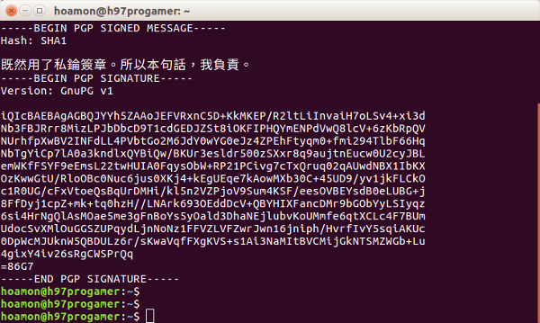

可匿名的公平筆試網站上線了
================================================================================

    既然用了私錀簽章。所以本句話，我負責。

再次廣告： `敝司徵才網站 <https://jobs.ho600.com/i2/>`_ ，主要語言： \
Python(Django) / Javascript ，主要平台： Ubuntu Linux on AWS ，年薪是 60 萬以上，\
敬請瀏覽指教。

搭配徵才網站的筆試系統，其述求重點在於 **完全匿名** 下，允許應聘者與考試委員準確交流。

就目前的信箱服務來說，如果在註冊新帳號時，\
完全給 **假的資訊** ，不也是很容易就可以拿到一組信箱來作為 **匿名考試** 的工具嗎? \
然則就算全部用假資訊來註冊，\
現今的信箱服務也往往會要求作手機號碼的驗證，無法完全匿名，\
於此，若是在筆試網站上是要求應聘者須提供個人信箱，來作為試題往返的管道，\
不免還是會洩露部份個人資訊，假使我能駭進他的信箱伺服器的話。\
另外給假資訊的方法，難免有違反信箱系統的會員使用條款，敝司不過是要徵個才，\
何必讓人落得作了個欺騙的動作呢?

況且，將匿名責任交由應聘者自行處理，成果也會參差不齊，\
如果有人就是大刺刺地用了 i_am_linus@gmail.com 的信箱來應聘，\
我是該信還是不信呢? 畢竟他透露出獨特資訊，\
這對我還是會造成錨定效應。

話說重頭，敝司徵才為什麼要搞得這麼複雜???

.. more::

因為敝司的經營理念是『在合法的前提下，謀求股東、員工、客戶利益的最佳平衡點』。

徵才活動自然要符合國家法律，雖說我們選出來的立法委員，素質也是參差不齊，\
但好歹這也反應了我國全體公民之素質，國法還是要遵守的。\
以 `就業服務法第 5 條 <http://law.moj.gov.tw/LawClass/LawSingle.aspx?Pcode=N0090001&FLNO=5>`_ 來說，\
現今的人力銀行徵才方式，敝下是覺得過了頭，一個應聘者得填了多少資訊在履歷上，\
像是有幾個爸爸、幾個媽媽、對社會的期待…，有的人沒話說了，還到 Google 那找範本貼，\
貼了別人的過往，如此過多的資訊秀給企業看，別的不說，\
就拿「語言、出生地、性別、年齡、婚姻、容貌、五官」來說，\
應聘者的履歷多半都會透露出這些資訊，要企業不看到也難，\
然後再要求企業須以 **公正的眼光** 來篩選人才，要說「能作到無歧視」，這只能檯面上說說而已，\
骨子裡，難以取信他人。

所以這對成天在幫業主分析、設計、實作、營運系統的敝司來說，不啻是個顯顯身手的機會。

系統分析如下:

    1. 邊際條件:

        1. 符合就服法第 5 條，且敝司創辦人不信任敝司考試委員能以「無歧視角度」看待應聘者履歷
        #. 專以「應聘人在專業能力上的答覆」為評選依據

    #. 系統需求:

        1. 完全遮罩應聘者的個人資訊，也就是無須提供現實世界的真實資料，但通過考試後，要能驗證參加筆試的應聘者與面試的應聘者為同一人
        #. 不用 Email/Phone/Messages 工具(或多或少會透露真實世界的資訊)，但應聘者與考試委員一樣有一順暢的溝通管道

    #. 解決方法:

        1. 用 pgp 公私錀作應聘者認證，信箱由筆試網站隨機決定。考題與答案的交流，皆以應聘者生成的 pgp key 作加密及簽章
        #. 註冊時，應聘者繳交一組以 md5 編碼過身份證號相關數字的 14 碼字串，供未來驗證真實身份

    #. 運作流程:

        1. 應聘者先申請帳號，帳號乃以 md5 函式隨機生成的 32 字元字串加上 @exam.yueh-cake.com 而成
        #. 應聘者須以該帳號生成一對 pgp 公私錀，公錀上傳筆試網站，並妥善保管私錀
        #. 應聘者與考試委員溝通的專屬網址是 https://exam.yueh-cake.com/jobs.at.ho600/<pgp 信箱>-<pgp ID>/ ，無須額外的帳號密碼認證，因為網址的設定一部份取決於系統隨機生成，一部份取決應聘者隨機生成，而且傳輸的考題、答案皆有經公錀加密，只要應聘者保護好自己的私錀，則答案就不會被他人篡改
        #. 就「軟體專業考核」來說，考題、答案皆能以純文字來述明，因此在該專屬網頁內，置一 <textarea> 區塊，就足以達成應聘者與考試委員的順暢交流

    #. 系統優點:

        1. 不使用網站帳密驗證，而使用 pgp 作身份驗證的優點在於，前者為中央式驗證模式，如果敝司所設計之系統有 bug ，則該匿名的應聘者將難以繼續作答，使用後者作驗證時，若敝司所設計之系統有 bug ，則應聘者仍可將「溝通訊息」以自身公錀+考試委員公錀加密簽章後，以匿名方式 po 到敝司安裝的 Disqus 討論區中
        #. exam.yueh-cake.com 網站上僅提供 JS 加密上傳的功能，解密方法由應聘者、考試委員自行下載加密檔後，在自身電腦解密，此可降低私錀遭他人盜用的風險
        #. 敝司實際為業主營運的系統，就帳密、操作參數…等機密資訊部份，皆使用 pgp 作加密後才加入版本控制器，因此一位符合敝司需求的工程師，懂得 gpg 工具是必要的。筆試網站以 pgp 驗證為主要操作依據，可藉此篩掉對 pgp 無興趣、無能力之優秀工程師，為敝司考試委員在工務繁忙的環境中，取得一點點喘息的時間

整個筆試網站以 MIT 授權發佈，詳見 `bitbucket 儲存庫 <https://bitbucket.org/ho600/exam-yueh-cake-com/>`_ 。

最後，再補上幾個個人想法:

1. 往往在徵才廣告上，可以看到企業主註明「無誠勿試」，這四個字於敝下來說，就是個「屁」字代表，不過花個一點錢，就相信應聘者會帶著誠意上門，你信不信我不知道，反正我是信不了。而我為了應聘員工，在百忙之中，還是專程寫了個筆試網站來跟應聘者交流，我先展現了誠意，也希望應聘者能賞個臉，回我幾題，大家就技術交流交流。
#. 人力銀行的使用便利性，讓應聘者「省事地」投履歷，當然這也是因為現今大環境中好的工作不多，只能靠亂槍打鳥來爭取錄取率，然則這亦造成了人資部門的生產力耗損，得從數十、數百、數千份履歷中挑出個鑽石、黃金，甚或是白銀，來給需用單位考試，於是過勞的人資人員，只能從「學歷、經歷、自說自唱的專業能力…」等狹隘的指標著手，努力地希望挑個好貨來交差，此時人資的 KPI 與需用單位的 KPI 可能發生衝突了，人資交出「台清交成」學歷的應聘者給需用單位面試，但需用單位當初開的徵才條件不見得符合應聘者的屬性，等需用單位回絕應聘者，再向人資抱怨時，人資只會攤手說: 「我都拿台清交成學歷的人才給你面試，還不夠，那是你條件開太高了，我也沒辦法」，需用單位也只能摸著鼻子走人，單竟在大公司體制下，需用單位沒法直接踫到應聘者，都得靠人資轉介。這也是某些科技公司會喜歡用內部推介的管道，因為內部人先幫你篩過技術條件、未來期望，而不被人資涂毒過，自然對得上需用單位的口味。
#. 敝司多搞了個筆試網站來給「應聘者麻煩」，看起來是欺負應聘者，然而事實證明，到目前為止也就 8 個人來註冊筆試網站(懂得運用 GPG )， 4 個通過筆試(會寫 Django )， 1 個通過面試(會想數學)拿到工作，錄取率有八分之一，比當年敝下考研究所的錄取率還高呢，來何六百工作真得不難。

.. author:: default
.. categories:: chinese
.. tags:: hire, puli, python, ubuntu, amazon web service, aws, django, javascript, pgp
.. comments::
