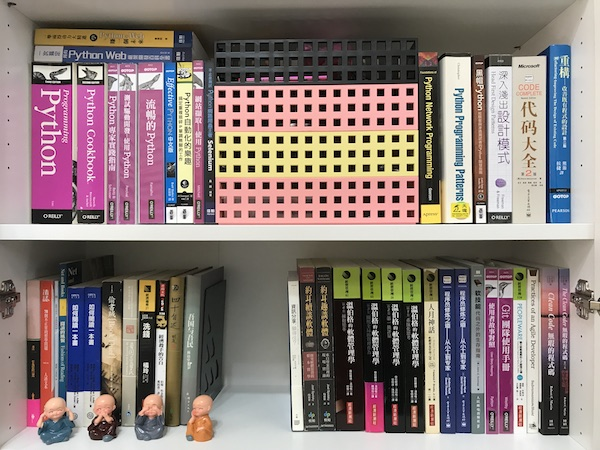

唷喔! 你憑什麼能管理軟體工程師?
===============================================================================

    工商廣告: **敝司持續徵求全端工程師，主要語言： Python(Django) / Javascript ，主要平台： Ubuntu Linux on AWS ，月薪是 2.5 ~ 8.5 萬之間，敬請瀏覽指教** `敝司徵才網站 <https://jobs.ho600.com/i2/>`_ 。

就像歷史一樣，看得短點的人，跟看得長點的人，所分析出的結論會不一樣。

不同時期認識我的人，對我也會有不同的看法。目前主要把人生花在軟體工作上，\
在這邊所接受到的回饋會比較多，等將來把時間多花在政治工作上，\
相信也會有不少人質疑我，年輕時不是個民進黨狂熱支持者，怎麼現在完全不一樣了!

回到標題的問題上，在大學時期以前就認識我的人，都會知道我讀的是土木工程學系，\
是一個誤把土木系當土地開發系的傻蛋，在百般懕惡力學下，\
大學時期的教科書讀的是二二六六。\
我無法求解靜不定結構、測量平差、滲透流量…，甚至在大學三修流力後，也還是到博士班時，\
才從碩班學弟口中聽到水錘現象。

因此當我開了軟體公司，聘請員工後，就常面臨老朋友們的一項質疑: 『唷喔! 你憑什麼能管理軟體工程師?』

這裡先簡單回答: 「我沒這能力。」但如果看倌有點時間的話，就請繼續看下去，了解一下 **「一個沒能力管理軟體工程師的人，究竟是憑什麼?」**

.. more::

這個問題的根源，並不在我本身的經歷上，而是廣泛出現在社會中，\
這就是所謂的 **標籤主義** 。看到土木兩字，\
即假定學的只有「陶土」及「木工」兩種學問。完全忽略，\
早期土木系教授們因為非英文系、中文系畢業，誤把 Civil Engineering 翻成土木工程學系，\
而非民生工程學系。後者的意義為「讓人民活著的工程學系」，聽起來不是偉大多了! \
另一種反例，即是「農業機械工程學系」，\
現代人覺得「農」不長進，所以就給它改了個「生物產業機電工程學系」的名字。

社會上，多數人都是靠短短不到 10 字的系名來推想 4 年百來個學分的課程內容，\
擁有著言簡意駭的認知模式。

尤有甚者，在暨大擔任行政助理時，曾在工餘之際到圖書館閱讀一本「圖書資訊學概論」。\
作者在序中，就委婉地把他/她在大學執教的行政經驗小小地抱怨一下，\
故事發生在他/她在準備創辦研究所的校內審查會議中，有來自資訊相關科系的審查委員，\
劈頭就問你們的學生有修習到任何程式設計、演算法、離散數學、…的課程嗎? 沒有的話，\
憑什麼在系所名稱上加上「資訊」兩字!

嘿嘿~ 學資訊的人無法海納各方資訊。這資訊，我們認識到了。

過去，我遇到這些疑慮時，也都會詳細講講我是如何踏入軟體開發、系統管理的經歷，\
學過什麼組合數學、軟體工程、網路概論、…的東東，但是現在我懶得講了，\
就直言我沒有能力，只會照抄別人的作法，\
不過抄的也不是什麼阿沙不魯的腳色，他可是我的偶像: \
`Joel Spolsky <https://en.wikipedia.org/wiki/Joel_Spolsky>`_ \
( `周思博 <https://zh.wikipedia.org/wiki/%E5%91%A8%E6%80%9D%E5%8D%9A>`_ ) 。

Joel 是耶魯電腦科學系畢業的高材生，做過微軟 Excel 的程式經理，也創辦了幾家軟體公司，\
目前是 Stack Exchange Network 及 Fog Creek Software 的執行長。

在我還沒有聘請其他軟體工程師之前，就是學著他的文章來管理自己。 \
Joel 有一篇著名的文章: \
`約耳測試: 邁向高品質的12個步驟 <http://chinesetrad.joelonsoftware.com/Articles/TheJoelTest.html>`_ 。\
它是提升自己生產軟體品質的準則。 Joel 提到: 『大部份軟體組織都只拿到2或3分』。而敝司的分數如下:

1. 你有使用原始碼控制系統嗎?
    * 有的。從 RCS, CSV, SVN, SVK, Mercurial 到現在的 Git ，我使用版本控制器的歷史近 20 年了。
#. 你能用一個步驟建出所有結果嗎?
    * 有的。目前使用 Jenkins + Bash script 。
#. 你有沒有每天都重新編譯建立(daily builds)嗎?
    * 有的。周一到周五上班日自動編譯、測試、發佈。
#. 你有沒有問題追蹤資料庫(bug database)?
    * 有的。與業主用自架的 Ticket 系統，與員工用 Bitbucket Issue 。
#. 你會先把問題都修好之後才寫新的程式嗎?
    * 有的。對資料有害、造成使用者疑惑、監控系統報錯的問題優先權高於功能新增。
#. 你有一份最新的時程表嗎?
    * 儘量。多半我的時程表上寫得都是「儘快」。
#. 你有規格嗎?
    * 有的。我一直以來都寫功能規格、技術規格，現在有員工後，也要求要寫測試規格書。
#. 程式人員有沒有安靜的工作環境?
    * 有的。
#. 你有沒有用市面上最好的工具?
    * 有的。 Bitbucket, Trello, macbookpro, Windows 10, AWS, Vim, ...
#. 你有沒有測試人員?
    * 沒有專任的。都是程式開發員兼任。
#. 有沒有在面試時要求面試對象寫程式?
    * 有的。面試一定有一則「遞迴問題」。
#. 有沒有做走廊使用性(hallway usability)測試?
    * 沒有。公司走廊沒有辦法遇到其他員工。我及員工們都是獨自在家工作。

第 10, 12 點目前辦不到，而第 6 點我真的儘量了。這樣算來沒有 10 分，也有 9.5 分吧! \
如此分數，我想應該超過我國軟體公司的平均值了。

於是，對一個書呆子(也就是我)來說，不需要自己想出什麼鬼東西來說服軟體工程師聽我的，\
只需要對著他們說: 「 **照 Joel 講的做，如果分數不到 9.5 分，那就不能當我的軟體工程師!** 」

唷喔! 我憑什麼管理軟體工程師! Joel!

什麼! 搬出 Joel 還不能說服你!!! 我真服了你了，\
如果你堅持當個「 `名教 <https://zh.wikipedia.org/wiki/%E5%90%8D%E6%95%99>`_ 中人」。\
那我只能抬出中興大學土木工程學系測量資訊組的名號，在中興大學的系所名稱上，\
我是掛在「測量資訊組」上的，而眾所皆知的: 「我不懂測量」，也只能懂懂資訊了。

最後再次強調: **敝司不在乎你的資訊學經歷，有懂程式、作業系統方面的資訊就歡迎來敝司求職** 。

.. author:: default
.. categories:: none
.. tags:: none
.. comments::
