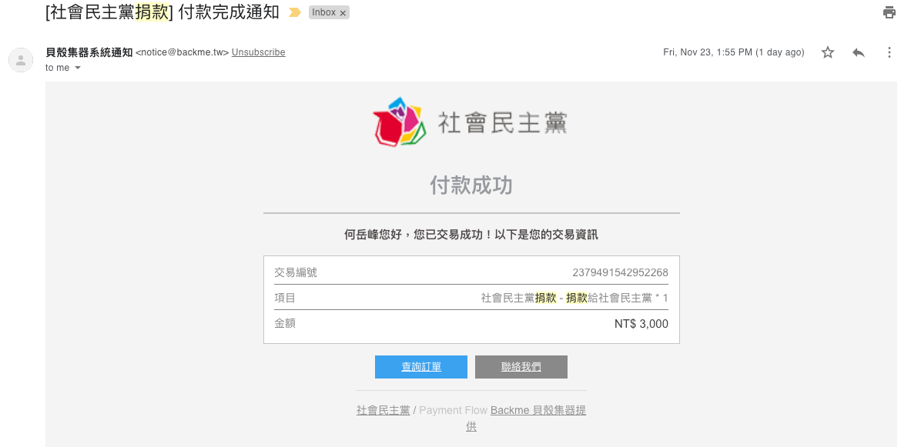
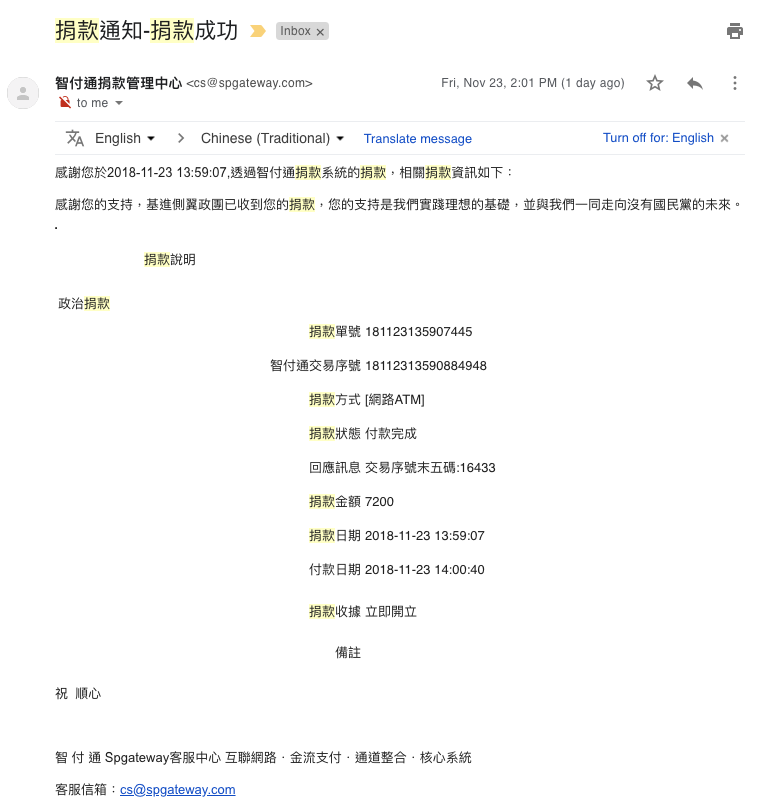
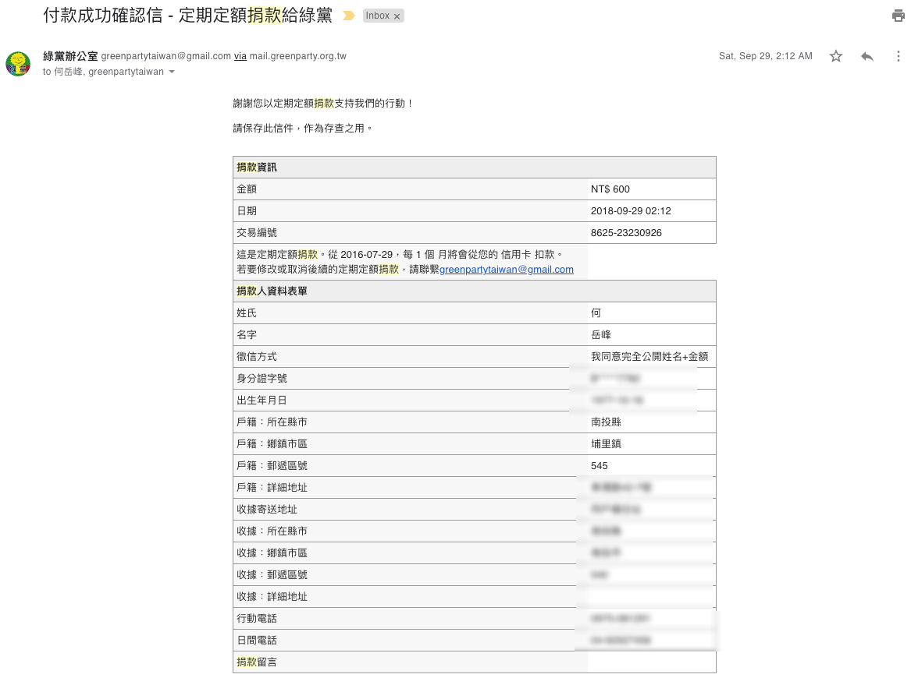

我對臺灣 2018 地方大選及公投選舉結果的看法
===============================================================================

已經過了投票截止時間了，雖然某些投票所還在繼續進行投票作業，但現在我們尚未得知最終投票結果。\
所以我先把結論寫在這裡。

.. more::

自沒有投票權開始，我就是一個對政治具有高度興趣、關注的青年人，\
也從有投票權以來，都有行使投票權利，就算沒有合適候選人讓我選擇，\
也是會去投廢票的。

第一次投票到現在，也過了二十多年了，期間經歷四任國家元首及懶得數清楚的縣市長、議員、鎮長、鎮民代表、里長選舉，\
沒印象我有缺席的。

在投票方面，我可說是老手級了。說沒投錯過票，是不可能的，就在本次公投案中，\
我早已擬定好的 10 個蓋法，到現場真的投票時，我 B B 的，還是有一張蓋錯邊了。

但是就算我事後發現，被某個候選人騙了，當初是投錯票了，中華民國現在還存不存在? **還存在吧** !

因為我們中華民國是真正的法治國，不會因為某個人當上，或是沒當上，就此滅亡，每個被選上的候選人，\
在憲法、地方制度法下，都有相對應的立委、議員、鄉鎮市民代表盡監督之責，不同人當上的差別不過是某方面進步的多、\
某方面進步的少，甚或退步了，兩者不會是天堂與地獄的距離，比較像是玉米與雞腿的差別。

小時候，我父親就跟我說，千萬不要讓一黨獨大，在一黨獨大下，大家很容易「掩蓋壞事」，\
可以是縣市長投 A 黨，而議員要投甲黨，讓他們相互制衡，我們人民才不會當魚肉。

我父親是國民黨員，他還是跟我講兩(多)黨制衡的概念，就是希望我不要把「人」當聖人看待，\
沒有人會是聖人，要有良好的政府，多權分立、相互制衡才辦得到，任何人跟你講，\
投給「他/她」就能「…」，投給對手就會「…」，這些都是「選舉術語」，要懂得明辦，\
政治是高明的騙術，而我們人民的責任就是視破它，就自己的利益或是自己認為「理想的利益」，\
把票投給能實踐它的人。

全臺灣只會有一個總統，全臺北市只會有一個市長，有人上，就有人下，上下之間，\
差別的是某部份人民的利益多了些、某些人的利益少了些，在法治國的架構下，\
不會有人失去「平等權」、「居住及遷徙」、「言論、講學、著作及出版」、\
「秘密通訊」、「信仰宗教」、「集會及結社」的自由，\
我們的「生存權、工作權及財產權」會受到保障，\
凡人民之其他自由及權利，不妨害社會秩序公共利益者，均受憲法之保障。

就算總統想要把臺灣賣掉，換得自己及身邊黨羽的利益，\
他/她也得把「臺灣賣身契」交給立法院表決呀!

我希望大家只要能實踐我國憲法五權分立的精神，讓政府不會變成一黨獨大、甚或專政，\
那選舉結果是期待的，或是不期待的，都會是臺灣人民的勝利。

於此，我昨天捐了二筆款項給社民黨及基進黨:

    捐 3,000 元給社會民主黨

    捐 7,200 元給基進黨

也一直持續捐款給綠黨:

    每月捐 600 元給綠黨

選舉是一時的，政治是長久的，讓多黨生存下去，才能完善這個監督機制。

我相信在中華民國憲法的架構下，只要確實實踐五權分立的精神，\
那中華民國長長久久是容易辦到的，又如果不想中華民國長長久久的話，\
要修個憲法，換個國號，只要有共識的立委夠多了，也是辦得到，\
千萬要記住，這些立委是我們人民選出來的，他們做得不好，\
先怪自己，這是民主的基本精神。

我們不像「中華人民共和國」一樣，有個 **大有為** 的政府來決定人民的一切成敗，\
所以當他們人民有錯了，他們大可把錯怪在「大有為政府」頭上，\
這大概是一黨專政政府的優點了。

我們民主國家，只能怪自己。

.. author:: default
.. categories:: chinese
.. tags:: elections
.. comments::