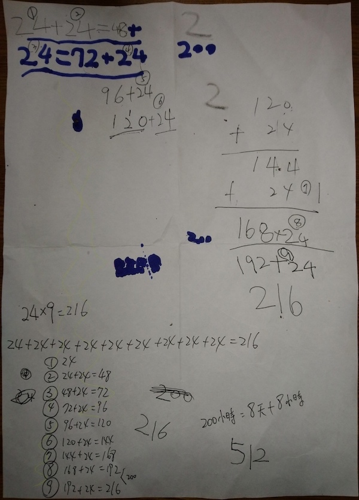

一切都是剛剛開始
===============================================================================

    9 天有 216 個小時

* 女兒跑來問我: 『你知道 9 天有幾個小時嗎? 有 216 個小時喔~ 媽媽教我的。』邊問邊把媽媽教她的紙張拿給我。
* 我心裡想著: 『這些直式真亂，如果要算的天數更多，這樣表示早晚會把自己搞亂。』\
* 所以我說: 『妳知道哪個 24 小時是指第幾天的嗎? 來，我們把它標上圓圈1、圓圈2、…圓圈9，這樣才不會加到亂掉。』

邊標記的過程中，再跟女兒確認一下，她是不是明確地知道什麼加上什麼後是得到什麼。\
因為我是個機車的人，並不能滿足得到正確的答案，推導過程也得是正確的。

而且在我用了近 40 年的數學後，\
經驗是: **規矩是算數的基本、算數是數學的基本**，數學要好，規矩不能少。

這裡先補充一個概念: **用直式教學並不是「錯誤的」，直式在進位表示上，對學習者有利，易於教學** 。\
只是在多數值的累計上，無法簡單地、整齊地呈現問題的核心。

在整理完紙張上半部的直式計算式後，我接著要向她說明使用橫式計算式來完成這個問題。

.. more::

首先是說明， 1 天有 24 小時， 9 天共有 216 小時，可用 24x9 = 216 表示，而這個乘法式又跟
24+24+24+24+24+24+24+24+24 = 216 加法式的意義是一樣的。

重複跟女兒驗算上述直式的計算結果，我用手指頭去遮住這個加法式的一部份，露出 1 個 24 代表 1 天，露出 2 個 24 代表 2 天，\
一直驗證計算到第 9 天。並把此番的討論整理到下方 9 個加法式，再重複唸出 9 個加法式的加總結果。此階段反覆與女兒驗證每個加法式的現實意義與計算結果。

最後，才跟她講在這 9 個加法式上，等號右邊的結果就是下一個加法式的第一個數值。這個概念，我已經有點是要她 **強背** 了。但我沒有非要她一定要記住這件事，沒記住也沒關係，總有一天，她會自己想明白，或許是在看旋轉木馬，還是程式語言中的迴圈邏輯時。我無所謂。

至此，算數指導到這裡結束。然後問了她一個關鍵問題:

* 我: 『為什麼妳要知道 9 天有幾個小時，為什麼不問 10 天，不問 20 天呢?』
* 她頓了一下，徐徐地: 『因為我要知道 200 小時有幾天?』
* 我又滿臉問號地: 『那又為什麼不問 100 小時還是 300 小時，非要問 200 小時呢!』
* 她: 『因為獅子出去旅行，花了 200 小時呀! 所以我要知道牠是玩了幾天?』

我哈哈地大笑了。

那如果問題是這樣的話，不能回答 9 天，因為 8 天有 192 小時，而 9 天有 216 小時， 200 小時是介於它們之間的，所以要說獅子玩了 8、9 天，或是 8 天多，要明確地講的話，就是 200 小時比 192 小時多了 8 小時，所以牠玩了 8 天又 8 小時。

晚上跟老婆睡覺前，我們聊到這件事。

* 我: 『說到這一點她跟我很像，沒事就拿問題來考自己。不過，她提到的獅子故事是用來呼嚨我，還是真的?』我會這麼問，是因為她有說謊的慣例，有時候她講得理由實在讓人不得不相信。
* 老婆: 『我想想…，…，對，她是在桌子上玩非洲動物玩偶時，說到獅子要去旅遊的，所以她才問了 200 小時的問題。』

花了那麼大的篇幅來講女兒的事，不曉看倌們猜得到敝下的心意嗎? 炫耀小孩能力證明父母有能力? 數學很重要，從小就要加強? 

炫耀小孩能力證明父母有能力?
-------------------------------------------------------------------------------

雖然女兒解數學的年紀比我早了 3、 4 年，但以她現在的數學知識跟我相比，還是天壤之別，目前我的數學能力還不需要靠她來美飾。

數學很重要，從小就要加強?
-------------------------------------------------------------------------------

我的成長年代充斥著「萬般皆下品，唯有讀書高」的觀念，智育成就遠遠高於其他四育，而數學、英文又是智育中的重中之重。\
但我活了四十幾年了，見過一堆英文、數學不好的人，在臺灣還是過得很好，而有些英文口說、聽寫俱佳或是數學很好的維吾爾族同胞，\
也是只能窩在集中住宿的學校， **自願** 地學習如何裁縫、烘焙，沒機會 **自願** 學習密碼學、設計網路路由器或是編寫電腦遊戲。\
數學在不同的社會下，重要性是不一樣的，不同地方的計算結果也不一樣，像是在臺灣， 2 的 6 次方是 64 ，\
但在大陸長江以北，所計算出的答案是 63 ，而在江南則是 65 。不敢相信，對吧!

這是有次與大陸網友討論程式語言時，\
他們提到: 『在大陸的伺服器得依用戶所在地來源算出不同答案，若是江北來的要吐 63 回去，江南來的是給他們 65 』，\
我聽了很不可思議，驚訝地: 『難道大陸沒有 64 嗎? 』然後，就沒有然後了，我再也沒接過他的訊息了。

另外，有次我試圖從中華民國在葬禮形式上的使用情形來統計宗教信仰比例。我國依憲法規定，大陸地區當然要列入計算，
所以我就找資料啦，結果很訝異地發現北平在民國 78 年 6 月 10 日完全沒有頭七儀式的紀錄， 9 日有、 11 日有，\
就是 10 日完全沒有。我花了很多時間在驗證資料的正確性，徒勞無功，\
最後只能接受 6 月 4 日北平沒有死人。而研究最終也只能走到死胡同，因為我的論文前提是：『哪個地方不死人。』

數學的重要性無法放諸四海皆準，反而是政治，到那個社會都一樣是 **很重要** 的。

要會問問題
-------------------------------------------------------------------------------

『要會問問題』就是本文的重點，不只是「問問題」而已，要會「問對問題」，這就關係先前問的問題及解題能力的培養。\

而只要你起頭問了問題，就會招致另個問題，這個問題又會引發下一個問題，\
只要開始了，問題就永遠問不完了。

女兒雖然只是問了「 200 小時有幾天」這樣的小問題，但我知道她早晚會問到「 **共產主義如何危害人類社會?** 」\
可能是酒足飯飽後的閒扯淡間問問，也可能是在 `下跪的時候問自己這個問題 <https://zh.wikipedia.org/wiki/%E5%9C%9F%E5%9C%B0%E6%94%B9%E9%9D%A9%E8%BF%90%E5%8A%A8>`_ 。 sooner or later 早晚而已，\
而身為她的父親，我希望她能早點問到 `這個問題 <https://tw.appledaily.com/new/realtime/20141128/514645/>`_ 。

問問題，對女兒來說， **一切都是剛剛開始** 。

P.S. 那張紙的右下方，後來又寫上 512 的數字，這又是另一個故事了，而這個故事，要留到講我有偏執症時再說。

.. author:: default
.. categories:: none
.. tags:: none
.. comments::
