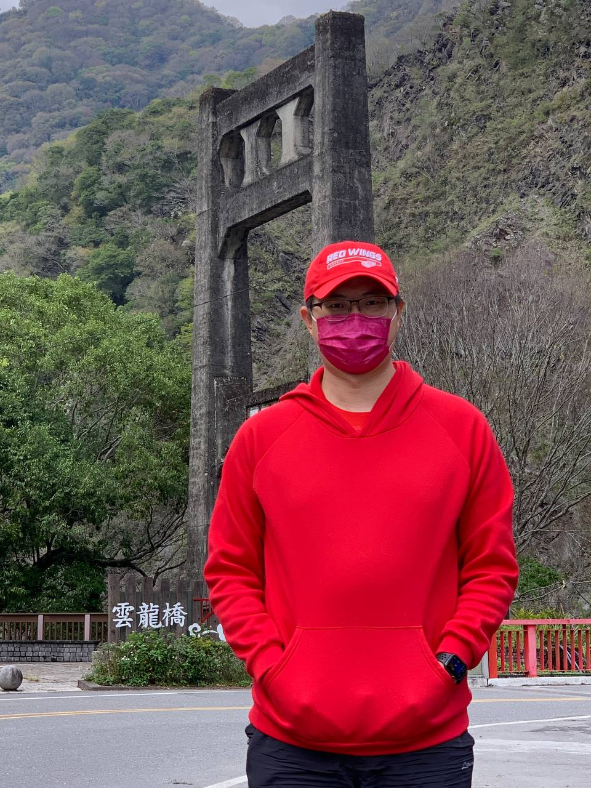

如果你得了武漢肺炎~
===============================================================================

隨著武漢肺炎病毒不斷地變種，現今的 Omicron 傳染力極其強大。\
我已經接收到不少朋友、親戚、小孩同學、…等人確診的訊息。\
是時候，再為自己補上最後一道防線了: 心理建設。

    戶外還是戴好口罩及有前緣的帽子，這種帽子再加眼鏡可再多擋些氣溶膠，也有助於提醒人「不要用手揉眼睛」

.. more::

疫苗打好打滿、不分戶內外戴口罩、勤洗手、保持社交距離就算都有做到，但病毒是不長眼的，\
不是說你保護措施滿點，就保證不會中。你活著的時間還很長久，病毒可是不用睡覺，\
死前也會繼續複製下一代，總有一天等到你不注意就上你的身，入你的體。確診案慢慢地會是通例。

現在，很多確診者的反應就只是發了燒、喉嚨痛、全身酸痛，更有大部份人是無症狀。\
我們的群體免疫力會愈來愈高，武漢肺炎病毒會變得愈來愈像 `小兒麻痺症病毒 <https://zh.wikipedia.org/wiki/%E8%84%8A%E9%AB%93%E7%81%B0%E8%B3%AA%E7%82%8E>`_ : \
對大部份人是無害的，只有少數人會有長期後遺症。

中了武漢肺炎病毒，那就是 **面對它、接受它、處理它、放下它** 。

不用去想，是誰傳的，好好地休養。該過的活，繼續過下去。

其他尚未中過的人，也不用去想別人是不是有中過? 我們防的是病毒，不是人。

.. author:: default
.. categories:: none
.. tags:: none
.. comments::
