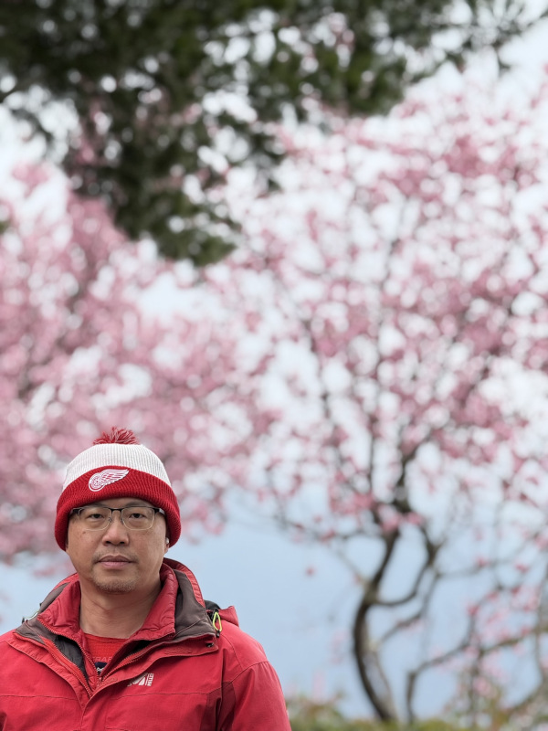

笨蛋能不碰政治
===============================================================================

自小就是個閱讀狂，沒事就是看路上招牌，不然國語日報也能一天看三遍。\
後來更是中時、聯合、中時晚報、聯合晚報、自由時報都看，\
算是了解中國政治，直到高中，台獨思想才漸漸萌芽，但到了大學又開始過渾渾噩噩的生活。\
當時，聽李前總統登輝先生講二二八的事，我還不相信。

.. author:: default
.. categories:: none
.. tags:: none
.. comments::
