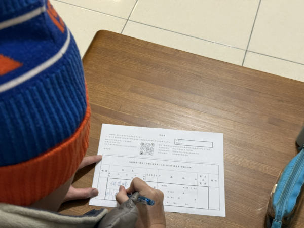

2025 立法委員大罷免
===============================================================================

2025 年初，台灣掀起一股罷免眾多素質差立法委員的活動，至 4 月 5 日止，\
共有 47 名立法委員的罷免案進入第二階段的連署程序。

如此多的罷免立委成案，遠因是 2024 年中，中華民國立法院通過多項事後被中華民國憲法法庭宣告違憲的法案:

* 立法院職權行使法
    1. 立法院要求總統至立法院國情報告，須即面即答或限期內要求總統書面回覆
    2. 官員反質詢所衍生的行政罰鍰、懲戒甚至刑事責任
    3. 部份人事同意權的審查程序
    4. 政府機關或公務人員於立法院調閱文件、資料及檔案時拒絕、拖延或隱匿不提供者，得經立法院院會決議，移送監察院糾正、糾舉或彈劾
    5. 法人、團體或社會上有關係人員於立法院調閱文件、資料及檔案時拒絕、拖延或隱匿不提供者，得經立法院院會決議處罰鍰的規定
    6. 超出立法院職權的調查與聽證權
* 刑法
    7. 藐視國會罪

在違憲法案制定過程中，多項「不合理、不民主」的立法程序，雖未被憲法法庭宣告違憲，但在意見書中說明，\
這些「不合理、不民主的立法程序」並不歸憲法約束，是由立法委員的選民約束，民主選出的立法委員在國會以不民主方式執行立法，\
那是「民主」的事，不是「憲法」的事。白話講: **依選舉罷免法選舉出來的立法委員，當人民無法接受這些不民主的立法委員，當依選舉罷免法來罷免** ，不是由憲法法庭判決他們失格。

.. more::

而後，素質差的立委們又在 2024 年底通過的「選罷法修正案: 連署須附身份證影本」、「財政收支劃分法修正案: \
地方政府從中央預算內拿走了三千多億預算」、「憲法訴訟法修正案: 提高違憲判決門檻」。

* 選罷法修正案: 素質差的立委們知道自己立法搞得遍地人怨，為了讓人民不容易罷免他們，所以加嚴連署門檻，想讓罷免案無法成案
* 財政收支劃分法修正案: 從中央預算挪走 3753 億元預算，但不重新檢討地方政府應需負擔事務，變相地逼迫中央政府若要維持正常運作，就用削減國防運算因應
* 憲法訴訟法修正案: 選罷法修正案，若提起憲法訴訟，很高機率會被宣告只能適用於新任期所選出的立法委員，而此任素質差的立法委員們一樣適用原來罷免方式；財劃法修正案減少中央預算來限縮行政權的執行，這一樣有被憲法法庭宣告違憲的機會，所以素質差的立法委員們提早以憲法訴訟法修正案來讓憲法法庭實質停擺

前述這些實質違憲、可能違憲的法案已經讓很多選民感冒、不爽，但畢竟這些法案真實地、直接地影響到人民生活，\
還是不容易想像。**直到 2025 年 1 月 21 日三讀通過 2025 年中央政府總預算，素質差的立委們業力終於引爆。**

素質差的立委們刪、凍起總預算，是連自己人利益相關的都砍、都刪。而且統刪額度之大，\
有違釋字391號( https://cons.judicial.gov.tw/docdata.aspx?fid=100&id=310572 )所示「審議方式自不得比照法律案作逐條逐句之增刪修改，\
而對各機關所編列預算之數額，在款項目節間移動增減並追加或削減原預算之項目，實質上變動施政計畫之內容，\
造成政策成敗無所歸屬，政治責任難予釐清之結果，有違立法權與行政權分立之憲政原理」。

立委刪政府總預算是天職，但這個天職並不是想刪多少就能刪多少，像監察院 2025 年度預算中業務費被刪 96%( https://www.cy.gov.tw/News_Content.aspx?n=124&s=32395 )，\
實質使監察院難以運作，已有立法權干預監察權之行使，違反我國五權憲法。

從報導者網頁( https://www.twreporter.org/a/legislature-passes-2025-government-budget )來看，統計自 2000 ~ 2025 年度總預算刪減比率，\
只有 2000 、 2005 、 2006 年的刪減率達 2 %，這都是阿扁總統時期，反對黨立委佔多數時發生的事。

自 2014 年起，每年刪減率約在 1 ~ 1.2% 之間，到 2025 年竟高達 6.63% 實屬詭異。\
首先，中央政府公務員明知此屆立法院是反對黨佔多數的第一年任期，這也是反對黨立委們第一次面對總預算案的審查，\
所以公務員們浮編、亂編的動機並不高。

2025 年中央預算總額是史上最高，主要原因是「想做的事」也是史上最多，\
那素質差的立委們硬是要刪 6.63% ，合理推斷是想讓中央政府難以運作、事做的差，\
連帶引發民怨，削弱全國人民團結一心。

搭配傅崐萁 2024 年 4 月 27 日帶眾多立委面見王滬寧的舊聞( https://www.threads.net/@yisan0519/post/DH87Hmlv9P1?xmt=AQGzeP0E0ZYeKJdLlDDURRohuvUIgEvhYr4W-vLbb0bbuA )，\
說素質差的立委們是親共立委，意圖干擾我國政府執政效率，讓我國執政差、反抗中共國能力不足，這對親共立委們而言，不哲是降低中共侵略戰爭的難度、大大地提高我國人民主動投降換取和平的機會。

除傅崐萁外，這些親共立委包含：

* 雙北
    * 王鴻薇
    * 羅明才
    * 張智倫
    * 廖先翔
* 基隆市
    * 林沛祥
* 竹苗地區
    * 徐欣瑩
    * 鄭正鈐
    * 邱鎮軍
* 南投縣
    * 游顥
* 金門縣
    * 陳玉珍
* 連江縣
    * 陳雪生
* 原住民
    * 黃仁
    * 鄭天財
    * 盧縣一
* 不分區
    * 翁曉玲
    * 林倩綺

同行的還有前國民黨立委張育美。

上述名單中，**並未有我選區的馬立委文君先生**，自然我不會把她視為親共立委，而單單做為地方派系的代表。\
或許有人說她涉嫌洩漏國造潛艦機密給韓國國家情報院，這怎麼不是親共立委? 首先，國造潛艦海鯤號並未停建，\
其二，她可以是親韓國的立委，目前要說她親共，言過其實。

馬文君當立委其實也沒做錯什麼對不起鄉親的事，從當埔里鎮長開始，\
她就一直住在那個財政部國有財產署的國有地上，\
到她現在都選上五屆立委了，最差得票率也有53%，埔里人並不會因為她是莊園主，就不投票給她，\
她高度符合埔里人的需求(水準)，她不懂(在乎)潛艦，也不是她的錯，而是埔里人也不懂(在乎)。

為了潛艦，我就要罷免她嗎? 其實也不是，上次她揚言要全刪潛艦預算，結果她收回，保留了潛艦預算，\
這一點，我很感謝她。

如果她想的話，**要當一輩子南投縣第一選區(烏溪線)的立委，也是可以的**。

那我填罷免她的連署書，甚或將來投罷免同意票的理由是什麼!!!

此屆立委有傅崑萁、黃國昌，又讓他們當了多數黨總召，所以一堆狗屁倒灶都出來了，此前四屆，馬立委表現很正常，\
雖說，有「看國防部報告因為英文不懂，打電話去問別人」的笑話，但難道，我或埔里人的英文就很好嗎? 有資格說人家英文不好!

所以，我主要還是想要罷免傅崑萁及其他素質差的立委們:

* 媽媽老家的貪汙嫌犯顏寬恒
* 爸爸老家的無腦立委廖偉翔
* 自己老家的鎖喉小弟羅廷瑋
* 新北板橋的硬凹名嘴葉凹之

只是這五位我罷不到，只好用罷免南投第一選區的馬立法委員文君先生來展示我的態度: **對此屆素質差立法委員們的反抗**。

我拋磚了，希望引大家的玉: 一起罷免傅隨組織( https://bafu.tw/ )

.. author:: default
.. categories:: none
.. tags:: none
.. comments::
