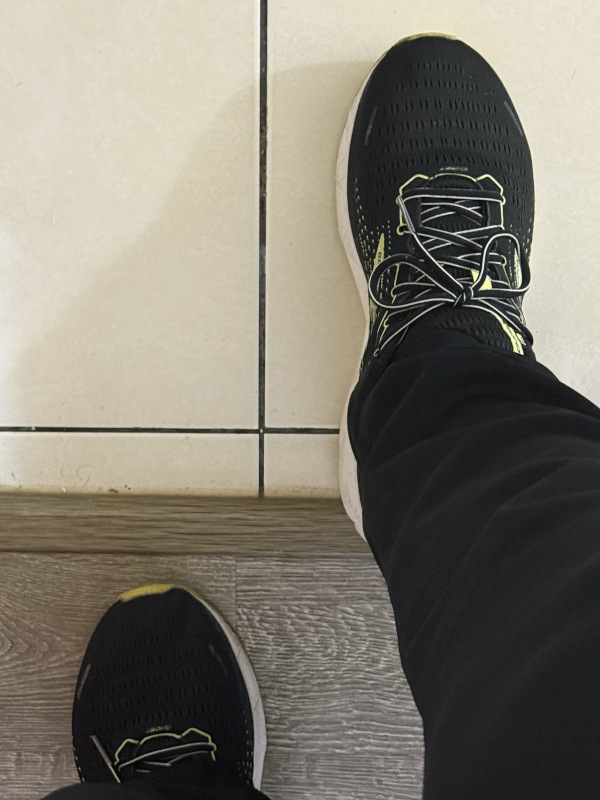

毫無根據的事實
===============================================================================

年輕時跟人合宿，莫名發現有些人會堅持奇怪的習慣。室友會強迫跟他出門的男生，\
一定要左腳跨出門檻，女生則是要右腳跨出門檻，理由是這樣做才會保證他此次出門的安全。\
我忘了他說是那位神尊從小給的指示。

有些同伴會順著他的規矩，用對的腳跨出門，但有些人就是天生反骨，硬跟他唱反調。\
那他總不能搬著別人的腿過門檻! 這有犯強制罪的嫌疑，所以，他的處理之道就是: \
把門關上，重新開門，自己用對的腳跨出門檻，跨完後直接把門關上，這樣，\
後續再出門的人就跟他是「不同次」出門的人，前人及後人的安全與否就跟他本人無關了。

而其他毫無根據的事實:

* 中共武力侵略台灣，是因為台灣搞台獨
* 香港回歸無法維持「馬照跑、舞照跳」五十年，是因為香港不愛國
* 新彊有再教育營，是因為維吾爾人不像中國人

.. more::

自 2020 年起，中共就批評蔡前總統英文先生「以疫謀獨」、「法理台獨」， 2024 年繼續批評賴總統清德先生走蔡英文路線倚美謀獨，持續堅持"台獨"。

很可惜的是，多年來，中共並未實踐「台灣搞台獨，中共就要武力侵略台灣」的宣告，中共只會 **持續宣告** 。

會不會中共講著講著，到了 2027 年，還是 2130 年，就真的武力侵略台灣了? **有可能**，\
但這樣能說是因為台灣先搞台獨，\
所以在多年後，中共終於實踐它的警告，還是該說，**它能武力侵略台灣，是因為它終於準備好了**。\
先前喊著「只要不搞台獨，就不武力侵略台灣」，目的是讓台灣人以為中共是有想要「和平」的，\
削弱台灣人的國防準備，到時候的入侵戰爭，就能跟烏東一樣，勢如破竹。

過去真有笨蛋相信中共愛好和平，自己砍掉情報人員、放任共諜滲透國軍、外交修兵、…，自己干願被稱呼「馬前那個」。

只要有回顧中國共產黨 104 年(對，比中華民國建國少 10 年)以來的歷史，就知道 **中國共產黨的話，是不能相信** 的。

若是有台灣人就是要相信中共說的「台灣搞台獨，就會武統台灣」這種毫無根據的事實時，可以請他跟我的前室友一樣，\
自己開門、自己跨對的腳、自己關門，自己要信就自己應付:

* 大力宣揚自己是愛好和平的統一人士，如果美國入侵，就直接投降；日本入侵，就直接投降；中共入侵，一樣直接投降
* 怕入侵時才投降，會被嫌棄太晚，那現在剛好有方案在推廣，可以去福建泉州去找一位林金城先生，他有門路可安排如何有利地投降
* 在總統、立委選舉時，不只自己投票給親近共產黨的人選，而且在我國選罷法規定下，幫這些親共人選拉票，因為台灣是民主國家，支持共產黨、共產主義非違法事由

**在台灣這個民主國家裡，當個笨蛋是不犯法** 的，但如果要強迫我跟著一起當笨蛋，我只能回: \
「你今天出門跨對腳了嗎!」

.. author:: default
.. categories:: none
.. tags:: none
.. comments::
